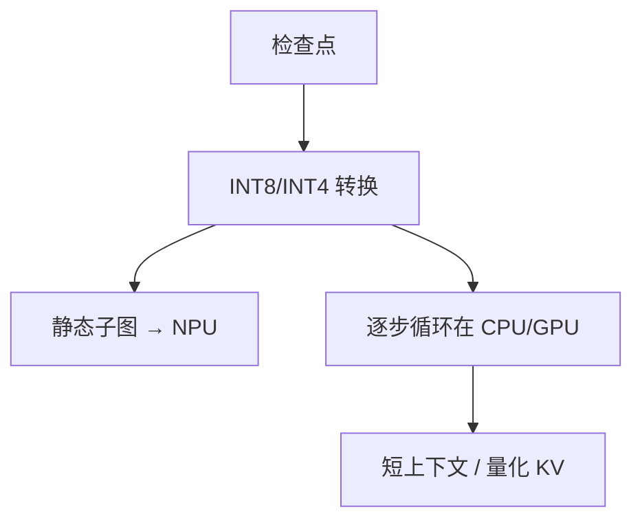

# 移动端 NPU 部署

手机上的 TOPS 写在发布会上；LLM decode 要的是能持续吃带宽的矩阵核、以及不会把 8GB DRAM 吃光的 KV 预算。

<footer>—— 对照 ExecuTorch / Core ML / NNAPI / 厂商 QNN 的端侧部署栈；量化与内存是硬约束</footer>

[上一课](/llm/webgpu-inference)是浏览器沙箱。原生 App 可以走 NPU：Apple Neural Engine、高通 Hexagon、联发科 APU，经由 Core ML、NNAPI、QNN、ExecuTorch。本课写部署差：静态图编译、INT8/INT4、热包络、以及 decode 循环往往仍落在 CPU/GPU，因为 NPU 对动态 KV 不友好。不要把「设备有 45 TOPS」写成「70B 能跑」。

## 问题

NPU 喜欢固定形状卷积/GEMM。LLM 逐步 $n$ 变、采样不规则、投机分支，编译器要么 pad 到 $n_{\max}$（DRAM 炸），要么每步回 CPU。缺口是混合：投影与 FFN 下沉 NPU，注意力在 GPU/CPU；或整网 CPU 量化（llama.cpp 系）。热功耗：持续 decode 会降频，峰值 TOPS 与持续 token/s 不是一回事——[每 token 能耗](/llm/energy-per-token)在手机上直接决定能不能聊完一条消息。

后台：OS 会杀长时间 GPU/NPU 占用。产品要把生成切成可暂停步。

ExecuTorch 把 PyTorch 边下沉边解释；Core ML 转换对动态控制流不完整。选栈先看 generate 循环能不能留下，再看算子覆盖。

## 方法

模型级：1B–8B 级量化，上下文 2K–8K 量级起步。KV 用量化或短窗。工具链：能导出的静态子图下 NPU，循环在运行时。与分词：移动端分词必须 C++/Rust，不能起 Python。UI 流式走稳定前缀。电量：测持续功率，不是芯片海报。

## 机制

屋顶线：NPU 峰值高、能用的形状窄；decode 强度低，可能根本打不满 TOPS，瓶颈回到 DRAM。这与数据中心 decode 同构，只是绝对数字更差。厂商 SDK 的「LLM 方案」往往是自家核 + 私有格式，可移植性低于 ONNX。选择等于绑定 SoC。

## 边界与工程取舍

不要在 NPU 上假设任意 [logit bias](/llm/logit-bias) 与文法掩码都能融合。不要用峰值 TOPS 除以 FLOPs 估 TPOT。下一课：纯 CPU 量化路径，反而更可移植。

出处：ExecuTorch；Core ML；NNAPI；厂商 QNN 文档。不发明 arXiv。

## 小结

- 手机 NPU 适合静态子图；LLM decode 循环常留在 CPU/GPU。
- 峰值 TOPS ≠ 持续 token/s；热与 DRAM 是真约束。
- 模型要小、KV 要短、权重要量化。
- 分词与 generate 必须在原生运行时。
- SoC SDK 绑定与可移植性权衡。
- 下一课：CPU 推理与量化。
- 出处：ExecuTorch；Core ML；NNAPI。
