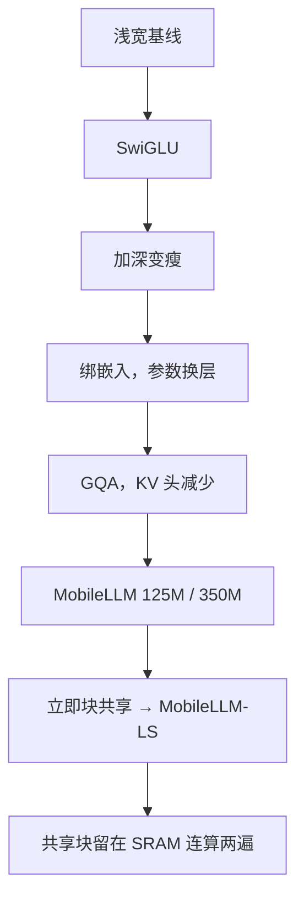

# MobileLLM

    
十亿参数以下，质量不再只由数据量和参数量决定；深度、绑嵌入和分组查询，决定同样磁盘预算能换出多少层有效计算。

    <footer>—— Liu 等，MobileLLM，arXiv:2402.14905</footer>

Meta 的 **MobileLLM**（Liu、Zhao、Iandola 等，ICML 2024）把设计目标钉在 **手机能驻留的亚十亿参数**，而不是把 7B 量化到能开机。论文主实验是 **125M 与 350M**，在约 **1T** token 上从零训练，并给出层共享变体 **MobileLLM-LS**。动机写得很硬：云端按「每人每天百分之几时间 × 大模型 FLOPs」外推不可持续；iPhone 级 DRAM 还要分给系统和其它 App，7B 即使 8-bit 也常常超过合理占用。本篇按 2402.14905 写架构原则与 LS，不把后来未在该文展开的更大 MobileLLM 档位写成同一张表。

## 问题

亚十亿模型里，词表嵌入占比可以超过 20%（论文例子：512 维、32K 词表，输入输出表各约 1600 万参数）。大模型里同一对表只占几个百分点，于是 OPT 之后业界逐渐放弃绑嵌入。手机上若仍用「浅而宽 + 独立输出头」，磁盘预算会先被词表吃掉，残差步数不够，常识与阅读理解都会差一截。

硬件层次同样是一等约束。论文图示移动设备上 SRAM 只有约 20MB 量级，往往只够放下 **一个** Transformer 块；decode 是内存带宽瓶颈，权重在 DRAM 与 SRAM 之间来回搬比多算一次 GEMM 更贵。因此「加深」若意味着多一份不共享的权重，延迟会涨；若加深的是**立即重复的同一块权重**，块可以留在 SRAM 里算两遍。

### 四条基线：SwiGLU、深窄、绑嵌入、GQA

从 12 层 768 维一类基线出发，论文逐步加：

1. FFN 从 ReLU MLP 换成 [SwiGLU](/llm/swiglu)，125M 零样本常识均分约 +1.3。
2. 在参数量几乎不变时加层、减宽——消融 19 个 125M/350M 形状，更深更瘦在 ARC、HellaSwag、RACE、TQA 上系统性更好。
3. 输入输出绑嵌入，125M 约少 11.8% 参数，均分掉 0.2；把省下的参数加回深度（30→32 层）可以补回来还净少参数。
4. [GQA](/llm/gqa)：约 16 个查询头较好；KV 头从 16 收到 4，125M 几乎不掉点、350M 约 -0.2，再把隐藏维补回去维持总参数，另有收益。

最终 MobileLLM-125M：约 30 层、查询头 9、KV 头 3、宽 576。MobileLLM-350M：约 32 层、15/5 头、宽 960。详细整数以论文表为准。探索实验 0.25T，主结果 **480k 步 / 1T token**，32×A100，Adam、余弦、峰值学习率 $2\times 10^{-3}$。

论文标题是 on-device，评测仍是零样本常识、TQA、RACE、AlpacaEval、MT-Bench 与 API 调用。50 token/s 的 125M 数字是他们的设备剖面，不能当成所有 NPU 的保证。权重当时并非全部公开，[SmolLM](/llm/smollm) 博客对照 MobileLLM 分数时已声明用的是论文表。

## 方法

层共享要在三种拓扑里选：立刻把相邻块绑成一对（immediate block-wise）、隔很远再重复、以及反向共享。重复全部层在精度上可以最好，但 SRAM 放不下「相距很远的两份逻辑层」所对应的调度；**立即块共享**让同一权重在缓存里连算两次，加载开销约 +2.2%、执行约 +2.6%（论文数字），换来有效深度加倍而磁盘不变。这就是 MobileLLM-LS。LS 表里的层数计的是**不同权重**的块数，前向展开后更深。

下游：聊天微调后，LS-350M 在 AlpacaEval 相对 `text-davinci-001` 的胜率约 48.2%（GPT-3 自胜约 50%）。API 调用上 350M 的意图/结构精确匹配接近 Llama 2 7B，Rouge 仍明显落后——论文强调端侧常见的「选对函数、填对槽」并不需要 7B 世界知识，长文生成才需要。

知识蒸馏用 Llama 2 7B 软标签在他们的设定里**略伤**硬标签预训练，没有写成必选项。不要把 MobileLLM 理解成蒸馏产品。

## 机制

深度优先的机制是：残差流上每一次注意力都是一次内容寻址。宽度增加的是单次寻址的通道，深度增加的是寻址次数。容量极小时，多跳组合比单层更宽的 MLP 更能拟合常识多跳。GQA 在大模型上本为省 KV；在小模型上它还省 **KV 投影参数**，省下来的预算可以加宽嵌入，使注意力通道够用。绑嵌入强迫输入几何与输出分类共享，小词表上这是合理的参数复用；大词表、多语、领域适配时这条约束会变痛，改词表等于动全身。

立即共享不是「同一层算两次等于两层独立权重」。共享块没有新的非线性参数，表达力来自**中间激活不同**（上一块的输出已经变了）。SRAM 故事只在 decode、块大小拟合缓存时成立；prefill 大矩阵乘是算力瓶颈，共享的延迟优势会缩小。API 任务接近分类与槽填充，350M 够用；开放聊天的世界知识仍受 1T 网页与 350M 容量限制，接近 davinci-001 的胜率不等于接近当时的 GPT-4。

「350M 8-bit 约 0.035 J/token、一天对话」是论文按能量模型做的数量级，电池、SoC 与操作系统会改这个数。不要写进产品 SLA。Llama 2 7B 的 API 接近，只在他们的 API 基准上成立。

### 头宽 64 与 KV 头约四分之一

附录把 GQA 的头宽钉在 64 附近、查询头大约是 KV 头的四倍，再加宽嵌入以维持总参数。这是小模型上的具体旋钮，不是大模型 GQA 论文里「为 decode 带宽」的同一故事：这里省下的首先是 **KV 投影矩阵的参数**，其次才是缓存。部署时若把 KV 头改回与查询头相等，参数量与论文表不再对应，SRAM 里一块的体积也会变，LS「连算两遍仍适合缓存」的假设要重测。头数还须能被推理后端的 warp/线程切分整除，否则所谓端侧加速会被 padding 吃掉。

### 和 SmolLM、Phi、端侧 MiniCPM

SmolLM-135M/360M 明确抄了这条深窄 + GQA 作业，但把数据换成公开教育混合，并开权重。Phi 用合成教材，模型往往大于 1B。[MiniCPM](/llm/minicpm) 1.2B/2.4B 走 WSD 与端侧多模态，不是亚十亿。选 MobileLLM 是读设计原则与 LS；选 SmolLM 是要可下载的学生权重与语料。手机 App 若已经决定上 1B–3B 量化档，应看那些产品线的延迟与许可，而不是把 350M 的 API 接近 7B 外推成「手机等于 7B 助手」。

## 边界与工程取舍

主文不是 1.5B/7B 手机全尺寸方案。词表 32K 级英语设定下绑嵌入才划算。GQA 的头数必须能被部署时的线程块整除。层共享使检查点里「层数」与前向步数不一致，转换 Hugging Face 时要展开或写自定义循环，否则会少算一半深度。蒸馏在该文是负面结果，换教师或温度可能不同，不能推广成「小模型不要蒸馏」。

许可与权重发布以 Meta 当时页面为准；论文开源的是方法，不等于 Apache 权重。不要把 ICML 论文号写成别的 2402.xxxxx。

真实编号：Liu 等 *MobileLLM: Optimizing Sub-billion Parameter Language Models for On-Device Use Cases*，arXiv:2402.14905。SwiGLU 引用 Dauphin 等；GQA 引用 Chowdhery 等 PaLM。不要给 LS 单独伪造编号。

## 小结

- MobileLLM 针对亚十亿端侧：SwiGLU、深窄、绑嵌入、GQA；125M/350M 主训 1T。
- MobileLLM-LS 用立即块共享加深前向、不增加磁盘，并契合 SRAM 只放得下一块的 decode。
- 聊天与 API 显示小模型够用常见端侧槽位；蒸馏在该设定未获益。
- 出处：Liu 等，arXiv:2402.14905，ICML 2024。
