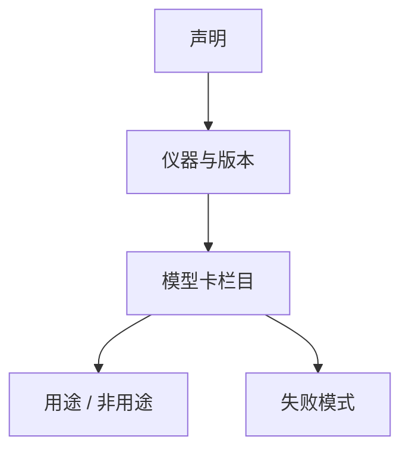

# 模型卡与报告

模型卡不是营销页。它记录预期用途、评测条件、失败模式与数据边界，让下一手决定能不能接这个权重。

<footer>—— Mitchell 等, Model Cards for Model Reporting</footer>

[上一课](/llm/benchmark-saturation)要求把饱和卷降级。若报告里只留一张高峰表，降级不会发生。本课写模型卡。协议单元在此收束：数字怎么来，要能写进一张可审计的卡。下一单元换裁判——卡上的「更好用」往往来自法官或人，而不是 harness。

## 问题

Mitchell 等人把模型卡写成类似数据表的短文档：谁训练的、训练数据边界、预期用户、量化指标、伦理考量。LLM 时代还要加：聊天模板、上下文长度、工具接口、[污染](/llm/eval-contamination)重叠表、评测框架哈希、解码超参。缺任何一项，外部就无法复现你卡上的数字。

常见失败：用 Arena 分代理数学能力；用英文榜代理多语言产品；把量化前后的 PPL 当唯一质量声明。本课程前十课拆开的仪器，应在卡上分栏出现，而不是折成一个「综合分」。

开源权重的模型卡还要写清许可证与训练数据是否可审计。只写「混合互联网数据」等于不可审计，与 Dolma 一类公开配方不在同一证据层级。

## 方法

最小栏目：用途与非用途；架构与上下文；训练数据与截止日期；评测表（任务、协议、框架版本、是否 CoT / 工具）；已知失败模式；安全与拒答行为的概述（细节走后课危险能力，不在此展开攻击面）；环境与能耗若可测则写。每条分数旁注明仪器，不把 Elo、ECE、pass@1 排进同一列排序。

更新权重要发新卡或明确 diff，禁止在旧卡上静默改数。

## 机制

卡的读者是部署者，不是排行榜观众。部署者需要的是条件：在什么提示、什么语言、什么工具下，哪些数字成立。把条件写全，分数才会从广告变回测量。省略条件等价于声称无条件成立，这在饱和与格式敏感之后已经不成立。

## 边界

模型卡不替代安全报告或数据卡（Gebru 等 Datasheets）。下一单元从「谁来判开放生成」开始，那些数字更依赖协议，更需要写进卡的脚注。

## 小结

- 模型卡记录条件与边界，不只记录高峰分。
- 不同仪器分栏；饱和卷标明为回归门槛。
- 权重更新必须有卡的 diff。
- 出处：Mitchell 等 *Model Cards for Model Reporting*；数据侧对照 Gebru 等 Datasheets。
