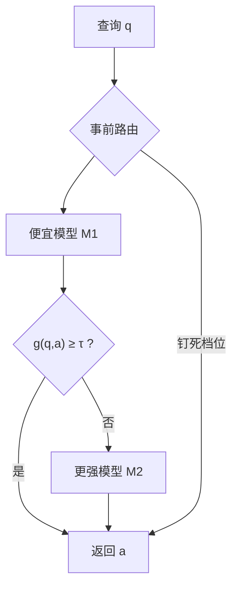

# 模型路由与级联

    
不是每条查询都需要最贵的那台模型；可以先看问题再选一个，或先让便宜模型回答、再用廉价判别器决定要不要升级。

    <footer>—— Chen et al., FrugalGPT: How to Use Large Language Models While Reducing Cost and Improving Performance</footer>

同一产品背后往往有好几档生成器：小模型快而便宜，大模型慢而强，中间还有带工具、带长上下文的变体。把所有流量打到最强档，延迟、[TPM](/llm/token-ratelimit) 与账单一起爆。Chen 等人把省钱策略收成三类：改提示、用缓存或小模型近似、以及 **LLM 级联**——按顺序调用从便宜到贵的模型，直到一个打分器认为回答足够可靠。与之并列的是**事前路由**：只看查询、不看回答，直接送进某一个模型。本篇写这两条分流，以及它们与 [TTFT](/llm/ttft)、质量 SLO 的冲突。不把某一篇的「最高 98% 降本」写成你流量上的承诺。

## 问题

模型之间不是处处排序。有的查询小模型与大模型答案相同，有的只有大模型能做对，有的甚至小模型对、大模型错。永远用最大的，在相同答案的那一子集上浪费钱；永远用最小的，在困难子集上质量违约。需要一种按查询（或按回答）付费的机制。

两条路的失败模式不同。事前路由猜错，错误答案会直接出门——它从不看回答。级联先看便宜回答，打分不过再升级，出门的是被检查过的文本，但升级路径上用户已经付了一次小模型的 TTFT 与费用，总延迟是串行和。交互产品若在级联完成前不出字，首字会等于「所有被调用模型的前填之和」；若先流出小模型再突然换成大模型，客户端很难拼接。

### 路由看问题，级联看答卷

记查询 $q$，模型序列 $M_1,\ldots,M_m$ 费用递增。事前路由学一个分类器 $R(q)\in\{1,\ldots,m\}$，只跑 $M_{R(q)}$。级联定义打分 $g(q,a)\in[0,1]$，对 $i=1,2,\ldots$ 取 $a_i=M_i(q)$，若 $g(q,a_i)\ge \tau_i$ 则返回 $a_i$，否则升级。FrugalGPT 用小型编码器（文中示例为 DistilBERT 一类）当 $g$，并在验证集上选排列与阈值，使成本约束下准确率最大。

$g$ 必须比 $M_{i+1}$ 便宜一个数量级，否则「判别是否升级」本身变成新的大模型调用，级联退化成两次贵调用。能用模式匹配、schema 校验、检索对齐检查的，不要上生成式评委。

## 方法

事前路由的特征来自查询：长度、语言、是否含代码围栏、工具意图、用户档位、历史失败。分类器可以是规则加轻量模型。输出是模型 id 与可选的「禁止升级」（批作业钉死便宜档）。路由要进日志，便于事后发现「困难查询被送进 7B」。与 [KV 感知](/llm/kv-aware-routing) 叠加时，键是「模型 + 前缀」：跨模型不得复用 KV。

级联需要停止准则。除 $g$ 外，结构化输出可用 JSON schema 是否通过、数学可用校验器、检索问答可用引用是否落在文档里。这些准则比学到的标量更可审计。阈值 $\tau$ 按类别分：客服闲聊可以松，医疗与资金类可以紧到几乎总是升级。最大升级次数要封顶，避免在 $m$ 很大时打出链式尾延迟。

混合常见：先路由到一条短级联（例如 8B → 70B），而不是在十个 API 上搜索排列。FrugalGPT 的实验说明排列本身也要学——费用单调递增不是唯一最优，因为有的中档模型在某任务上又贵又差，应从链中删掉。

### 延迟合同要按路径改写

只跑小模型：TTFT 按小模型前填。级联升级：若等 $g$ 再决定是否出字，用户可见 TTFT 含 $T_{M_1}+T_g$ 或再加 $T_{M_2}$。产品策略有三：始终等最终答案（质量优先、TTFT 差）；先流小模型，升级则作废重开（体验断裂）；先出「正在深入分析」占位，再流大模型（需产品文案）。[SLO](/llm/serving-slo) 必须按路径分列，否则全局 P99 会被升级那一子集决定，看起来像小模型变慢。

## 机制

降本来自 skew：若 80% 查询在 $M_1$ 上 $g$ 已过线，只对 20% 付 $M_2$，平均成本接近 $0.8 c_1+0.2(c_1+c_2)$（先跑了 $M_1$）。准确率是否保住，取决于 $g$ 的漏放：把坏答案判成好，级联比单用 $M_2$ 更差；把好答案判成坏，只是多花钱。因此 $g$ 的 ROC 与主任务准确率要一起画，不能只报平均费用。

### 没有廉价检查就不要假装级联

事前路由的误差不可挽回，适合「明显的简单/困难」可分、且错误代价低的流量。级联适合「有廉价可检验信号」的任务：分类、有标准答案的抽取、可执行代码。开放聊天缺少 $g$ 的监督信号，学到的打分器容易变成「句子像不像好回答」的风格模型，对幻觉不敏感——这时不要假装有级联，改用人工抽检加事前路由。

论文中相对 GPT-4 的大幅降本，绑在特定基准与当时 API 价差（可到两个数量级）。价差收窄、任务变成长思维链时，级联的杠杆变小。容量规划用自己的 $c_i$ 与升级率重算。

## 边界与工程取舍

级联与同步审核叠加时，每级模型的输入输出都要过 [安全卡点](/llm/moderation-inline)，否则便宜模型成为绕过政策的旁路。工具调用：小模型若已产生副作用，升级大模型无法撤回——工具路径应事前路由到能安全执行的档，或把工具放到最终档之后。多区域转移后，某档缺失应显式降级，见 [多区域故障转移](/llm/multi-region-failover)，不要静默把 70B 改成 7B 还报同一个 `model` 别名。

不要用用户付费档位冒充难度路由：付费用户仍有简单查询，免费用户也有困难查询。档位决定配额与优先级，路由决定质量-成本；两者交叉要写清。缓存：同一 $q$ 的 $M_1$ 与 $M_2$ 答案都可缓存，但键含模型 id。提示缓存计费在级联下会写多次前缀，断点设计要避免每级都付一遍写税。

打分器若与 $M_1$ 同源微调，可能共模失败：一起自信地错。评测要含「$M_1$ 错、$g$ 是否仍升级」的条件指标，类似过滤器与生成器的相关性讨论。

## 小结

- 事前路由只看查询、一次调用，错了就出门；级联看答卷，用 $g$ 或可执行检查决定是否升级。
- $g$ 必须远便宜于下一级；能 schema / 校验器解决的不要用生成式评委。
- 用户可见 TTFT 在级联上是串行和，SLO 要按路径切片。
- 降本依赖「多数查询在廉价档过线」；漏放比多花钱更伤质量合同。
- 工具副作用、安全卡点、模型别名在降级时都要显式，禁止静默换质。
- 出处：Chen, Zaharia, Zou，*FrugalGPT*，arXiv:2305.05176（TMLR 版本同思路）；路由与级联的对比是该文策略 3 与后续系统实践的合写。
