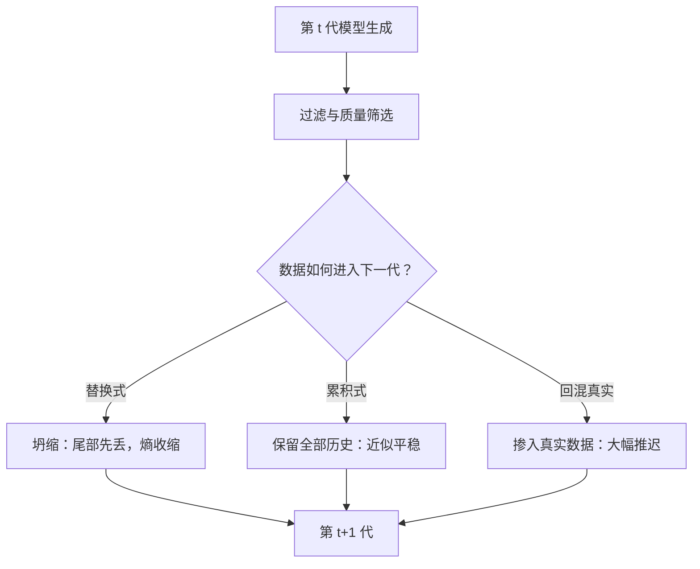
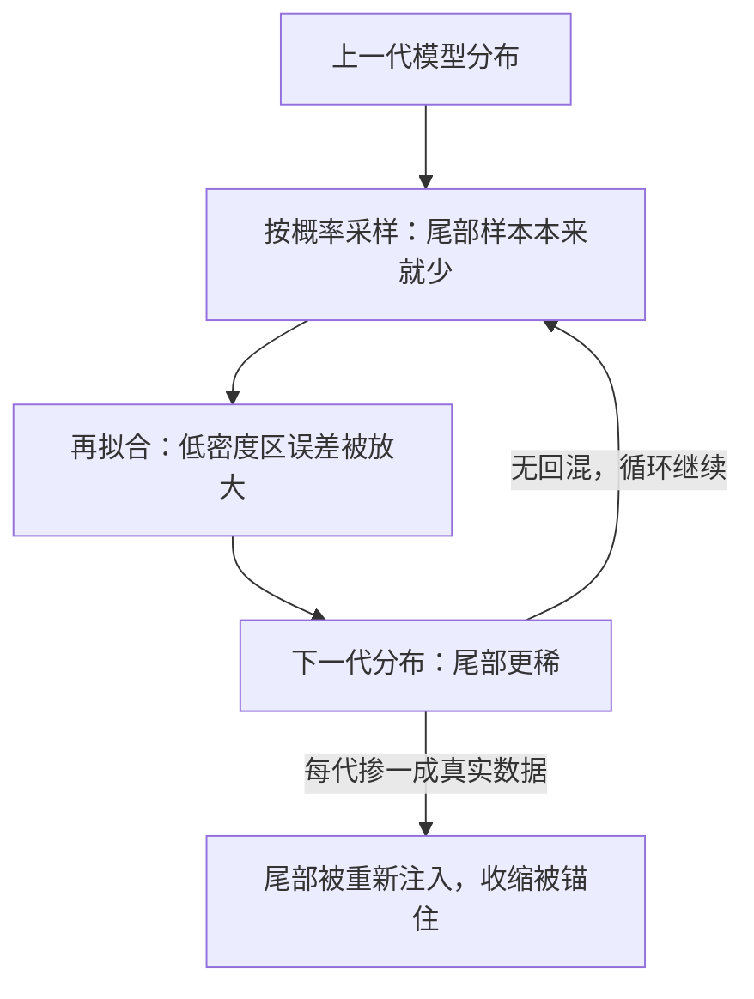

# 模型坍缩的实证

递归自食的模型不是先变笨，是先失去尾部：稀有但正确的表达最先消失，剩下的分布一代比一代窄。

<footer>—— Shumailov 等，AI models collapse when trained on recursively generated data，Nature 2024</footer>

[上一课](/llm/data-flywheel-stop)把「何时停」写成了可否决的判据。本课补上判据背后的事实依据：递归用合成数据训练自己会发生什么。实证文献给的是两条不对称的结论——替换式递归会坍缩（尾部先丢、熵收缩），累积式与回混真实数据则可以不坍缩。「所有合成数据都危险」与「我们没观察到崩坏」都是错读。

## 问题

Shumailov 等人 2024 年发表于 Nature 的实验把「生成—训练」循环跑了多代，覆盖高斯、数字与文本三类任务，每代用上一代模型的输出替换原始分布训练。三条实证结论：尾部先丢——分布两端的低密度样本（罕见词、极端值、少见解法）在数代内最先消失；熵收缩——输出的多样性与熵逐代下降；退化在数代内近乎不可逆——其文本实验到第九代前后，输出已接近无意义（原文实验口径）。Alemohammad 等人对自消费生成模型的同期工作得到同构结论：完全自食的生成器收敛到远离真实分布的退化态。

替换式与累积式的差别在工程上就是数据湖删不删旧数据：每代只用最新合成数据重训是替换式；追加进数据湖再训是累积式。前者才会坍缩。

术语翻译：熵在这里就是「输出多样程度」的度量——模型下一句话的可选范围有多宽。熵收缩不是变笨，而是变窄：翻来覆去只会说少数几种「安全」的说法，稀有但正确的表达先从菜单上消失。

## 方法

### 什么条件下不坍缩

三条不坍缩条件切断坍缩链的不同环节：累积式（Gerstgrasser 等 2024，含证明：替换式才坍缩，累积式即使加入合成数据也平稳）切断了真实分布信息的丢失；回混约一成真实数据即可大幅推迟坍缩（Shumailov 原文实验口径），相当于每代重新注入尾部样本；质量过滤减缓收缩速率，但不改变方向。落成工程口径：监测上，每代在真实 held-out 上看分布尾部指标——稀有 n-gram 覆盖率、长尾题型通过率、生成熵，不看平均分，平均分最后才动；结构上，回路必须带过滤器（上一课仪表加质量筛选），必须有真实数据锚（真实题、真实文本按固定比例回混），数据湖不删历史；比例上，合成占比在无独立真实探针验证时应设硬上限——[教科书式合成](/llm/textbook-synthetic)课的 $w_{\mathrm{syn}}$ 结论在闭环场景下更严。

## 机制

每代是「采样—再拟合」两步：拟合对低密度区域的误差最大，采样又按模型概率加权——尾部本来样本就少，拟合误差在那里被放大，于是收缩从尾部开始、向中心推进。这解释了为什么监测尾部而不是均值：尾部是收缩的先行量，均值是滞后量。上一课的新颖度仪表与生成熵监测的正是这个损失——熵下降与新颖占比下滑先于平均指标恶化。三条不坍缩条件的共同点是把「生产数据的分布」与「模型自己的输出」重新锚定：累积式锚在历史，回混锚在真实语料，过滤则只是拖慢，不提供新信息。

数字实例：设某罕见表达在真实数据里占 0.1%，而模型对它的采样概率只有 0.05%——替换式递归下，下一代的训练集里它出现得更少，拟合后概率再降。按每代打对折的速率，五六代后这个表达就等于消失了；高频表达则几乎无损。这就是「尾部先丢」的算术。

## 边界

坍缩实证多在受控设定（高斯、小语料、数字级任务）与替换式递归；大模型工程里回路通常带过滤、回混与外部题源，观测到的多为「分布变窄」而非「崩溃」。反过来，没观察到崩溃不等于收缩没发生——尾部能力（罕见解法、长尾实体）的退化先于平均指标。常见误区：初学者容易用「我们递归训练了好几代，基准分没掉」反驳坍缩。实际上平均分是滞后量，最先坏掉的是长尾——应去看稀有 n-gram 覆盖率与长尾题型通过率，而不是平均准确率。RL 侧还有另一种熵收缩（[熵塌缩](/llm/entropy-collapse)课）：那是策略熵在优化压力下的塌缩，不是数据测度的收缩，不要混用。分布即使不坍缩，也已被验证器与过滤器的支撑截断——截断点选在哪，是下一课验证器瓶颈。

## 小结

- 替换式递归自食：尾部先丢、熵收缩、数代内近乎不可逆（Shumailov 等，Nature 2024）。
- 不坍缩三条件：累积式数据、真实数据回混（约一成即可大幅推迟）、质量过滤减缓。
- 监测尾部指标不看平均分；新颖度与熵是先行量。
- 熵塌缩是策略熵现象，与数据坍缩机制不同，不混用。
- 出处：Shumailov 等 Nature 2024；Alemohammad 等自消费生成模型；Gerstgrasser 等 2024 累积式不坍缩。
