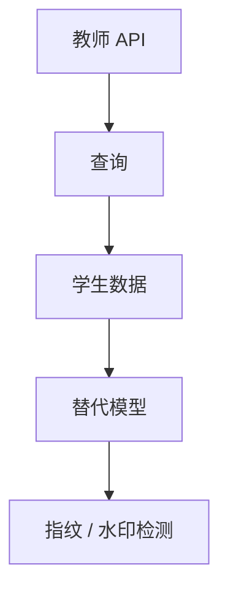

# 模型提取攻击

接口若稳定地回答查询，对手就可以拟合一个替代模型。保护的是行为与成本，不是把权重藏在机房里就结束。

<footer>—— Tramèr 等对模型提取的早期工作；对照 API 蒸馏与水印讨论</footer>

[上一课](/llm/dp-sgd)保护训练样本。本课转向部署：模型提取——用查询–响应拟合替代模型，逼近教师的决策边界或生成分布。缺口不是 [序列蒸馏](/llm/sequence-distill) 作为训练技术，而是**未经授权、以 API 为教师**的行为盗窃。后课指纹用来检测「像不像被偷的那份行为」。

## 问题

蒸馏课假定你拥有教师。提取假定对手只有黑盒或灰盒接口。语言模型上，提取表现为：大规模采样补全、用补全当 SFT 数据、得到能力接近的学生。缺口是把「开源复现」与「打 API 搬家」分开：前者用公开权重，后者消耗你的计量与可能的专有行为。

本课讲机制与监测，不提供高效提取的查询策略或绕过条款的办法。

提取的目标可以是任务准确率，不必是逐权重复现。对分类器，少量查询就能逼近边界；对 LLM，成本主要在 token 与多样性覆盖。

## 方法

防御侧公开讨论过的层：查询速率与账户风控、输出水印（[Kirchenbauer](/llm/kirchenbauer-watermark) / [SynthID](/llm/synthid-watermark)）便于事后举证、条款与审计、对异常长会话的抽样。监测：同一前缀的查询密度、学生模型在你特有错误模式上的吻合（后课指纹）。技术上无法让黑盒 API 在任意查询下既有用又不可学——只能提高成本与举证。

## 机制

若教师是确定性函数，查询就是标签。语言模型带随机采样，对手可以用低温度或多次采样降噪。学生容量足够时，行为在训练支持上可逼近；支持外仍可能分叉。这与 DP 正交：DP 不阻止学公共行为。

## 边界

不写攻击脚本。合法知识蒸馏、公开技术报告复现，不是本课对象。下一课指纹是检测工具，不是阻止查询的防火墙。安全等级与 RSP 会把「可提取的危险能力」当成部署门槛的一部分。

## 小结

- 提取：用接口行为拟合替代模型。
- 目标常是行为而非权重；成本在查询。
- 防御是成本、水印与审计，不是密码学保密。
- 出处：Tramèr 等；蒸馏与水印课。
