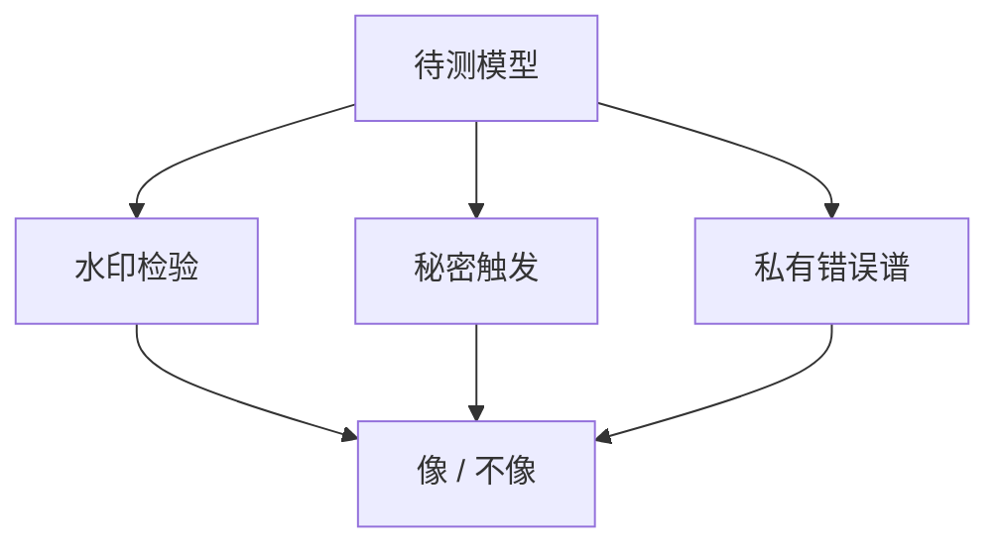

# 模型指纹

特有的错误、特有的水印、特有的触发完成，可以当指纹。指纹证明「像」，很少单独证明「就是偷来的权重」。

<footer>—— 对照水印与权重指纹文献；检测服务于提取与泄露，不是新的能力基准</footer>

[上一课](/llm/model-extraction-attack)留下举证缺口。本课补指纹：用行为或权重上的独特模式，识别「这是不是那一家的模型 / 学生」。缺口不是评测排行，而是取证——误报会冤枉独立训练，漏报会放过提取。

## 问题

开源微调、合并、量化会改变表面文风，但可能保留教师的特有缺陷或水印。产品需要：一组只有本模型（或本水印密钥）才会稳定表现的测试。公共基准题不能当指纹，人人都会。

指纹应在你控制的密钥或持有提示上，不应依赖「只有我们会答错这道著名题」——著名题会被下一版修掉，也会被别人碰巧答错。

## 方法

三类。**水印**：生成时嵌入统计模式，验证器持有密钥。**触发完成**：训练或系统层保留秘密前缀→固定短语（类似合法的后门，仅用于取证）。**错误谱**：在私有难例上的对错向量，比较学生与教师的相关。权重指纹（哈希、特定层统计）只适用于你仍能拿到参数的泄露场景。

## 机制

水印改变 token 采样的绿色列表，密钥未知则难以抹掉且难以伪造（在假设内）。微调、改温度、转写会衰减信号，验证要报功效。错误谱依赖「教师特有的失败」在蒸馏中被模仿——提取越成功，指纹越容易命中，这是故意的。

## 边界

指纹不能替代访问控制。秘密触发若泄漏，就变成可被滥用的后门，必须当密钥管。下一课安全等级把「危险能力是否可被提取到无门控学生」写进部署政策，指纹只是检测手段之一。

## 小结

- 指纹：水印、秘密触发、私有错误谱。
- 证明「像」，慎称「就是原权重」。
- 密钥与私有集是生命线；公共基准不是指纹。
- 出处：水印课；提取课。
