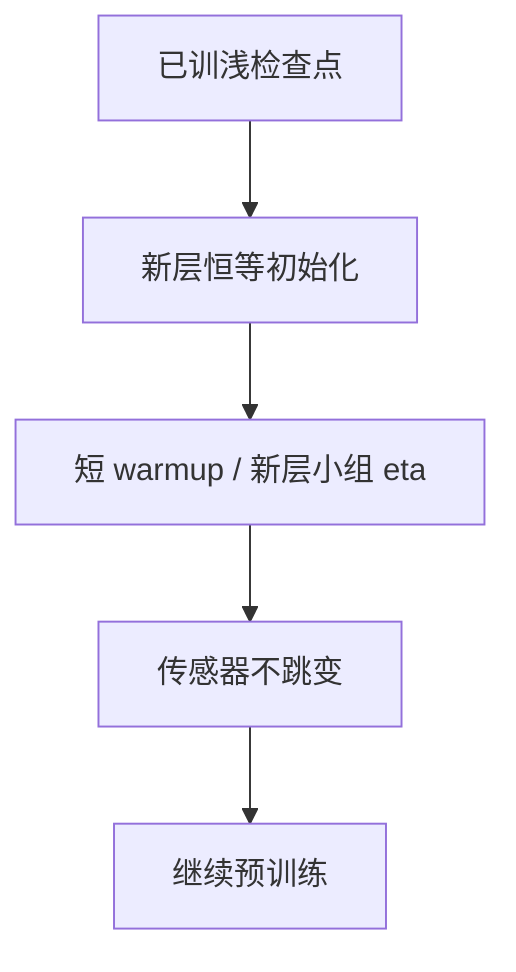

# 模型生长与深度扩展

把已训好的浅网复制、插层或叠成更深的初始化，比从随机深网再走一遍压熵段更省；但插入的恒等必须在数值上真是恒等。

<footer>—— Gong et al., Efficient Training of BERT by Progressively Stacking, ICLR 2019；Chen et al., bert2BERT, ACL 2022；Kim et al., SOLAR 10.7B 的 depth up-scaling, 2023</footer>

[上一课](/llm/proxy-model-experiments)要求形状改动先在代理上做应力测试。缺口是：目标不是从零加 $L$，而是已有检查点要**长深**。Gong 等人逐步 stacking BERT；Chen 等人的 bert2BERT 把小模型映射到大模型初始化；SOLAR 把层复制插进中段做 depth up-scaling。本课写生长的数值条件，接 [深度缩放](/llm/depth-scaled-init) 与残差恒等，不把生长写成免费的 $N$ 倍增。

## 问题

随机初始化一个更深的模型，压熵段要重买。生长希望：$x\leftarrow x+F_{\mathrm{new}}(x)$ 在起步时 $F_{\mathrm{new}}\approx 0$，旧层功能保留。实现手段：复制已有层、或插入 LayerScale $\alpha=0$ 的新层、或把相邻层插值成新层。失败模式：复制层的残差增量立刻翻倍（同一 $F$ 加两次），总线 RMS 跳变，注意力熵塌缩——稳定性单元的传感器会在生长后第一步报警。

宽度扩展（bert2BERT 一类）还要扩 $d$：矩阵要补行补列。补零保持函数恒等；补随机则破坏。μP 下扩宽应按 infshape 的方差补，而不是 Xavier 再来一遍不管旧权重。

复制层会复制注意力头的功能，也可能复制已经塌缩的头。生长不是治熵塌缩的药；先在源模型上把传感器调健康，再复制。

## 方法

深度扩展常见配方：

1. 选插入点（常在中后段，保留底浅层与顶层 LN/头）。
2. 新层初始化为恒等：$\alpha=0$，或输出投影乘 0，或 DeepNorm 系数按新 $L$ 重算。
3. 短 warmup / 小 $\eta$ 先训新层或全体，再回到原日程。
4. 代理上做：生长后 100 step 的总线 RMS、熵、LSE 相对生长前连续，不允许跳一个数量级。

SOLAR 式把层块复制再继续预训练，本质是用数据把「双份 $F$」重新正交化。预算仍要计入：生长后 $N$ 变了，$D$ 应按新的推理/训练最优重估，不能认为「已经训过浅的，深的白送」。

宽度扩展：对 $W$ 做切块复制或填零，嵌入补行要与词表课一致。tied 头与嵌入必须同步扩。

## 机制

恒等初始化使旧映射在函数空间连续。优化器状态 $m,v$ 对新增参数是 0，冷坐标碰上 [ε 课](/llm/adam-epsilon-update-scale) 的巨步——新层应更大 $\varepsilon$ 或更小 $\eta$，与嵌入分组同类。复制已有层若连 $v$ 一起复制，等于假设新层梯度统计相同，通常过猛；更稳是只复制权重、优化器状态清零，再用短 warmup。

Stacking 把浅网学到的回路重复两遍，可能加速深度方向的组合，也可能让模型满足于重复同一局部算法。后续训练必须有足够 $D$ 把重复回路拆开。否则只是更贵的浅网。

## 边界

本课不覆盖把 CNN 长成 Transformer。下一课的稠密→MoE 是另一类生长：复制 FFN 成专家，而不是插层。合并课则把**已有多个模型**合成，不增加深度。生长是单轨迹变形状；合并是多轨迹变一点。

## 小结

- 深度扩展靠插入函数恒等的层，避免双份 $F$ 把总线打飞。
- 新参数是冷坐标，优化器状态与 $\varepsilon$ 要分组；先在代理上查传感器连续性。
- 生长后 $N$ 变了，数据预算要重估；复制前先治源模型的熵塌缩。
- 只复制权重、清零 $m,v$，通常比连状态一起复制更稳。
- 出处：Gong et al., ICLR 2019；Chen et al., ACL 2022；Kim et al., SOLAR, 2023。
