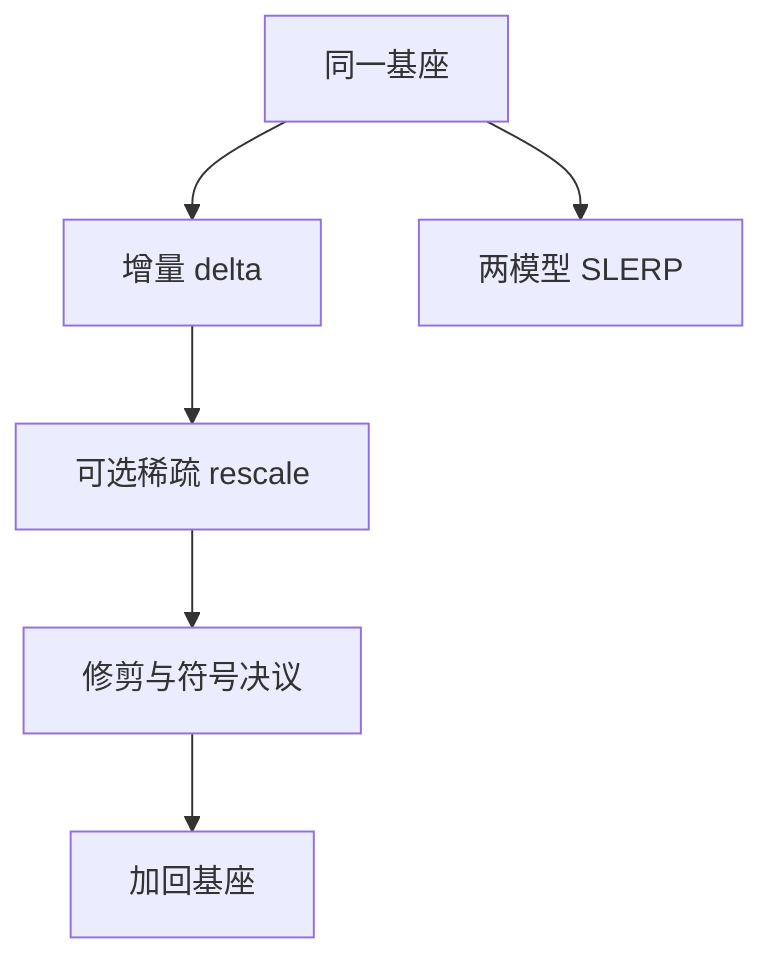

# 模型合并：SLERP / TIES / DARE

两个微调增量逐元素相加会在符号冲突处互相抵消；先对齐几何、再处理冲突与稀疏，合并才不像在参数空间里掷硬币。

<footer>—— Shoemake, Animating Rotation with Quaternion Curves, SIGGRAPH 1985（SLERP）；Yadav et al., TIES-Merging, NeurIPS 2023；Yu et al., Language Models are Super Mario (DARE), ICLR 2024</footer>

[上一课](/llm/dense-to-moe-upcycling)是单检查点变稀疏形状。[模型汤](/llm/model-soups-averaging) 是同一盆地里稠密均匀平均。缺口是：**任务不同、增量可能冲突** 的多个微调，如何合成一个权重。SLERP 在球面插值；TIES 处理符号冲突与量级修剪；DARE 随机丢掉增量再缩放。本课写三者的对象都是 $\delta=\theta_{\mathrm{ft}}-\theta_{\mathrm{base}}$，下一课把 $\delta$ 当成可加减的任务向量。

## 问题

均匀汤假设 $\theta^{(i)}$ 已在低损失连通集。指令微调 vs 代码微调，路径更长，$\delta$ 在同一坐标上符号可相反：直接 $(\theta_1+\theta_2)/2$ 把该坐标抹回基座，两个任务都丢。Yadav 等人的 TIES：修剪小增量、对齐符号（冲突则丢或投票）、再合并。Yu 等人的 DARE：以高概率把 $\delta$ 的坐标置零，剩余放大 $1/(1-p)$，发现微调增量极冗余，稀疏后仍能保任务，再与其他 $\delta$ 相加冲突更少。

SLERP：对两个权重（或增量）按球面线性插值，而不是欧氏直线。Shoemake 原本为旋转；在高维权重上这是启发式，当 $\|\theta\|$ 接近时与线性插值相近，范数差大时避免欧氏平均缩范数。它不管符号冲突，常作两模型之间的几何，不是多任务冲突的主工具。

合并在 FP32 的 $\delta$ 上做。基座必须逐比特同一检查点。词表或层数不同，没有逐元素 $\delta$。

## 方法

统一流程：

1. 固定基座 $\theta_0$，算 $\delta_i=\theta_i-\theta_0$。
2. **可选 DARE：** 独立 Bernoulli 保留，再 rescale。
3. **可选 TIES：** 按幅值修剪；符号冲突决议（多数或丢弃）。
4. 求和或加权求和 $\delta$，加回 $\theta_0$。
5. 两模型、无冲突需求时，可用 SLERP$(\theta_a,\theta_b;\lambda)$ 代替欧氏。

与汤的选择：同一任务多样超参 → 汤或 EMA；多任务增量 → TIES/DARE。不要对已经汤过的权重再当 $\delta$ 用不同基座减——基座要对齐。

验收：各源任务的验证集；合并后若一任务崩、另一任务满血，是冲突决议吃掉了前者的符号。调修剪率而不是再加学习率去「修」合并模型。

## 机制

微调增量冗余（DARE 的经验）：很多坐标的 $\delta$ 对损失不敏感，丢掉它们减少与其他任务冲突的表面积。TIES 的符号对齐承认：冲突坐标没有线性好解，与其平均成 0，不如选一侧或置零。SLERP 保范数，避免欧氏平均把两个同方向大向量收成更短的向量从而改变有效学习后的尺度——这与激活尺度课同类，只是发生在权重范数上。

## 边界

合并不是训练，没有 $m,v$。合并后若再微调，优化器状态应从 0 起。许可与安全：合并会混合各源的行为，包括拒绝策略，本课只写数值。下一课把 $\delta$ 显式命名为任务向量，做加减算术。

## 小结

- 多任务增量用 $\delta$ 空间；汤用同一盆地的稠密平均。
- DARE 利用增量冗余降冲突表面积；TIES 处理符号；SLERP 是两模型球面插值。
- 基座与精度必须对齐；崩了调修剪/决议，不要当新模型去猛训掩盖。
- 合并后无 Adam 状态，再训从 0 计。
- 出处：Shoemake, SIGGRAPH 1985；Yadav et al., NeurIPS 2023；Yu et al., ICLR 2024。
