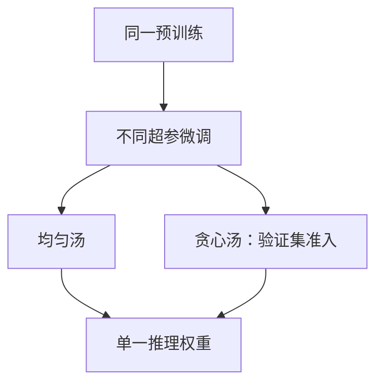

# 模型汤与权重平均

同一预训练出发、用不同超参微调得到的权重点，往往仍在一个可线性连结的盆地里；均匀或贪心的平均能提高准确率与鲁棒，而不增加推理成本。

<footer>—— Wortsman et al., Model Soups: Averaging Weights of Multiple Fine-Tuned Models, ICML 2022</footer>

[上一课](/llm/ema-checkpoint-averaging)平均的是一条轨迹上的时间。缺口是**多条轨迹**：同样的预训练初始化，扫不同学习率、增强、种子，得到 $\theta^{(1)},\ldots,\theta^{(k)}$。Wortsman 等人把它们的均匀或贪心平均称作 model soup：推理仍是一个模型，成本与单体相同。本课写「可汤」的前提——线性模式连通性——以及与 EMA 的差别。后课的确定性与 SDC 会问：你平均的那些点，是否在数值上真的是你以为的那些点。

## 问题

独立训练的两个随机初始化，平均通常毁掉特征（置换对称、不同盆地）。微调则从**同一**预训练点出发，沿较短轨迹走，Nagarajan 与 Kolter、Frankle 等人观察到这些微调解之间常常存在低损失的线性路径。Wortsman 等人利用这一点：在超参网格上得到许多微调检查点，再

- **uniform soup：** $\bar\theta=\frac1k\sum_i\theta^{(i)}$；
- **greedy soup：** 按验证指标排序，依次加入能使汤变好的点。

增益来自误差不一致：各超参过拟合的方向不同，平均把它们抵消。推理 FLOPs 不变，这与ensemble 的 $k$ 次前向不同。

对从零预训练的两条大模型轨迹，连通性没有保证，汤可能失败。本课默认场景是「共享预训练 + 多样微调」，或「同一配方不同种子的短跑」。把两个不同数据配比训到结束的基座直接对半切，不属于 model soup 的原论文主张。

平均在 FP32 里做。BF16 权重直接相加会丢尾数，汤的增益可以被舍入吃掉。存盘的是平均后的高精度，再量化。

## 方法

候选必须对齐：同一架构、同一词表、同一层数，参数向量逐元素可加。LoRA 汤应先合并到基座或只汤同秩适配器。greedy soup 需要一块验证集；用测试集做贪心是泄漏。uniform soup 不看验证，更保守，失败时整体变差的风险是「所有点都偏同一方向」——此时汤不增加多样性。

与 EMA 叠用：每个微调轨迹先 EMA，再把各 $\bar\theta^{(i)}$ 做汤，是合理的两级平均。不要把同一轨迹的每步检查点既当 SWA 又当汤的 $k$ 个成员——成员之间相关性过高，汤退化成 SWA。

报指标时声明是汤还是 ensemble。汤的延迟与单体相同；若有人用汤的数字和 ensemble 比 SOTA，必须写清推理次数。

## 机制

线性连通意味着 $\theta(\alpha)=(1-\alpha)\theta^{(1)}+\alpha\theta^{(2)}$ 上损失不高。平均是 $\alpha=1/k$ 的多点推广。失败模式：某次微调已经走远（大学习率、训太久），离开共享盆地，贪心会拒绝它，均匀汤会被它拖坏——所以均匀不是免费午餐。另一失败：分类头类别置换或不同词表，逐元素平均无意义。

鲁棒性：不同增强下的微调对分布偏移的破坏方向不同，汤在 ImageNet 分布外上的收益是原论文重点之一。语言指令微调同构：不同提示模板 / 不同 $\eta$ 的 SFT 可以汤，但 RLHF 之后的策略可能不在同一线性盆地，不要默认能汤。

## 边界

TIES / DARE / SLERP 处理的是**冲突符号与稀疏增量**，那是合并课，对象常是不同任务的 delta。Soup 假设点已经在同一盆地、做稠密均匀平均。下一课先把「你存下来的 $\theta$ 是否可复现」钉住，再谈更复杂的合并；否则汤的增益与随机种子不可分。

## 小结

- 模型汤平均的是共享预训练上的多样微调，推理成本等于单体。
- 均匀汤与贪心汤：后者用验证集拒远点；前者更脆。
- 与 EMA 是时间 vs 超参两条轴，可两级叠，不要把同轨迹检查点冒充多样性。
- 不同词表、过远的 RL 策略、随机初始化的两条预训练，不在原论文范围内。
- 出处：Wortsman et al., ICML 2022。
