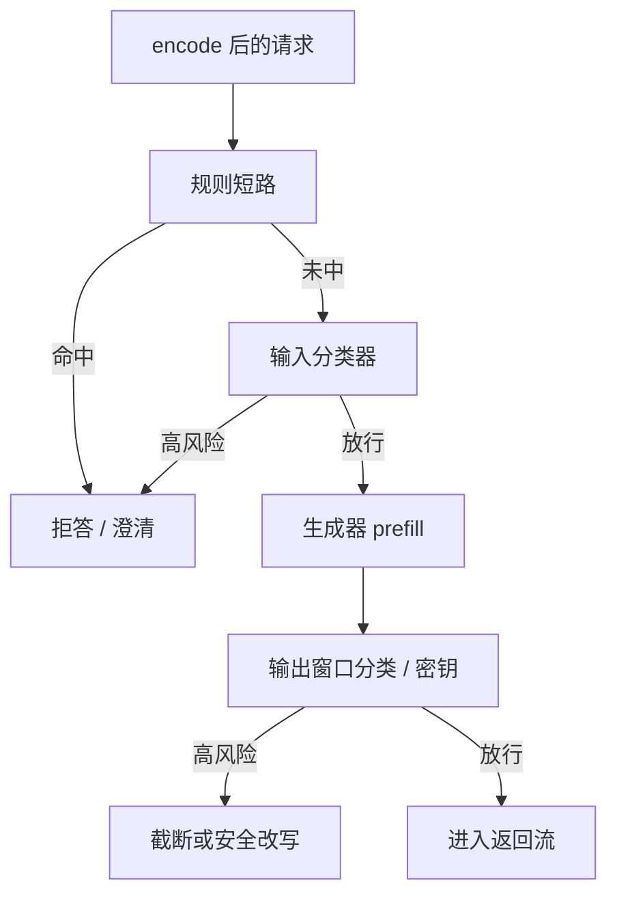

# 内容安全同步卡点

    
政策要在第一个生成 token 之前给出可审计的放行或拒绝；卡点加在关键路径上，TTFT 必然付一次分类器或规则的墙钟，失败策略必须先写成闭还是开。

    <footer>—— 对照 Llama Guard 一类输入门放在生成器之前，以及产品把审核做成同步依赖</footer>

输出过滤可以在话说完再判；同步卡点要求**生成开始前**（以及可选的流式窗口上）已经有一个安全决策。输入侧拦的是不允许的求助意图，避免把有害请求做成一次完整前填；输出侧同步则是在首段或每个窗口离开系统之前再判一次。Inan 等人的 [Llama Guard](/llm/llama-guard) 把分类器做成可独立更新的指令模型；规则与密钥探测并行。本篇写卡点在服务路径上的位置、对 [TTFT](/llm/ttft) 的税、以及失败是闭是开。不写如何绕过审核，不提供越狱或注入样本，不把类别表展开成攻击字典。

## 问题

只靠生成器自己拒答，政策与有用性抢同一组权重，边界难以热更新，审计也拿不到「哪一条政策被触发」。只做异步事后扫描，有害内容已经流到用户屏幕或工具 API。同步卡点把决策提前：输入高风险则不进引擎；输出高风险则截断、换安全回复或送人审。代价是关键路径变长，且多一个会失败的依赖——分类器超时、过载、误判。

输入门与输出门不是同一任务。输入拦意图，漏了会浪费前填并可能在工具参数里造成副作用；输出拦泄漏与有害生成，只做输入挡不住「无害提问、危险续写」。两端都同步时，TTFT 含两次小模型前填（输出门若等完整答案则不进 TTFT，而进 E2E）。产品必须声明测点，见 [TTFT 分位](/llm/ttft-percentiles)。

### 同步的含义是决策阻塞调度

「同步」不是「和生成器同一个进程」，而是：没有放行令牌，调度器不准把该请求编进前填运行集。实现可以是网关 RPC 到审核服务、或引擎内嵌规则。只要前填可能已经开始，就不是输入同步卡点——那是尽力而为的旁路扫描。工具调用同样：参数出门之前要有一次卡点，否则外部副作用比文本更难撤回。

过拒绝与漏放必须成对扫阈值。只报「拦截率」会激励把阈值拧死；只报「有用性」会激励把卡点关掉。工作点按政策类别分开：自伤与版权的代价不同，不要共用一个分数线。

## 方法

路径写成流水线。请求经模板与 encode 之后、[token 限流](/llm/token-ratelimit) 通过之后，跑输入规则（密钥、内网 URL、明确违禁模式）与输入分类器。规则命中可短路，不必等模型。分类器吃对话片段，吐 `safe`/`unsafe` 与类别；短解码或读 `unsafe` 的对数概率当分数。放行才进入连续批。拦截返回固定安全回复或澄清，HTTP 仍可以 200（内容是拒答）或 4xx，契约要统一，避免客户端把拒本当成服务器错误而重试——重试会把有害请求再打一遍。

输出侧有两种同步强度。强：缓冲到完整答案或到第一个可判断窗口再放行，流式 TTFT 变差或变成「先空白再整段」。弱：先流出低风险前缀，窗口分类器并行，命中则截断并覆盖已发送内容——已发送的字在客户端可能撤不回，工具副作用更撤不回，故工具路径应用强同步。流式窗口不要把半截 UTF-8 或半截 JSON 送进分类器。

失败策略预先写死。审核服务超时：闭（fail-closed）则拒答或 503，安全优先、可用性掉；开（fail-open）则放行并打紧急指标，可用性优先、漏放风险升。没有第三种「再等一会儿」可以当默认——那会把 TTFT 尾巴写成审核尾延迟。[熔断](/llm/circuit-breaker) 若在审核依赖上打开，等于临时改成 fail-open，必须有级别授权与审计。

## 机制

TTFT 预算变成

$$
T_{\mathrm{TTFT}} = T_{\mathrm{queue}}+T_{\mathrm{prep}}+T_{\mathrm{mod}}+T_{\mathrm{prefill}}+T_{\mathrm{sample}}^{(1)}.
$$

$T_{\mathrm{mod}}$ 主要是分类器前填，长度等于送审文本，与主模型前填抢 CPU/GPU。应用更小规格、量化、或只对高风险路由（例如工具开启、新会话）调用重分类器，轻流量走规则。分类器与生成器应尽量异构：不同家族、不同对齐数据，降低共模越狱；这会再加一份运维，见 [输出过滤](/llm/output-filter)。

### 审核容量是关键路径的一部分

卡点还会改变队列形状。同步审核的 QPS 上限若低于主模型，审核先饱和，主 GPU 空转，看板显示 GPU 利用率低、TTFT 却差——根因在卡点容量，不在注意力。容量规划要把审核副本算进关键路径，而不是当成可有可无的微服务。

提示注入把政策写进用户或工具返回里，试图让生成器忽略系统说明。输入卡点应把不可信段标成数据而不是指令；这是防御姿态，细节见提示注入专文。本文不讨论如何构造注入。

## 边界与工程取舍

同步卡点守不住的东西要承认。分类器是另一台语言模型，长上下文稀释、对抗后缀、多模态「图里写字」都可以让它失败；它是可版本化的门，不是根证书。多模态必须有看图/听音频的审核，否则输入门是盲的。内部员工调试通道若绕过卡点，应在另一套网络与审计里，不要用同一对外 URL 加秘密头——头会泄漏。

### 延迟与漏放无法同一旋钮拧掉

延迟与安全的权衡无法用一个核按钮消掉。把审核挪到异步，TTFT 好看，漏放窗口变大。把审核模型加大，漏放下降，P99 TTFT 上升。应在 [goodput](/llm/goodput) 里把「政策合格」与「延迟合格」写成联合约束：又快又违规的完成数不是有效吞吐。

日志存类别与分数以便审计漏放，不要把完整有害输出写入广可访问的工单。评测用公开套件的官方标签，不在文档展开失败样例全文。

## 小结

- 同步卡点阻塞前填（输入）或阻塞出站（输出/工具）；旁路扫描不是同步。
- TTFT 含 $T_{\mathrm{mod}}$；审核容量不足时主 GPU 会空转，分位要切片到 moderate 跨度。
- 超时是闭还是开必须预先写成政策；熔断等于改政策，要授权。
- 输入门与输出门分列评测；工具路径用强同步，因为副作用难撤回。
- 分类器与生成器异构可降共模失败，但不能声称不可攻击。
- 出处：对照 Inan 等 Llama Guard（2023）的输入/输出门，以及把审核放在生成关键路径上的工程惯例。
