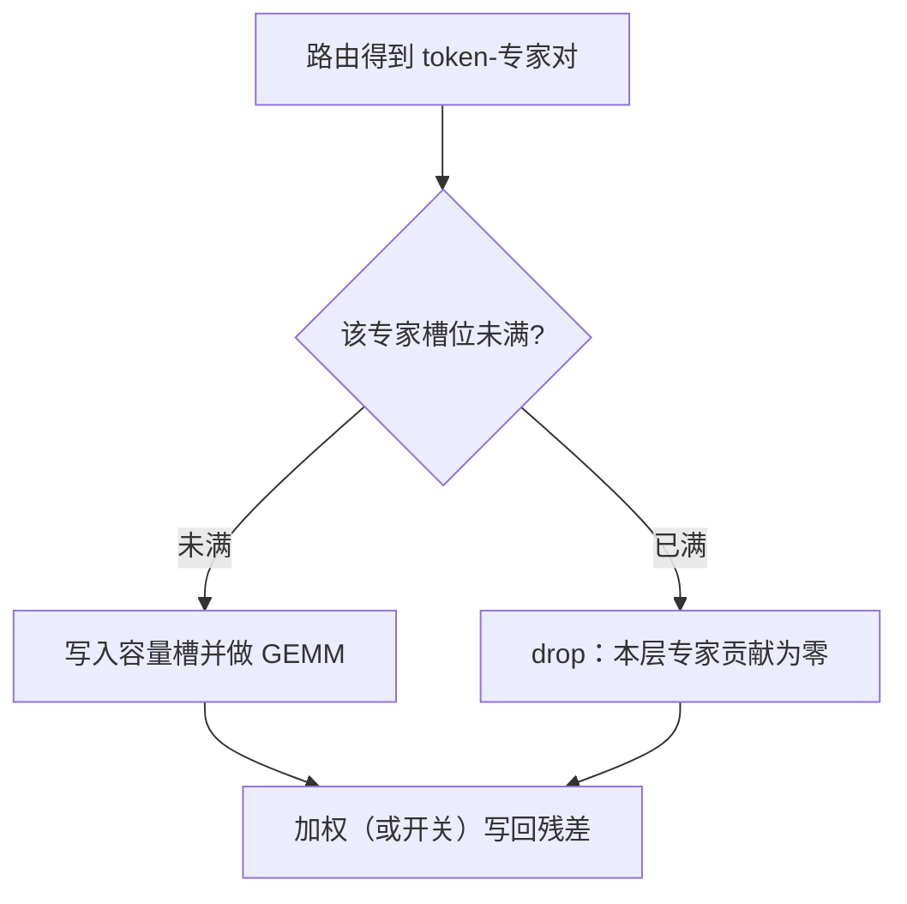

# Capacity factor

专家一次能吃下的 token 数不是无限的；容量因子把「想去这个专家的人」裁成一块固定大小的桶，多出来的要么丢掉，要么改道。

<footer>—— Lepikhin et al., GShard, 2020；Fedus, Zoph, Shazeer, Switch Transformers, 2021</footer>

[上一课](/llm/moe-inference-cache)把推理侧写成热专家常驻、冷专家按需加载。本课回到训练图里那条更硬的约束：即使专家权重全在 HBM 上，每个专家每个 step 也只能处理有限个 token。GShard 与 Switch 把这条上限写成 **capacity factor**（容量因子）。[负载均衡损失](/llm/moe-load-balance)只能软性地把流量往均匀推；容量因子是硬截断。后面的 Dropless、Expert-choice 都默认你会本课的桶大小，不再从「为什么 MoE 要路由」讲起。

## 问题

[MoE 路由](/llm/moe-routing)给每个 token 一个 top-$k$ 专家集合。若实现按「谁被点到就算谁」，热专家会在一次 All-to-All 里收到远超本地算力与激活缓冲的 token，冷专家空转。通信缓冲、专家 GEMM 的 batch 维、以及按专家切分的张量形状，都需要在编译期或至少在 step 开始时知道上限。没有上限，图无法静态分配，过载专家还会把整卡打满。

于是训练必须回答：专家 $i$ 这一步最多处理多少 token？设一批有 $T$ 个 token、一层 $N$ 个专家、每个 token 选 $k$ 个专家，均匀负载下每专家应分到

$$
c_{\mathrm{eq}} = \frac{kT}{N}.
$$

容量因子 $\mathrm{CF}$ 把实际上限写成 $C = \lceil \mathrm{CF}\cdot c_{\mathrm{eq}}\rceil$。$\mathrm{CF}=1$ 表示刚好按均匀切；$\mathrm{CF}>1$ 留出余量给暂时不均；$\mathrm{CF}<1$ 则故意欠载、逼更多 drop。Switch 常用 $1.0$–$1.25$ 这一档。问题不是「要不要稀疏」，而是：**过载时丢掉哪些 token，以及丢掉之后梯度还算不算 MoE**。

### 容量是通信与计算的同一把尺子

All-to-All 的发送缓冲按 $N\times C$ 开，不是按「这一步实际路由结果」开。$\mathrm{CF}$ 每加 $0.25$，缓冲与专家侧 GEMM 的 token 维一起涨。它同时是算力税和显存税。推理缓存课里的 $C$ 是「HBM 里能钉住几个专家权重」；本课的 $C$ 是「一个专家这一步能吞几个激活」。两个 $C$ 不要混用。把容量因子理解成「模型有多宽」是错的。总参数仍是 $N$ 份专家；$\mathrm{CF}$ 只改每个 step 真正算完的 token–专家对数目，以及有多少对在门口被扔掉。

## 方法

对每个专家维护一个长度为 $C$ 的槽。路由给出 token $t$ 的专家 $e$ 之后，若 $e$ 的已占用槽 $<C$，则把 $t$ 写入该槽；否则该 $(t,e)$ 对 **drop**：前向里该专家对 $t$ 的贡献视为零（或残差旁路原样穿过），反向里这条边没有专家梯度。Switch 还讨论过把路由概率乘回输出；drop 发生时乘的是零贡献，等价于这个 token 在这一层没走稀疏 FFN。

实现上常见两种计数。一是按全局 batch 统计 $T$，所有设备用同一 $C$。二是按本卡局部 token 数统计，EP 组内再 All-to-All。局部计数在数据并行不均时会让有的卡先满，表现为「同一超参、不同切片 drop 率差一截」。论文数字必须写清 $T$ 是全局还是每卡。

### 谁先占用槽，决定谁被丢

槽位分配不是数学恒等，而是一种仲裁。按序列位置从左到右填，会系统性地丢掉右侧 token——长文档的后半段更常被丢。按路由分数从高到低填，保住「路由器最自信」的对，丢掉犹豫的对。按随机排列填，无位置偏见，但不可复现性上升。GShard / Switch 的工程默认多是确定性的位置序或分数序；换序会改有效数据分布，不是无害的实现细节。

## 机制

drop 把稀疏变成**随机深度的近亲**：被丢掉的 token 这一层退回「只走残差 / 共享部分」。若 drop 率长期很高，有效深度变浅，主损失会逼路由器把流量挤进尚未满的专家——这与[辅助损失](/llm/moe-load-balance)的均匀先验同向，但辅助损失在 drop 之前就作用，容量因子在 drop 之时作用。只加 $\mathrm{CF}$、不加均衡，热专家先满、冷专家仍饿，drop 集中在热专家门口，冷专家依然学不到东西。

$\mathrm{CF}$ 与 $k$ 耦合。$k=2$ 时每个 token 占两个槽，同等 $T,N$ 下 $c_{\mathrm{eq}}$ 翻倍，同样 $\mathrm{CF}$ 的绝对槽数也翻倍。Switch 把 $k$ 收到 $1$，一个动机就是让容量账更简单：每个 token 最多占一个专家的一个槽。Mixtral 式 $k=2$、$N=8$ 时 $\mathrm{CF}=1$ 意味着每专家 $T/4$ 个槽，看起来很宽裕，但若路由崩到两三个专家，那两三个仍会先满。

评测 drop 不要只报平均值。按专家、按序列位置、按语言 / 代码子批切开会看到：被丢的往往是已经处于分布尾部的 token。平均 drop 率 1% 可以掩盖「某一层某一专家 20%」的局部事故，那种事故会在长训里变成损失尖峰的伏笔。

### 容量余量换的是什么

$\mathrm{CF}=1.25$ 相对 $1.0$，多付 25% 的专家侧计算与通信，换来更少的硬截断。训练早期路由还在随机游走，余量很值钱；训练后期若辅助损失或偏置已经把 $f_i$ 拉平，余量的边际收益下降，可以逐步把 $\mathrm{CF}$ 收回来省算力。把它当成全程常数，是图编译图省事，不是最优策略。动态 $\mathrm{CF}$ 则要能改 All-to-All 形状或始终按峰值开缓冲——后者等于从来没省过。

## 边界与工程取舍

容量因子不能替代路由质量。$\mathrm{CF}$ 很大时几乎不 drop，模型可以靠「所有人挤进好专家、好专家桶够大」活着，均衡损失的梯度变弱，崩溃被推迟到你开始收紧 $\mathrm{CF}$ 的那天。反过来，$\mathrm{CF}<1$ 是一种正规化：强迫一部分 token 跳过 MoE，类似 LayerDrop，但选择集由路由拥塞决定，不是由层号决定，对长尾语言不公平。

生成服务里没有「按 batch 预留 $C$ 个槽再 All-to-All」这一套时，容量因子通常不再以训练原义出现；decode 逐步、每步 token 少，过载改成[专家缓存](/llm/moe-inference-cache)的缺页，而不是 drop。不要把训练日志里的 drop 率直接翻译成线上 TTFT。微调若冻路由器、只训专家，训练期的 $C$ 仍在，但路由分布已经定型，drop 模式会与预训练不同，需要单独盯。

Switch 文中的容量实验是「同一 FLOPs 预算下 $\mathrm{CF}$ 怎么选」，不是「$\mathrm{CF}$ 越大质量越好」。引用时要带上他们当时的 $k=1$、TPU 切片和辅助损失系数；把 $\mathrm{CF}=2$ 抄到 GPU EP + top-2 上，桶的绝对大小已经不是同一物件。

## 小结

- 容量因子把每专家每 step 的 token 上限写成 $C=\lceil\mathrm{CF}\cdot kT/N\rceil$，是硬截断，不是软损失。
- 槽满则 drop：该 token–专家对本层贡献为零；仲裁顺序（位置 / 分数 / 随机）会改有效数据。
- $\mathrm{CF}$ 同时放大 All-to-All 缓冲与专家 GEMM；余量换的是少 drop，不是更多参数。
- 只加大容量、不均衡负载，热专家门口仍丢、冷专家仍饿。
- 训练期的 $C$ 与推理期「能缓存几个专家权重」不是同一个量。
- 出处：Lepikhin 等，GShard；Fedus、Zoph、Shazeer，Switch Transformers。
