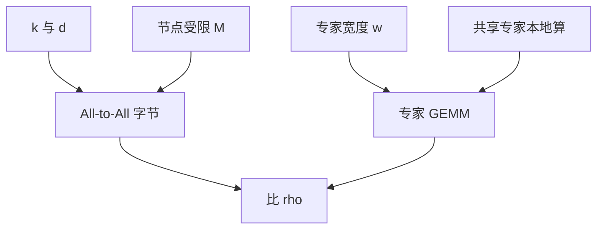

# MoE 的通信-计算比

稀疏省的是专家内部 GEMM；All-to-All 把隐状态按路由搬动，带宽不够时 MoE 比稠密更慢。

<footer>—— Lepikhin et al., GShard, 2020；实现侧亦见 MegaBlocks 对分组 GEMM 与通信重叠的处理</footer>

[层次 MoE](/llm/hierarchical-moe)、[节点受限](/llm/node-limited-routing)、[Switch](/llm/switch-transformer) 都改扇出，但课序还没有把「何时划算」写成一条比。本课补通信-计算比：一次 MoE 层里，跨设备字节对专家 FLOPs 的比值，以及 $d$、$k$、$M$、专家宽度如何进公式。后课抖动是质量问题；本课是能不能跑满硬件。主干 [MegaBlocks](/llm/megablocks) 给分组 GEMM，不重复其实现。

## 问题

稠密 FFN 的通信主要是张量并行切 $d$，有成熟重叠。MoE 多一次按 token 的动态 All-to-All：体积 $\approx \mathrm{batch}\times n \times k \times d \times \mathrm{bytes}$ 量级（还要算回程）。计算 $\approx \mathrm{batch}\times n \times k \times \mathrm{FLOPs}(E)$。专家很窄、 $d$ 很大、$k$ 不小时，比值恶化，机器在等网。缺口是设计时先算这条比，再决定 $N$、宽度、层次，而不是先定 $N=64$ 再发现机群跑不满。

计算里不要漏掉未选专家：它们 FLOPs 为零，但若权重仍要在设备间同步（优化器状态），那是另一次通信账，属数据并行 / 专家并行的放置，本课主账是前向 All-to-All。

## 方法

粗公式：令每 token 激活 $k$ 个专家，每专家 FLOPs 为 $c\cdot d\cdot w$（$w$ 为中间宽），每 token 通信字节为 $2k d b$（去回）。比 $\rho=\mathrm{comm}/\mathrm{comp}\propto (k d)/(k d w)=1/w$。**专家越宽，$\rho$ 越好**；切细粒度窄专家，$\rho$ 变差。$k$ 在分子分母同阶，对 $\rho$ 影响弱于 $w$，但 $k$ 增大会增绝对通信，延迟仍涨。节点受限把有效对端从 $P$ 台收到 $M$，延迟与争用下降，体积若仍 $k$ 份向量则字节相近，但拓扑更局部。

重叠：计算当前层注意力时发上一层 MoE 的通信，或分组 GEMM 与通信流水。$\rho$ 接近 1 时重叠也救不了。设计目标是让专家 GEMM 明显长于 All-to-All 的传输时间。

### 与张量并行叠

注意力仍 TP，MoE 常 EP（专家并行）。两条通信域争用同一张网。报 $\rho$ 应在真实并行策略下测，而不是单机公式。层次 MoE 若组=EP 组，第一跳便宜。

## 机制

细粒度专家在质量与粒度律上可能赢，在 $\rho$ 上输。这就是为何共享专家（本地常开、无 All-to-All）能改善系统：一部分 FLOPs 变回稠密本地 GEMM，拉低平均 $\rho$。哈希与节点受限改善的是争用与跳数，不一定减少字节。Soft MoE 对所有专家通信，$\rho$ 最差。

容量因子过小导致 drop，表面上通信变少（丢了 token），质量掉，不是合法降 $\rho$ 的方法。把专家复制到每台机器可以去掉 All-to-All，但内存按 $N$ 倍涨，只适合小 $N$。$\rho$ 恶化时先考虑加 $w$、加共享专家、收 $M$，再考虑复制。

推理 batch 小，$n$ 的有效值小，All-to-All 启动开销主导，$\rho$ 比训练更差。服务 MoE 要用足够的 token 聚合，或接受本地专家复制。

## 边界

本课公式忽略拓扑非均匀（机柜内外差一个数量级）。真实选型要按链路测。下一课路由抖动会让通信体积随步变化，使 $\rho$ 的方差变大，缓冲更难。粒度律课会与 $\rho$ 对质：质量要更细的专家，系统要更宽的专家，折中点不是纯损失最小点。

## 小结

- MoE 的系统可行性由 All-to-All 字节对专家 GEMM 的比决定；专家宽度 $w$ 是最敏感项。
- 细粒度窄专家伤 $\rho$；共享专家、节点受限、通信重叠是补救。
- $k$ 对 $\rho$ 同阶相消，但仍增延迟与争用。
- 推理小 batch 时启动开销使情况更差。
- 出处：Lepikhin et al., 2020；MegaBlocks 一类实现。
