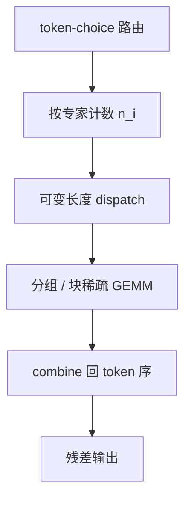

# Dropless MoE

若专家侧的矩阵乘可以按实际到达的 token 数长成不规则块，过载就不必再把 token 扔掉。

<footer>—— Gale, Zaharia, Young, Yosinski, MegaBlocks, 2023</footer>

[上一课](/llm/moe-capacity-factor)把过载收成容量槽：满了就 drop。drop 让静态图好编译，却把一部分 token 的 MoE 层变成残差空转，质量与负载统计都被截断污染。Gale 等人的 MegaBlocks 问的是另一条路：**不要固定 $C$ 再丢，让每个专家的 GEMM 吃下这一步真正分到的全部 token**。这就是 Dropless MoE 的核心：负载仍可以不均，但不靠丢 token 来保护形状。本课不重讲 $\mathrm{CF}$ 的公式，只补「去掉硬截断之后，不规则专家 batch 怎么算、通信怎么写」。

## 问题

[容量因子](/llm/moe-capacity-factor)的前提是：专家计算必须是形状固定的稠密核——$C$ 行、$d$ 列，空槽用 padding 填零。padding 浪费算力；drop 浪费数据。二者都是在迁就「编译期必须知道 $C$」。若某专家这一步分到 $n_i$ 个 token，$n_i$ 随 step 变，标准 batched GEMM 要么 pad 到 $\max_i n_i$，要么对每个专家发一次不同形状的核启动。前者在负载不均时把冷专家的空行也算一遍；后者把启动开销打满，吞吐崩掉。

Dropless 要同时满足：零 drop（每个被路由到的 token 都真正进专家）、尽量少的 padding、以及仍能走 GPU 上高效的块稀疏 / 分组 GEMM。它解决的不是「如何选专家」——路由仍可以是 Switch 式 token-choice——而是 **选完之后如何计算**。

### drop 会污染你以为已经均衡的统计

辅助损失里的 $f_i$ 统计的是「路由器点名了谁」。若点名之后又 drop，真正更新参数的频率是 $f_i^{\mathrm{eff}}<f_i$。日志里看起来均匀，专家梯度仍偏。Dropless 让 $f_i$ 与有效更新对齐，均衡损失这才作用在真实计算上。「Dropless」不是「无容量约束」。设备显存与通信缓冲仍有物理上限；只是上限不再翻译成按 $\mathrm{CF}$ 丢 token，而是翻译成「这一步 $n_i$ 太大就 OOM 或改用更慢的回退」。工程上仍要盯 $\max_i n_i$。

## 方法

MegaBlocks 把一层 MoE 收成**块稀疏矩阵乘**：把各专家的 token 排成一组不规则行块，专家权重是对应的列块（或反过来），用专门的 block-sparse kernel 一次打完，而不是 $N$ 次稠密 GEMM。Tutel、Megatron-LM 后来的 Dropless 路径则常用 **grouped GEMM**：一次 kernel 内对 $N$ 组不同 $M$ 维的乘法做分组发射，避免 $N$ 次启动。两条实现共享同一接口：

$$
y_t = \sum_{i\in\mathcal{E}(x_t)} p_i(x_t)\, E_i(x_t),
$$

对每个 $i$，$E_i$ 的输入行数等于实际分到的 $|\{t:i\in\mathcal{E}(x_t)\}|$，不再截成 $C$。

通信仍要两次 All-to-All（dispatch / combine），但 payload 长度按真实 $n_i$ 变。静态 NCCL 计划若假定固定 $C$，Dropless 就要走可变长度集合通信，或先做一次计数 All-to-All 再传激活。这是 Dropless 相对 Switch 参考实现多出来的运行时。

### 不规则 batch 的反向

前向可变，反向的路由梯度仍只沿被选中的专家走，与[下一课](/llm/moe-router-gradient)将展开的 straight-through 是同一条链。差别只在：没有因 drop 而人为断开的边。实现必须按与前向相同的 permutation 把梯度 scatter 回 token 序，permutation 本身由路由下标构成，不可与下一 step 复用。

## 机制

去掉 drop 之后，过载专家的 $n_i$ 可以远大于 $kT/N$。该专家这一步的 GEMM 更重，成为步内 straggler；整层墙钟由 $\max_i n_i$ 决定，而不是由平均值决定。Dropless 因此**把质量问题变成同步问题**：token 都算了，但最快卡要等最慢专家。负载均衡损失、专家偏置、辅助 z-loss，在 Dropless 下的首要服务对象从「少 drop」变成「压低 $\max_i n_i$」。

与 padding-to-$C$ 对比：固定容量时，过载被截断，straggler 被人为砍掉，墙钟可预测、质量不可预测。Dropless 相反：质量更接近「路由器真正想要的计算图」，墙钟跟负载峰值走。训练初期路由噪声大，峰值比均值可以高数倍，这时 Dropless 的 step 时间方差会明显高于 Switch+$\mathrm{CF}=1.25$。这不是核写错，是负载的物理后果。

有人用「token 放到最近的未满专家」当 dropless 的替代。那是改路由，不是改核：token 进了它没选的专家，等价于另一种 drop（丢掉原选择）。MegaBlocks 意义上的 Dropless 保留原选择，只改计算形状。

### 何时仍要人为封顶

显存峰值按 $\sum_i n_i \cdot d_{\mathrm{ff}}$ 的激活计，极端崩溃时某一专家吃下几乎全部 $kT$ 个槽位，单专家激活可以打爆 HBM。生产配方往往加一个**软顶**：超过某 $n_{\max}$ 才 drop 或拆成两拍。这与经典 $\mathrm{CF}$ 不同——$n_{\max}$ 设在分布的极尾，平时不触发，只防爆炸。把它设成 $c_{\mathrm{eq}}$ 就退回有 drop 的 MoE，只是核仍是 grouped GEMM。

## 边界与工程取舍

Dropless 对「专家数很大、$k$ 很小、负载已经较均」最划算：不规则核的收益来自少 padding，均衡之后 $n_i$ 接近，grouped GEMM 接近一块大方阵。专家很少且经常崩到 $1$–$2$ 个热专家时，核再快也救不了 straggler，应先修路由。微调 batch 远小于预训练时，$n_i$ 更稀疏，kernel 启动占比上升，Dropless 的吞吐优势会缩小甚至倒挂，需要单独 profile。

与[推理专家缓存](/llm/moe-inference-cache)正交：缓存决定权重在不在卡上；Dropless 决定激活按什么形状乘。Decode 一步只有几个 token，$n_i\in\{0,1,2\}$，不规则核没有用武之地，服务运行时几乎总是稠密小 GEMM 或直接跳过未选专家。不要把训练用的 MegaBlocks 核原样搬到 decode。

引用 MegaBlocks 时分清两件事：块稀疏核，以及「训练可不 drop」。后者是系统设计；前者是实现手段。用普通 foreach-expert 稠密 GEMM 也可以零 drop，只是慢。论文的速度数字绑定他们的核，不是绑定「dropless」四个字母。

## 小结

- Dropless 去掉按 $\mathrm{CF}$ 丢 token，让每个被点名的 token–专家对都真正做 GEMM。
- 实现靠块稀疏或 grouped GEMM 消化不规则 $n_i$，通信改为可变长度。
- 墙钟由最忙专家决定；均衡损失的任务从「少 drop」转为「压峰值」。
- 极尾仍要 $n_{\max}$ 防 OOM，但这是保险，不是日常容量因子。
- 对 decode 几乎无意义；主要是预训练 / 大 batch 微调的计算图选择。
- 出处：Gale 等，MegaBlocks: Efficient Sparse Training with Mixture-of-Experts。
