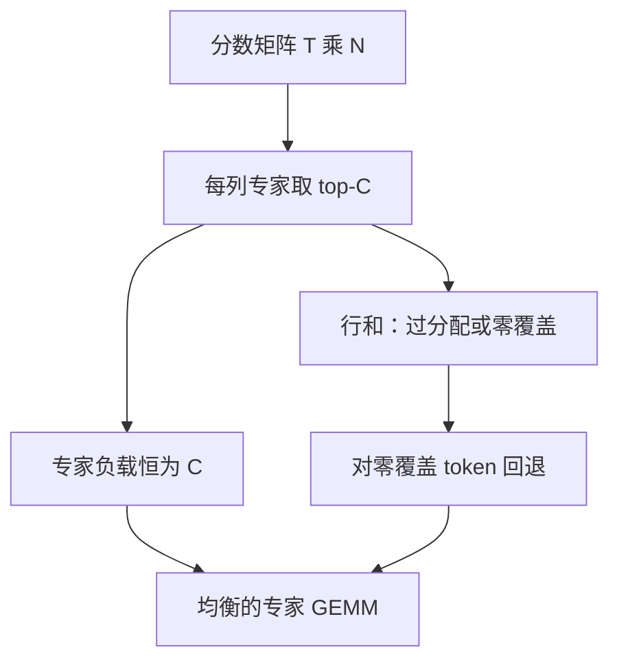

# Expert-choice 路由

让每个专家挑选自己容量内最想处理的 token，负载在专家维上天然齐平；付出的代价是：有的 token 可能被多个专家抢走，有的一个都轮不到。

<footer>—— Zhou et al., Mixture-of-Experts with Expert Choice Routing, NeurIPS 2022</footer>

[Dropless](/llm/moe-dropless) 在 **token-choice** 下用可变核消化不均。Zhou、Lei、Liu 等人的 Expert Choice（EC）把不均从根上改掉：不再是每个 token 挑 $k$ 个专家，而是每个专家在自己的容量 $C$ 内挑分数最高的 token。专家维的负载恒等于 $C$（只要候选够），[容量因子](/llm/moe-capacity-factor)不再靠 drop 来守。缺口是另一侧：**token 维的覆盖不再有保证**。本课只写这一翻转，不把 Switch 的 $k=1$ 再推导一遍。

## 问题

Token-choice 的均衡是事后修补：辅助损失、偏置、Dropless 核，都在承认「token 先投票」。投票一旦塌缩，无论核多么不规则，总有专家空、有专家爆。EC 问：若约束写在专家身上——每人必须、也只能处理 $C$ 个 token——负载还需要损失去拉吗？

设 $T$ 个 token、$N$ 个专家，令 $C=kT/N$（$k$ 为每个 token 的目标专家数，只用来定总槽数）。对路由分数矩阵 $S\in\mathbb{R}^{T\times N}$，token-choice 沿专家维对每行取 top-$k$；expert-choice 沿 token 维对每列取 top-$C$。列上取 top 之后，每列恰好 $C$ 个一，专家负载完美均衡。行和变成随机变量：有的 token 被许多专家选中（过分配），有的行和为零（**token drop**，与上一课的专家侧 drop 方向相反）。

### 生成时未来 token 还不在矩阵里

训练可以看见整段序列再填 $S$ 的所有行，列上 top-$C$ 合法。自回归 decode 时，当前步只有一个新 token，列上「在全部 $T$ 个里挑」无法执行——未来行不存在。EC 的训练图与逐步生成图因此不一致。这是 [MoE 路由](/llm/moe-routing) 里把它标成非默认的原因，也是本课必须单独写清的缺口。不要把 Expert Choice 理解成「专家可以拒绝 token」。它是硬挑选：每个专家的名额发完即止。拒绝发生在 token 侧——没进任何专家的名额，该层就没有 MoE 变换。

## 方法

对隐状态算 $S_{t,i}=x_t^\top w_i$（或带温度的 softmax 前 logits）。专家 $i$ 取

$$
\mathcal{T}_i=\mathrm{top}\text{-}C(\{S_{t,i}\}_{t=1}^{T}),
$$

输出仍是被选中的 $(t,i)$ 上 $p_{t,i}E_i(x_t)$ 的和。$p$ 可以对列做 softmax 再掩码，或只在选中位置上归一。Zhou 等人表明，同样参数与相近 FLOPs 下，EC 相对 token-choice 可以提高专家利用率，并减轻辅助损失的负担。

过分配时，同一 token 进多于 $k$ 个专家，该 token 的计算超标；欠分配时，行和为零，必须定义回退：残差直通、或强制分配到分数最高的专家（破坏完美均衡）。实践里常混合：**先 EC 再对零覆盖 token 做一次补分配**，均衡变成近似。

### 与容量因子的关系

EC 的 $C$ 就是容量，但语义是「专家保证吃满」而不是「专家最多吃这么多」。Token-choice + $\mathrm{CF}>1$ 是上界；EC 的 $C$ 是等式。若把 EC 再叠 Dropless，意义不大——负载已经齐，不规则核没有峰值可吃，只剩下实现偏好。

## 机制

EC 把竞争从「token 抢热专家」换成「专家抢高分 token」。热门专家会挑走分数最高的那批，冷门专家只能在剩余分数里找满 $C$ 个——若分数是全局可比的，冷专家吃到的是相对低分 token，专业化方向被「吃残羹」塑造。若每列独立标准化，冷专家在自己的分数尺度上仍能挑到「自己最想要的」，专业化更干净。列归一还是全局归一，是 EC 的隐性归纳偏置，论文复现必须对齐。

Token 零覆盖等于一层随机深度，但选择集由专家门控决定：往往是路由器对所有专家都不自信的 token，或与整批都不同质的离群点。长尾语言、代码混批里，少数语种 token 更容易零覆盖。这与 token-choice 丢掉**过载专家门口的多余 token** 伤害的对象不同：后者伤害的是热专家的拥挤者，前者伤害的是谁都不想要的人。

预训练可以用整段做 EC；指令微调若按 packing 把无关样本拼进同一 $T$，列上 top-$C$ 会让专家跨样本抢 token，样本之间出现非因果的分配耦合。Packing 边界必须在分数矩阵上掩掉，否则 EC 会引入一种奇特的 batch 内竞争。

### 推理近似

Decode 时退回 token-choice（当前 token 取 top-$k$）是常见折中，训练–推理路由不一致。缓解包括：训练后期逐步把 EC 退火回 token-choice；或在 prefill 用 EC、decode 用 token-choice（prefill 有完整 $T$）。质量是否可接受，取决于不一致发生在哪些层——底层路由更像词法，不一致伤害更大。不要默认「训练 EC、服务 Switch」零成本。

## 边界与工程取舍

EC 擅长「专家数大、batch 内 token 足够多、$C$ 不是极小整数」的预训练。$T$ 太小（微 batch、短序列）时 top-$C$ 的统计失去意义，$C=1$ 退化成每个专家只抓一个 token，大量 token 零覆盖。多模态交错序列里视觉 token 与文本 token 的分数尺度不同，列上 top 会系统偏向某一模态，需要分模态配额，否则「负载均衡」只是把槽填满，填的全是图或全是字。

辅助损失在完美 EC 下可以关掉或减弱，因为专家维已经齐。但 token 覆盖率、过分配率要另做日志。只报专家负载均匀会得到一张好看但骗人的表。与 DeepSeek 式[共享专家](/llm/shared-expert-moe)搭配时，共享专家给零覆盖 token 一条永远在线的出路，EC 的伤害被部分托住——这是配比课将用到的接口。

出处钉死 Zhou 等人 NeurIPS 2022 的 Expert Choice，不要和「专家可以输出 router 分数再由 token 选」的各种变体混名。后者仍是 token-choice，只是分数来源不同。

## 小结

- Expert-choice：每列（专家）取 top-$C$ 个 token，专家负载恒齐，token 覆盖不再保证。
- 与容量因子方向相反：EC 的 $C$ 是吃满配额，不是满了再丢。
- 自回归 decode 看不见未来行，训练图与生成图默认不一致，需要退火或 prefill/decode 分策。
- 零覆盖伤害长尾 token；过分配浪费算力。应用覆盖率而不仅是专家均匀度来验收。
- packing 与多模态必须在分数矩阵上加边界，否则跨样本、跨模态抢配额。
- 出处：Zhou 等，Mixture-of-Experts with Expert Choice Routing，NeurIPS 2022。
