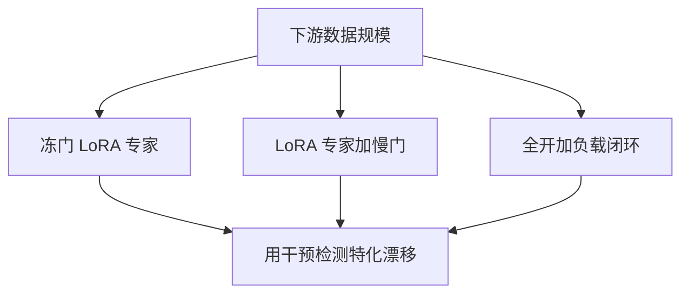

# MoE 微调

指令微调会改写路由；只训专家不训门，或只训门不训专家，得到的是两种不同的特化漂移。

<footer>—— 综合稀疏 MoE 在指令微调中的实践；LoRA 接到专家与门的不同槽位会改变路由还是改变专家内部</footer>

[上一课](/llm/expert-specialization)在预训练分布上画专精图。下游数据更窄、更尖，门若继续学，会把大量指令打进少数专家，其余专家冻成死权重；门若冻结，新任务只能挤进旧切片。[无辅助损失均衡](/llm/aux-loss-free-balancing) 的偏置在微调 batch 更小、更偏时也会失配。本课补微调时动哪一部分。后课剪枝假设微调已经决定哪些专家还活着。

## 问题

稠密模型微调是改一套 FFN。MoE 有三组旋钮：专家 MLP、路由门、均衡控制器（辅助权或 $b_i$）。只改专家，路由仍按预训练语义切片，新任务若落在冷门专家会欠拟合。只改门，专家内部是旧技能，门负责重分配。全开则小数据上路由先崩——辅助项或偏置来不及跟上，出现少数专家包办。缺口是按数据规模选冻结策略，而不是套稠密 LoRA 教程。

LoRA 打在专家上，增加的是专家内部适应；打在 $W_r$ 上，增加的是重路由。打在注意力上则与 MoE 无关。写配置时要写清槽位。

## 方法

常见配方。小数据：冻门与偏置，LoRA 所有专家或只 LoRA 预训练占用最高的子集——后者更快，但放弃冷门专家里可能有用的知识。中等数据：LoRA 专家加小学习率更新门，均衡用冻结的 $b$ 或略增大容量以免 drop。大数据 / 继续预训练：全开，重新跑负载闭环。

专家并行下，微调也要 All-to-All。为省通信可把微调改成「只激活本机专家」的节点受限极端，等于把模型当多套稠密适配器，质量通常下降。另一条路是把 MoE 稠密化（所有专家变稠密 FFN 再 LoRA），通信消失、参数暴涨，只适小模型。

### 与指令分布

代码指令会把路由推向代码专家。若预训练专精清晰，这是好事，应保持序列级均衡较弱，允许尖。若预训练专精本来就是词频，指令微调会进一步把功能词专家打满，需要提高容量或重训门。用上一课的干预手段在微调前后各做一次，才能看见漂移。

## 机制

门的 softmax 对小梯度很敏感：指令前缀高度相似，top-1 容易锁死。锁死后梯度只进那几个 MLP，其它专家的 LoRA 零更新，表面上「训了所有专家」实际只训热点。缓解：提高 $k$、对门加熵、或周期性把 token 强制打到占用最低的专家（与哈希混合）。这些都会伤预训练特化，是税。

均衡偏置若仍按预训练步长 $\gamma$ 在微调小 batch 上更新，会剧烈振荡。微调阶段通常减小 $\gamma$ 或冻结 $b$。多任务混合微调时，不同任务想要不同热点专家，门会被拉成折中；按任务拆 LoRA 专家、共享门，往往比一个全局门伺候所有指令更稳。

任务向量算术在 MoE 上要对齐专家下标。微调若重排了路由，差值不能按层直接加。训练基础课的合并默认稠密，本课是它在稀疏上的缺口。

## 边界

没有一种冻结策略适合所有下游。评测应报激活专家数的直方图，不只报下游分数。把 MoE 当稠密模型全参数微调，在万亿规模不可行，在百亿规模可能是最稳但最贵的路。下一课在微调后或直接在预训练检查点上剪、合并专家，以部署为目标。

## 小结

- MoE 微调要分别决定专家、门、均衡控制器谁动；稠密 LoRA 习惯不够。
- 小数据冻门防崩，风险是新任务挤旧切片；大门学习率在相似前缀上易锁死热点。
- 微调前后都应重测专精与占用直方图。
- 任务向量合并依赖专家下标稳定。
- 出处：稀疏 MoE 指令微调与专家/门槽位 LoRA 的工程实践。
