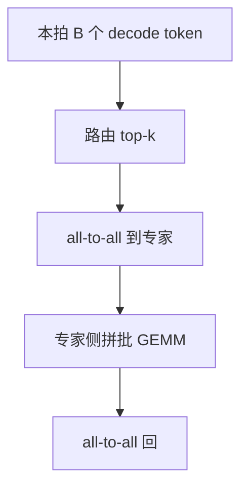

# MoE 推理批处理

训练时专家靠巨大的 token 海填满；decode 每步每请求只有一个 token，专家侧的 GEMM 会瘦到算不动，除非把并发与路由凑成专家批。

<footer>—— Shazeer et al., 2017；GShard：Lepikhin et al., 2020；推理侧对照 Mixtral 与 DeepSeek-V2/V3 的部署叙述</footer>

[上一课](/llm/nccl-tuning)调的是稠密 TP 的 All-Reduce。MoE 还要 all-to-all：token 按[路由](/llm/moe-routing)送到专家所在的 rank。[会计](/llm/arithmetic-intensity-decode)说过只加载被点到的专家；decode 上若每个专家只分到 0–2 个 token，既搬了专家权重，又做不了胖 GEMM。本课写推理如何把 *专家维的 batch* 凑起来：连续批加大 $B$、同一 token 的 top-$k$ 专家、以及 EP 切分。不重推门控公式。

## 问题

稠密 MLP 的 decode 已经瘦；MoE 把瘦 GEMM 再拆到 $E$ 个专家上，每个更瘦。Mixtral 一类 $k=2$，每 token 两次专家 FFN，权重大、复用差。缺口是：服务并发必须高到「每个被点中的专家都有足够 token」，否则 MoE 的「稀疏计算」变成「稀疏且更不适合 GPU」。容量因子、drop token 在推理上通常不允许丢用户 token，溢出只能走共享专家或本地备份，形状更碎。

EP（专家并行）把专家分到卡上，all-to-all 体积随 $B$ 升。$B$ 太小，通信启动开销与自定义 AR 同一类病；$B$ 太大，KV 容量墙先到。MoE 服务的拐点比稠密更苛刻。

Prefill 天然有 $n$ 个 token，专家批好凑，MoE 在 TTFT 上往往比 decode 好看。用 prefill 的加速比宣传 decode 会骗人。

## 方法

优先用连续批把 decode $B$ 堆到专家 GEMM 可吃的程度；再考虑把同一拍的 prefill 切片混入（提高专家批，但 TPOT 抖动）。共享专家（DeepSeek 一类）每 token 必算，形状稳定，应单独走稠密核。路由输出做成 permutation + 分段 GEMM，而不是 $E$ 次启动。能融合的专家核（Triton 按专家分块）减少启动。all-to-all 走 NCCL，体积过小同样考虑融合或延迟发送（会伤延迟）。

## 机制

稀疏对 *计算量* 成立，对 *权重搬运* 只在「点中的专家」上成立。点中集合若几乎覆盖全部专家（$B$ 大、$k\ge 2$），稀疏的搬运优势消失，只剩参数容量优势。这是 MoE 推理与训练的不对称：训练 $B$ 巨大，推理 $B$ 受 KV 限制。MLA 减 KV 正是为了让 MoE 服务能堆更大 $B$，从而专家批和屋顶线一起好过。

## 边界与工程取舍

不要在 $B=1$ 的单用户笔记本上期待 Mixtral 相对同激活量稠密模型大幅更快——搬运两项专家权重可能更慢。量化专家权重减字节，对 decode MoE 特别对症。下一课离开 GPU 矩阵，处理分词并行：CPU 侧不要成为逐步同步点。

出处：Shazeer et al., 2017；Lepikhin et al., 2020；Mixtral、DeepSeek-V2/V3 报告中的推理部署。不发明编号。

## 小结

- decode MoE 的瓶颈是专家侧瘦 GEMM 与 all-to-all 启动。
- 用并发把专家批凑厚；prefill 好看不能代替 decode。
- 共享专家走稠密核；路由用 permutation 而不是 $E$ 次启动。
- $B$ 受 KV 限制，减 KV 才能堆 MoE 服务。
- 稀疏计算 ≠ 稀疏搬运。
- 下一课：分词并行与预处理。
- 出处：Shazeer et al., 2017；Lepikhin et al., 2020。
