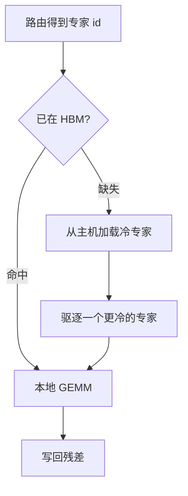

# MoE 推理时的专家缓存

训练时专家靠 All-to-All 全体在线；推理时只有被点到的专家需要算，热的常驻显存，冷的按需从主机侧搬上来。

<footer>—— 对照 Lepikhin 等 GShard（2020）的训练通信，与 Mixtral / DeepSeek 技术报告中的推理稀疏激活</footer>

[专家并行](/llm/expert-parallelism) 在预训练里默认假设：参与 EP 的设备上，各自负责的专家权重始终在高速存储里，token 用两次 All-to-All 找专家、再回家。推理尤其是单机、小 batch、decode 逐步生成时，这个假设既不必要也不经济。Mixtral 一类 top-$2$、DeepSeek-V3 一类「总专家数百、每 token 只激活数个」的模型，一次前向真正用到的专家是全集的一小撮。把冷专家从 HBM 里赶走、把热专家钉住，是推理侧独有的缓存问题，不是把训练图原样搬到服务进程。

## 问题

稠密 FFN 每层一份权重，加载策略就是「层在不在卡上」。MoE 每层有 $N$ 个专家，路由只挑 $k\ll N$ 个。训练为了吞吐，几乎总是让全部专家常驻（只是切到不同卡）；推理若仍按训练拓扑把 $N$ 份 FFN 塞进每张生成卡，HBM 会先被专家库吃满，KV 缓存、批次和并行解码都没地方。反过来，若每次路由结果出来再从 CPU 或 NVMe 拉专家，一次 PCIe 搬运的延迟可以高过 GEMM 本身，首 token 时间（TTFT）被冷启动打穿。

于是出现第三种状态：专家是可缓存的参数块。热专家——近期反复被路由点到的、以及始终在线的[共享专家](/llm/shared-expert-moe)——留在 HBM；冷专家的主体放在主机内存或更慢的层，命中失败再加载。容量、命中率、缺页惩罚，这三项取代了训练里 All-to-All 的带宽账本。训练通信的单位是 token 激活；推理缓存的单位是专家权重。把 All-to-All 的实现直接当成推理运行时，会把「没被点到的专家」也留在关键路径上，稀疏带来的显存红利就消失了。

## 方法

### 热常驻、冷按需

设一层有 $N$ 个路由专家，每份大小为 $S$ 字节，HBM 在扣掉注意力、共享专家、KV 与工作区之后，还能放下 $C$ 个专家，即缓存容量 $C<N$。路由给出专家集合 $\mathcal{E}_t$。对 $e\in\mathcal{E}_t$，若已在 HBM 则直接 GEMM；否则从下一级存储加载，必要时驱逐一个被认为更冷的专家。共享专家不参与这套淘汰，因为每个 token 都会用到。

驱逐策略可以是 LRU、LFU，或按路由 logits 的历史频率加权。Decode 步与步之间，同一对话的专家集合往往高度重叠，LRU 已经能拿到很高命中率。Prefill 一次吃整段提示，token 多、路由发散，冷专家会成片出现，这是 TTFT 的主要风险窗口。

### 与训练 All-to-All 的差别

训练 EP 的路径是：本地路由 → dispatch All-to-All → 本卡专家算完 → combine All-to-All。专家权重几乎不动，动的是激活。推理专家缓存的路径是：本地路由 → 对缺失专家做权重传输 → 本地 GEMM → 无需按专家维做第二次集体通信（单机）或只在热专家所在卡之间做一次很窄的交换。权重传输走 PCIe / NVLink / CPU pin 内存，语义是缓存填充，不是 token 置换。若推理仍用多卡 EP 且每卡专家固定常驻，那是训练拓扑的缩小版，没有「冷加载」。专家缓存指的是权重层级的驻留决策，通常出现在单机 offload、专家数远大于卡数、或想把 HBM 省给 KV 的时候。

### 容量、命中率与 TTFT

命中率 $h$ 定义为被路由到的专家中已在 HBM 的比例。缺页惩罚 $\tau_{\mathrm{miss}}$ 主要是搬运 $S$ 字节的延迟。一步 decode 的专家时间可粗写成

$$
T_{\mathrm{exp}} \approx k\cdot T_{\mathrm{gemm}} + k(1-h)\tau_{\mathrm{miss}}
$$

Prefill 的 $k$ 要换成「本步唯一专家数」：提示越长、领域越杂，唯一专家越多，$h$ 越低，$\tau_{\mathrm{miss}}$ 被乘在 TTFT 上。容量 $C$ 增大则 $h$ 上升，但 KV 与 batch 被挤占；$C$ 过小则每次都在换专家，缓存名存实亡。工程上先量「对话稳态 decode 的 $h$」，再单独量「冷提示 prefill 的唯一专家数」，不要用一个平均数同时描述两段。

将热专家钉在 HBM 还有一层调度含义：预取。路由若能比 GEMM 提前半拍知道下一层的专家 id（层间流水），就可以在算上一层时把下一层的冷专家搬上来。预取失败会变成带宽争用，比不预取更糟，所以只在命中率已经高、缺失可预测时打开。

## 机制

机制的核心是：**激活稀疏变成了工作集局部性**。[路由](/llm/moe-routing) 在训练里要靠负载均衡把 token 摊开，避免专家饿死；推理时同一用户、同一任务会反复点到同一小撮专家，工作集比训练时的均匀负载小得多。缓存正是在吃这份额外的局部性。DeepSeek 式细粒度专家让 $N$ 很大、$k$ 也不算小，工作集比 Mixtral 的 8 选 2 更容易溢出 $C$，所以更依赖频率统计和共享专家把「每次都用」的那部分从缓存方程里抠掉。

从存储层次看，HBM 是 L1，主机页是 L2，盘是 L3。专家粒度远大于常规张量分页：一次缺失是整份 FFN，不是一页 4KiB。因此命中率必须极高才划算；50% 的命中在普通 CPU 缓存里可以接受，在专家加载里意味着每两步就堵一次总线。量化专家（FP8 / INT4）降低 $S$，等价于提高有效 $C$，往往比把 LRU 换成更花哨的策略更管用。TTFT 对缺失次数近似线性，对 GEMM 近似线性，但对「要不要把专家量化」极敏感：把 $S$ 减半，同样的 $C$ 能多住一倍专家，冷提示的唯一专家更容易被盖住。先减 $S$，再调淘汰，是更稳的顺序。

## 边界与工程取舍

专家缓存不改变数值，只改变延迟与能否放下。若所有专家本就能常驻（Mixtral-8x7B 在 80GB 级卡上常常如此），引入 offload 只会增加抖动，不应为了「有缓存」而缓存。它真正必要的场景是：专家总数 $\times S$ 明显大于单机 HBM，同时服务又不能上训练那种大规模 EP。

Batch 增大会摧毁局部性：不同请求的路由并集迅速接近 $N$，命中率掉向 $C/N$，系统退化成每步都在换专家。这与稠密模型「batch 越大越划算」相反。MoE 生成服务往往要限制并发，或按专家亲和性把请求聚到同一副本，让热集重合。Prefill / decode 分离时，prefill 池需要更大的 $C$ 或干脆专家全驻留，decode 池才走激进 offload，否则首 token 被冷加载主导。

另一条边界是正确性与一致性：加载必须是整专家原子替换，不能算到一半权重被驱逐；多卡复制同一热集时，淘汰决策要避免来回颠簸。调试延迟时，把「路由命中率」和「PCIe 吞吐」分成两个计数器——前者是工作集问题，后者是搬运问题，对策完全不同。

## 小结

- 推理只计算被路由点到的专家；热专家常驻 HBM，冷专家按需加载，与训练期全体在线不同。
- 训练 EP 移动的是 token 激活（All-to-All）；推理缓存移动的是专家权重，语义是层次存储而不是置换。
- 缓存容量 $C$、命中率 $h$、缺页惩罚共同决定 decode 延迟；TTFT 主要由 prefill 的唯一专家数和冷启动决定。
- 共享专家应视为始终热；细粒度、大 $N$ 的模型更依赖量化来等效扩大 $C$。
- Batch 会合并工作集、打低命中率，MoE 服务不宜按稠密模型的方式盲目加大并发。
- 能全驻留就不要 offload；缓存是显存放不下时的延迟换容量，不是算法精度手段。
- 出处：Lepikhin 等 GShard（2020）与 Fedus 等 Switch（2021）给出训练期 All-to-All 对照；Jiang 等 Mixtral（2024）、DeepSeek-V2/V3 技术报告给出推理稀疏激活的规模；工程层次上的热/冷驻留是服务端对上述稀疏性的直接推论。
