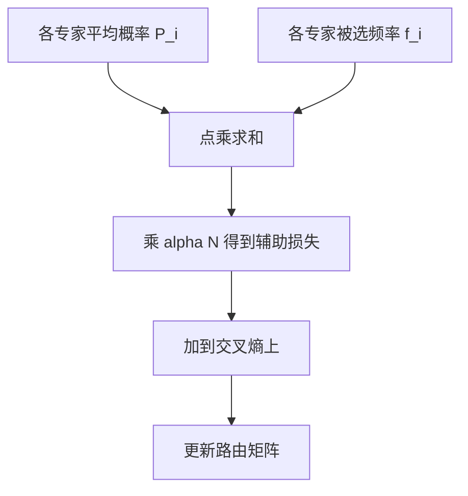

# 负载均衡损失

若不惩罚「大家都去同一个专家」，路由会把自己训练成一个常数开关，稀疏容量名存实亡。

<footer>—— Fedus, Zoph, Shazeer, Switch Transformers, 2021</footer>

MoE 的主损失只关心下一个 token 对不对。对路由来说，把所有人送进目前最好的那个专家，短期交叉熵往往更低，于是正反馈开始：热专家数据更多、变得更好、更热。Shazeer 2017 就加过重要性损失；GShard 与 Switch 把它写成可计算的辅助项，加在训练目标上。负载均衡损失（load balancing loss, auxiliary loss）的任务很窄：让每个专家被选中的频率、以及路由分配给它的平均概率，尽量接近均匀。它不教专家怎么变换表示，只教路由器别塌缩。DeepSeek-V3 后来改用无辅助损失、靠偏置调负载的策略，说明这件事重要，但损失形式可以换。

## 问题

设 $N$ 个专家、一批 $T$ 个 token。若无约束，均衡时每个专家应分到约 $kT/N$ 个 token。实际训练中，路由 logits 的微小优势会被 softmax 放大，再被专家参数的更新放大。崩溃有两种可见症状。一是多数专家的 $f_i\approx 0$，有效参数量塌到 $k$ 个稠密 FFN。二是少数专家过载，超过容量后大量 drop，那些 token 等于没走 MoE，质量与吞吐双输。

### 为什么主损失帮不上忙

交叉熵的梯度经过专家输出再进路由，鼓励的是「选能降损失的专家」，不是「选空闲的专家」。二者只在「空闲专家其实也很好、只是没被探索」时对齐——而这恰恰需要探索机制。辅助损失提供与任务无关的均匀先验。容量因子只能截断过载，不能把 token 推向冷专家。drop 发生后，冷专家仍然冷。所以「加大容量」和「加均衡损失」不是替代关系：一个管硬约束，一个管软激励。

## 方法

Switch Transformer 采用的标准项如下。对一批 token，令

$$
f_i=\frac{1}{T}\sum_{t=1}^{T}\mathbf{1}[i\in\mathcal{E}(x_t)],\qquad
P_i=\frac{1}{T}\sum_{t=1}^{T}p_i(x_t).
$$

$f_i$ 是专家 $i$ 被选中的分数（$k=1$ 时和为 1；$k>1$ 时常改成按 token 归一的分配份额）。$P_i$ 是平均路由概率。辅助损失为

$$
\mathcal{L}_{\mathrm{aux}}=\alpha\, N\sum_{i=1}^{N} f_i P_i.
$$

由 Cauchy-Schwarz，在 $\sum f_i=1$、$\sum P_i=1$ 时，$\sum f_i P_i$ 的最小值为 $1/N$，此时 $\mathcal{L}_{\mathrm{aux}}=\alpha$。均匀负载达到下界；完全塌到一个专家时该项约为 $\alpha N$。$\alpha$ 典型取 $10^{-2}$ 量级，太大则路由不顾语言模型损失，太小则仍崩溃。

### 重要性损失与序列级统计

Shazeer 2017 还使用 importance：$P_i$ 的方差惩罚，避免某些专家的概率质量长期偏高。GShard 在设备局部统计 $f_i$，因为全局归约会太贵。实践中 microbatch 太小会使 $f_i$ 噪声很大，均衡项乱抖，需要在更大的 token 窗口上做滑动平均。Mixtral 类 $k=2$ 模型同样加 aux loss；Qwen2-MoE 技术描述里也保留负载均衡。DeepSeek-V3 则提出 **auxiliary-loss-free**：给每个专家一个可调偏置 $b_i$ 加在路由得分上，根据近期负载升或降 $b_i$，不把均衡项加进梯度，避免干扰主损失。这是同一问题的另一种方法，不是否定 Switch 的 $\mathcal{L}_{\mathrm{aux}}$。

## 机制

$\partial\mathcal{L}_{\mathrm{aux}}/\partial P_i \propto f_i$。热专家（$f_i$ 大）会收到压低 $P_i$ 的梯度，即压低其路由 logits；冷专家相反。$f_i$ 本身含有离散的 $\arg\max$，对 $W_r$ 不可微或用 STE。常见实现只对 $P_i$ 反传，把 $f_i$ 当常数，这已经足够形成负反馈。$\alpha N$ 的缩放使目标的数值不随专家数漂移：均匀时损失恒为 $\alpha$。

### 和 drop、EP 的耦合

均衡损失降低热专家的 $f_i$，从而减少容量溢出，间接减少 drop。它不能保证瞬时均匀：某一 batch 全是代码 token，仍可能打向同一批专家。EP 下热专家所在卡既算得慢又收得多，训练 step time 由最慢卡决定，所以 $\mathcal{L}_{\mathrm{aux}}$ 也是并行效率损失。细粒度专家（$N$ 很大）时均匀更难，有时要加设备级约束：限制一个 token 去往的设备数，使负载在节点间也均衡，而不仅在专家间均衡。

辅助损失过大的失败模式是：路由变得过于平坦，top-$k$ 接近随机，专家无法专业化。过小的失败模式是：训练前 1k step 看起来均匀，之后突然塌缩。需要在日志里同时画 $f_i$ 的最大值、$\sum f_i P_i$ 和 drop 率，而不是只看总 loss。评测期关掉 dropout，但不要「关掉」路由均衡所塑造的 $W_r$——那已经训进权重里。V3 式偏置若在推理忘记加载，负载会回到崩溃状态，这是部署时的静默 bug。

## 边界

负载均衡损失不提高单专家的表达力，也不替代更好的专家结构。它是正则。Switch 证明有它才能把专家数加到很大；没有它，报万亿参数没有意义。但它引入超参 $\alpha$，且与主损失抢梯度，这是 DeepSeek-V3 改偏置法的动机。

统计范围选错会失效：只在单卡、单 microbatch 上算 $f_i$，全局仍然不均。packing 了多文档时，文档边界处的特殊 token 可能垄断专家，需要按真实 token 而不是 padding 计 $T$。专家数为 8 的 Mixtral 对 aux 的依赖弱于专家数为 256 的 DeepSeek-V3——$N$ 越大，崩溃的熵减空间越大，均衡越关键。

不要把 z-loss（惩罚路由 logits 过大）和负载均衡损失当成同一个东西。z-loss 管数值稳定，aux loss 管分配均匀。二者常一起用，来源和公式都不同。

$\alpha$ 的调节应跟着专家数和 batch 走。$N$ 从 8 加到 256 时，同样的 $\alpha$ 可能从「几乎没感觉」变成「压过主损失」。更可靠的做法是盯 $\sum f_i P_i$ 距离下界 $1/N$ 有多远，以及 $f_i$ 的最大值是否长期贴在容量上限。若最大值总是打满容量，说明均衡项还不够，或容量因子本身太小。若所有 $f_i$ 几乎相等但验证集变差，说明正则过强，专家没有分工。把 aux loss 乘到每一层再求和时，深层和浅层的路由难度不同，有人只在 MoE 层用同一 $\alpha$，有人按层衰减；这是配方，应写进报告，不要假装有统一最优值。全局均匀不等于设备均匀。专家级 $f_i$ 看起来很平，但若热专家碰巧都在同一节点，All-to-All 仍然歪。设备级负载需要单独统计，这正是 DeepSeek 要做设备限制路由的原因之一。推理服务不计算 $\mathcal{L}_{\mathrm{aux}}$，但训练末期学到的 $W_r$ 已经带有均衡过的偏好。若用与训练不同的 $k$ 或温度做服务，负载会重新失衡，drop 或延迟会出现在线上而不是 loss 曲线上。

## 小结

- 负载均衡损失对抗路由崩溃：热专家更热的正反馈。
- Switch 形式为 $\alpha N\sum_i f_i P_i$，均匀时取最小值 $\alpha$。
- 它只约束分配，不替代容量上限；drop 与 aux 要一起看。
- $\alpha$ 过大伤害专业化，过小仍会塌缩；应监控 $f_i$ 与 drop 率。
- DeepSeek-V3 用无辅助损失的专家偏置调负载，问题相同、方法不同。
- 出处：Shazeer et al., 2017（重要性 / 负载）；Fedus et al., *Switch Transformers*, 2021；Lepikhin et al., *GShard*, 2020；DeepSeek-V3 技术报告，2024–2025。
