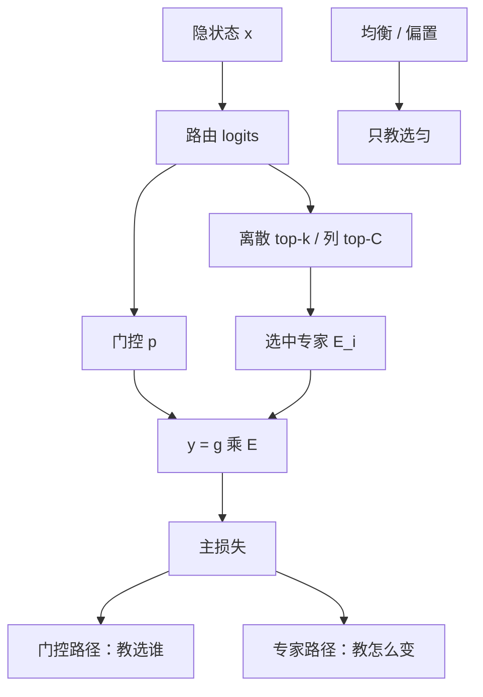

# 路由器梯度

top-k 是离散的；若不把选中专家的门控值乘回输出，路由器就收不到来自损失的信用，只会跟着辅助项或噪声走。

<footer>—— 对照 Shazeer 2017 的稀疏门控；Fedus 等 Switch 中把路由概率乘回专家输出</footer>

[Expert-choice](/llm/moe-expert-choice) 与 token-choice 都在离散下标上做选择。选择一旦变成 $\mathrm{argmax}$ / $\mathrm{top}\text{-}k$，对路由权重 $W_r$ 的直接导数是零。本课补的是这条断掉的反向路径：专家内部的梯度如何（以及是否）流进路由器，离散选择用什么估计来 straight-through，以及为什么路由器学习率、梯度范数与主模型必须分开盯。不重讲如何算 $p_i(x)$，只问 **$p$ 的梯度从哪来**。

## 问题

前向可以写成

$$
y=\sum_{i\in\mathcal{E}(x)} g_i\, E_i(x),
$$

其中 $\mathcal{E}(x)$ 是离散集合，$g_i$ 是门控系数（常取 $p_i$ 或对 top-$k$ 再归一化的值）。$E_i$ 对 $x$ 可微；$g_i$ 对路由 logits 可微；$\mathcal{E}$ 对 logits 不可微。若实现把 $g_i$ 设成 $1$、只靠下标选专家，则 $\partial L/\partial W_r$ 只可能来自[负载均衡](/llm/moe-load-balance)等辅助项，主损失不教「该选谁」。Switch 把 $g_{i^*}=p_{i^*}$ 乘回唯一专家的输出，正是为了让交叉熵能改变路由 logits。

即便乘了 $p$，仍有偏置：没被选中的专家 $E_j$ 对这次前向没有贡献，它们「若被选中会多好」的反事实进不了梯度。路由器看到的是 **已选专家的局部改进**，不是对全部 $N$ 个专家的完整 softmax 雅可比。这是稀疏门控相对稠密混合的根本差别。

### 辅助损失不是路由器的主课

均衡项推动 $f_i$ 与 $P_i$ 均匀，不推动「这个 token 选对专家」。只靠辅助项，路由可以变成高熵的均匀随机，专家差异化失败；只靠乘 $p$ 的主损失，路由可以塌缩。两者的梯度量级差一个系数 $\alpha$，调 $\alpha$ 就是在调「选对」与「选匀」的相对学习率。把路由器接到与 FFN 相同的 Adam 组、相同的 $\eta$，常见后果是路由 logits 先炸或先塌。许多配方给 $W_r$ 单独的更小学习率，或在 logits 上加 z-loss，下一优化课会再碰到尺度问题。

## 方法

**乘门控（Switch 默认）**：$y=p_{i^*}E_{i^*}(x)$。$\partial L/\partial p_{i^*}$ 来自输出，再经 softmax 传到全部 logits——未选中专家也能从「归一化的分母」里收到负向信号：提高 $p_{i^*}$ 会压低其他 $p_j$。这不是反事实价值，只是归一化耦合。

**Straight-through**：前向用离散 $\mathcal{E}$，反向把 $\partial L/\partial \mathcal{E}$ 当成对 soft $p$ 的梯度。估计方差大，适合 $k\gt 1$ 或 Expert-choice 这种硬 top。**REINFORCE / 得分函数**：把选择当策略，用 $L$ 当负回报估计 $\nabla \log \pi(\mathcal{E}\mid x)$，无偏但噪声大，大 batch 预训练很少当主路径。**Gumbel-softmax**：用连续松弛训练、离散部署，温度退火要对齐；语言模型预训练里不如乘 $p$ 常见。

DeepSeek-V3 一类无辅助损失配方把负载交给专家偏置的更新，而不是加大 $\alpha$。偏置的梯度来自负载统计，不来自 token 损失——路由器权重仍主要靠乘门控吃主损失。分工要写进实现：哪一组参数吃哪一种梯度。

### 专家内部梯度会不会回流

$E_i$ 的参数梯度只来自分给它的 token。路由器若共享底层表示 $x$，则 $E_i$ 对 $x$ 的梯度会改注意力与前置层，**间接**改变下一层的路由输入。这不是 $W_r$ 的梯度，但会被误读成「路由在学」。冻路由器只训专家时，这条间接通道还在；冻专家只训路由器时，必须保证 $g_i$ 乘回或有辅助项，否则 $W_r$ 零学习。

## 机制

softmax 门控的雅可比在高置信时接近零：一旦 $p_{i^*}\approx 1$，乘 $p$ 不再提供有效学习信号，路由器锁死。这与注意力饱和是同一类几何。缓解包括：路由 logits 的 z-loss（惩罚 $\log\sum e^{h_i}$ 过大）、噪声门控（Shazeer 2017）、以及较低的路由温度。Expert-choice 的列 top 对行方向不可微，更依赖 STE 或「只对选中位置的分数回传」。

$k\gt 1$ 时，两个专家的 $g_i$ 通常在被选集合上再归一。归一把信用限制在已选子集内：第三个专家仍然只从「没进子集」得到分母信号。增大 $k$ 会改善信用分配的覆盖，同时增加计算——这是质量–梯度方差的权衡，不是单纯的 FLOPs 权衡。

日志里同时看三件事：路由熵、$W_r$ 的梯度范数、各专家接收的 token 数。熵高而 $\|g_r\|$ 极小，说明主损失没进路由器；熵低而专家负载仍均，可能是偏置在干活、$W_r$ 已经死锁。只看损失曲线会漏掉「稀疏已经名存实亡」。

### 与 Expert-choice 的梯度差

列上 top-$C$ 让专家之间的竞争发生在 token 维。某个 token 的分数提高，会挤掉同一列里分数刚过线的另一个 token，梯度是跨样本的。这在因果语言模型里意味着：位置 $t$ 的路由梯度依赖同 batch 里其他位置的分数，破坏了「token 独立选专家」的假设，也让梯度检查更难。Token-choice 的梯度至少在选择集上是逐 token 的（除了均衡项的 batch 统计）。

## 边界与工程取舍

混合精度下路由 logits 很窄（$N$ 常为数十到数百），用 BF16 累加 softmax 可能整个头都量化成几个桶，梯度变阶梯。路由计算应保留较高精度。梯度裁剪若按全局范数，$W_r$ 相对巨大专家权重容易被淹没，表现为路由器不更新；应对 $W_r$ 单独 clip 或单独学习率。

从稠密 FFN 暖启动 MoE 时，复制专家再训路由，初期 $E_i$ 几乎相同，主损失对 $p$ 无差异，路由器只能靠噪声与辅助项分开专家。此时加大主损失路径的学习率没有用，先要有专家差异。反过来，专家已经分化后再把乘 $p$ 关掉，路由会冻结在旧选择上，微调新领域时无法改道。

不要把「路由器梯度」实现成对未选专家做二次前向估反事实——那会把稀疏 MoE 算力打回稠密。本课只讨论沿已选路径与 softmax 分母的合法梯度，以及 STE / 得分函数这类估计，不讨论每个专家都跑一遍的 oracle。

## 小结

- 离散 top-k 本身无导数；把门控 $p$ 乘回输出，主损失才能改 $W_r$。
- 未选专家没有反事实价值，只有 softmax 分母上的耦合；辅助损失 / 偏置另管均匀。
- 高置信锁死后乘 $p$ 失效，需 z-loss、噪声或温度维持可学区间。
- Expert-choice 的列选择把梯度变成跨 token 竞争，与 token-choice 的信用结构不同。
- 学习率、精度、clip 应对 $W_r$ 单独设；否则路由器静默死亡。
- 出处：Shazeer 等 2017 稀疏门控；Fedus 等 Switch；Zhou 等 Expert Choice 的离散选择。
