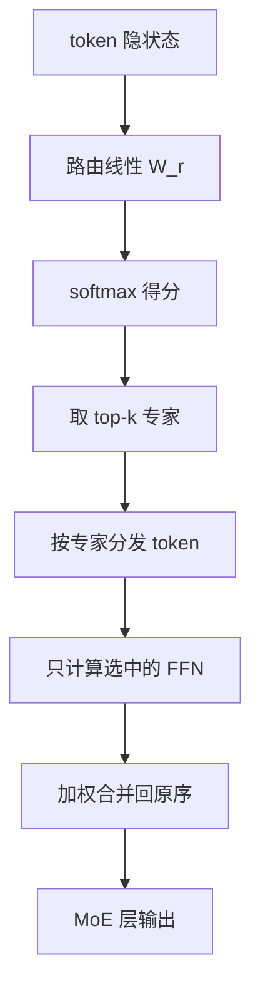

# Mixture of Experts 路由

每个 token 只激活少数专家，其余专家的权重留在参数里不参与这次前向——稀疏，是对计算而不是对存储。

<footer>—— Shazeer et al., Outrageously Large Neural Networks, 2017；Lepikhin et al., GShard, 2020</footer>

稠密 FFN 让每个 token 走过全部中间通道。参数再大，一次前向的 FLOPs 就再大。Shazeer 等人 2017 年的稀疏门控混合专家（Sparsely-Gated MoE）把 FFN 换成 $N$ 个专家，路由网络给每个 token 打分，只把 top-$k$ 个专家真正算一遍。Lepikhin 等人的 GShard（2020）把这套机制接到 Transformer 上，做出能在 TPU 上训练的万亿参数翻译模型。路由是 MoE 的中枢：选错专家，容量再大也是噪声；选得太集中，多数专家饿死，模型退化成稠密小网。本篇只讲 token 如何选专家，以及为什么必须有负载均衡，不把 Switch 的 $k=1$ 或 DeepSeek 的细粒度专家展开成全文。

## 问题

想加大模型容量，最笨的办法是加宽或加深稠密 FFN。训练和推理的计算立刻按比例涨。若承认「不是每个 token 都需要同一套通道」，就可以把容量做成专家库：总参数很大，每次只跑其中几份。问题变成三个互相咬合的约束。第一，路由必须足够便宜，不能比 FFN 还重。第二，每个专家分到的 token 数不能差出一个数量级，否则有的专家过拟合、有的从未更新。第三，硬件一次能处理的 token 有上限（capacity），超量要么丢弃要么溢出到备份专家。

### Token 选择而不是专家选择

主流 LLM MoE 是 **token choice**：每个 token 独立挑 top-$k$ 专家。另一种是 expert choice：每个专家挑自己最想要的 token。后者负载天然均衡，但生成时未来 token 尚未出现，训练和推理的路由不一致。因此预训练语言模型几乎都走 token choice，再用辅助损失或偏置去拉负载。路由崩溃指绝大多数 token 涌向两三个专家，其余专家的梯度接近零。看起来参数量很大，有效容量接近稠密小模型。辅助损失、专家容量、噪声门控，都是在对抗这件事。

## 方法

对隐状态 $x\in\mathbb{R}^{d}$，路由层是一个小线性：

$$
h(x)=xW_r,\qquad W_r\in\mathbb{R}^{d\times N}.
$$

Shazeer 2017 在 logits 上加可学习噪声，再取 KeepTopK 与 softmax，使探索足够、又只算 $k$ 个专家。GShard 和后来的实现多用干净的 softmax，再切 top-$k$：

$$
p_i(x)=\frac{e^{h_i(x)}}{\sum_{j=1}^{N}e^{h_j(x)}},\qquad \mathcal{E}(x)=\mathrm{top}\text{-}k\bigl(p(x)\bigr).
$$

专家 $i$ 的输出为 $E_i(x)$，通常是 SwiGLU FFN。层输出是选中专家的加权和：

$$
y=\sum_{i\in\mathcal{E}(x)}\frac{p_i(x)}{\sum_{j\in\mathcal{E}(x)}p_j(x)}\,E_i(x).
$$

$k=1$ 时权重为 1，就是 Switch。$k=2$ 是 GShard / Mixtral 的常见选择。

### 容量与丢牌

设一批里有 $T$ 个 token、 $N$ 个专家、容量因子 $c$。每个专家最多接收

$$
C=\left\lceil c\cdot k\cdot T / N\right\rceil
$$

个 token。超过 $C$ 的 token 被丢弃，残差直接跳过该专家，或落到指定的溢出专家。$c=1$ 最省计算，丢牌多；$c=1.25$ 或 $2$ 更稳，通信和计算都涨。GShard 用专家容量约束实现分布式调度，避免某一个专家把整张卡的内存撑爆。

## 机制

路由的梯度有两路。一路进专家内部，和普通 FFN 相同。另一路进 $W_r$：softmax 的导数让得分高的专家更高、低的更低。若没有均衡项，这是正反馈，崩溃几乎必然。因此 Switch 与 GShard 都加辅助损失，使专家被选频率 $f_i$ 与平均路由概率 $P_i$ 的点积尽量小（详见负载均衡损失一文）。机制上，**主损失学的是选对专家，辅助损失学的是选得散**。

### 离散选择与直通

top-$k$ 是离散的，对未选中专家的 $p_i$ 在前向里不乘到输出上（或只在归一化分母里出现）。实现通常仍对全部 $N$ 个 logits 做 softmax，好让未选中专家也接到「你差一点点」的梯度。有的系统对路由用直通估计，对专家输出用 STE；大规模训练里更常见的是：前向硬选 top-$k$，反向把 softmax 梯度完整回传。噪声门控（Shazeer 2017）在 logits 上加 $\mathrm{Softplus}(xW_{\mathrm{noise}})\cdot\varepsilon$，训练期探索、推理期关掉。

通信上，路由一旦确定，就要 All-to-All：token 按专家编号发到对应设备。路由本身的 GEMM 很轻，$d\times N$ 且 $N$ 通常几十到几百；真正贵的是分发后的专家 FFN 和两次 All-to-All。$k$ 增大，每个 token 的计算与通信线性涨，负载通常更匀，但稀疏优势变薄。Mixtral 取 $k=2$ 是质量与稀疏的折中；Switch 取 $k=1$ 把路由简化到极致。没有对所有规模都最优的 $k$。

## 边界

路由解决的是「这次算哪些 FFN」，不解决注意力二次复杂度，也不自动提高长上下文。专家再多，若路由塌成常数映射，等效参数量回到 $k$ 个专家。评测不能只报总参数，必须报激活参数。Mixtral 8×7B 激活约 13B；Qwen2-MoE 与 DeepSeek-V2 同样以激活量为推理成本。

Token choice 在变长、padding、文档packing 时会偏：短序列、特殊 token 可能垄断某些专家。需要在 batch 或序列级统计 $f_i$，而不是只看单个 microbatch。推理期若关闭辅助损失（本来就只在训练），路由会固定，应与训练时的 top-$k$、温度、是否归一化选中专家权重完全一致，否则是静默的分布偏移。

不要把路由写成可以任意换成可微注意力。MoE 的意义就是离散稀疏；一做成对全部专家的软加权，计算回到稠密，只是多了 $N$ 倍 FFN。那叫混合专家的稠密版本，不是 LLM 里说的 MoE。

路由权重在 top-$k$ 内是否重新归一化，会改变梯度尺度。不归一时，选中专家的 $p_i$ 可能总和远小于 1，输出偏小、残差占主导；归一后加权和为 1，专家增量更满。Mixtral 类实现通常在选中集合上重归一；Switch 则常把单个 $p_{i^*}$ 直接乘上去。这两种不可混用检查点。温度或 logits 缩放同样是路由超参：温度过低，softmax 接近 one-hot，探索消失；过高则 top-$k$ 接近乱选。噪声门控只应出现在训练，推理必须关掉，否则生成不可复现。路由器几乎总是一层无偏置线性，不要再叠两层 MLP 当路由，除非明确在做实验。更重的路由会吃掉稀疏省下的计算，也更容易过拟合到当前 batch 的 token 分布。文档 packing 时，应禁止路由统计跨过文档边界去「借」别的样本的专家负载，否则均衡项会把不相关文档绑在一起。这些细节写进训练日志的价值，不低于报一个 $N$ 和 $k$。

## 小结

- MoE 路由让每个 token 用线性打分选 top-$k$ 专家，只计算被选中的 FFN，总参数大、激活参数小。
- 经典来源是 Shazeer et al. 2017 的稀疏门控 MoE，以及 Lepikhin et al. 2020 的 GShard。
- 必须配合容量上限与负载均衡，否则路由崩溃，有效容量塌缩。
- Token choice 利于自回归推理；expert choice 更匀但训练推理不一致。
- $k$、容量因子、softmax 是否在 top-$k$ 内重归一化，都是会改变质量的实现细节。
- 出处：Shazeer et al., *Outrageously Large Neural Networks: The Sparsely-Gated Mixture-of-Experts Layer*, 2017；Lepikhin et al., *GShard*, 2020；Fedus et al., *Switch Transformers*, 2021。
