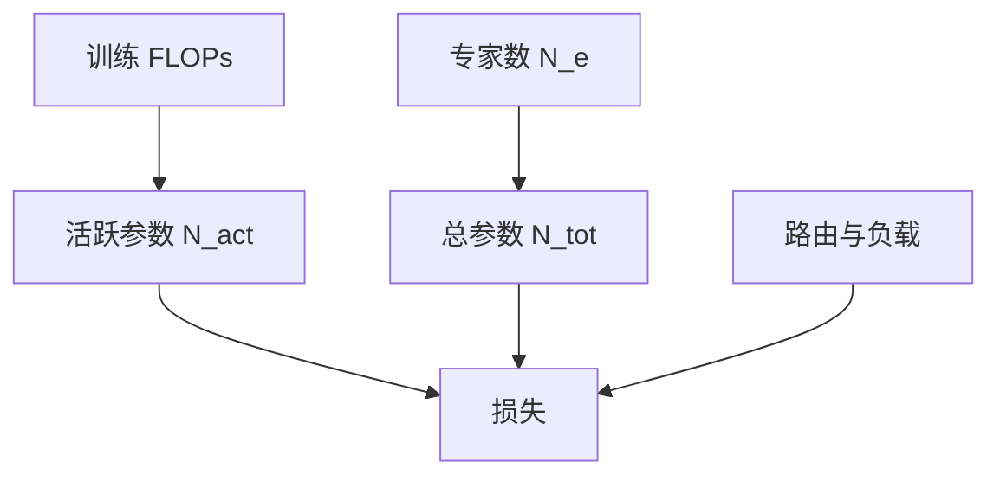

# MoE 的扩展律

    
稀疏模型把容量和计算拆开：总参数可以随专家数涨，每次前向真正算的只有活跃的那几份。

    <footer>—— Clark 等人对路由语言模型的统一扩展律；Fedus 等人的 Switch Transformer</footer>

稠密扩展律把参数量 $N$ 和训练 FLOPs 几乎焊在一起：$C\approx 6ND$。MoE 松开这道焊点。专家总数决定存储容量，路由只激活 $k$ 个专家，活跃参数 $N_{\mathrm{act}}$ 决定每 token 的计算。Fedus 等人用 Switch 证明，在相近的 FLOPs 下可以放下远更多的总参数；Clark 等人则把路由模型的损失写成对活跃容量与专家数都敏感的标度，而不是只代入总参数。本篇讲 MoE 扩展时必须分开的两条轴——专家数与活跃参数——以及稀疏带来的额外损耗：路由、负载不均、通信。

## 问题

若仍用总参数去套 Kaplan / Chinchilla 曲线，MoE 会显得「同样 $N$ 却更弱」，或反过来「同样 FLOPs 却更强」，两种读法都能找到例子。原因是比较对象错了。一个 8 专家、每专家与稠密 FFN 同宽、$k=1$ 的模型，总参数大约是稠密的数倍，活跃 FLOPs 却与稠密接近。它该和「同活跃计算的稠密模型」比，还是和「同存储的稠密模型」比，结论完全不同。扩展律必须声明自变量是哪一个 $N$。

第二个问题是专家数本身是否永远有红利。把专家从 8 加到 64 再加到 256，总容量涨，但路由更难、All-to-All 更重、每个专家分到的数据更稀。红利可能递减。Clark 等人要回答的正是：路由模型的损失如何同时依赖计算（或活跃参数）与专家数目，而不是把 MoE 当成免费的容量。

### 活跃参数与总参数

记总专家为 $N_e$，每个专家参数 $P_e$，再加共享的注意力与路由参数 $P_s$。总参数 $N_{\mathrm{tot}}\approx P_s+N_e P_e$，活跃参数 $N_{\mathrm{act}}\approx P_s+k P_e$（忽略路由开销）。稠密模型是 $N_e=1,k=1$ 的特例。Switch 取 $k=1$，用极大的 $N_e$ 拉高 $N_{\mathrm{tot}}$，同时把 $N_{\mathrm{act}}$ 留在可训练的 FLOPs 预算里。比较扩展时，FLOPs 轴应对齐 $N_{\mathrm{act}}D$，存储与服务显存对齐 $N_{\mathrm{tot}}$。推理期若 $k>1$ 或专家因负载被多次调用，活跃计算会高于训练会计。服务扩展律不能直接搬训练时的 $N_{\mathrm{act}}$。训练扩展只对「每个 token 固定 top-$k$」这一假设干净。

## 方法

Fedus 等人的经验图像是：在固定计算下增加专家，语言建模损失下降，直到路由与优化开始不稳。他们用 $k=1$ 降低通信与实现复杂度，使专家数可以加到上百，从而把「稀疏容量」推到可以画曲线的范围。曲线的横轴若取 FLOPs，Switch 点落在同计算稠密模型的下方（更好）或相当，同时总参数大很多。

Clark 等人把路由语言模型放进统一拟合：损失既随计算下降，也随专家数变化，专家数的指数与单纯加宽稠密 FFN 不同。增加专家改善的是容量项，但每个专家的有效样本量下降，数据项可能变差。最优专家数因此是计算预算与数据量的函数，不是越大越好。统一律的价值是：让「加专家」和「加宽度 / 加深度」可以画在同一张图上比较边际收益。

### 细粒度专家与共享专家

后来的预训练 MoE（DeepSeek MoE、Mixtral 一类）把专家切得更小、或加共享专家。细粒度提高专家数、降低 $P_e$，同一 $N_{\mathrm{tot}}$ 下路由选择更灵活，但通信更碎。共享专家把一部分 FFN 变回稠密，保证每个 token 都有公共容量，扩展时相当于把 $P_s$ 加大、把稀疏红利集中在残差专家上。这些形态会改变 Clark 拟合里「专家数」这一轴的含义：真正的自变量更接近「稀疏分支的个数与粒度」，而不是一个整数 $N_e$ 的字面值。写扩展实验时应同时报 $N_e$、$k$、中间维、是否共享。

## 机制

稠密三项式 $E+A/N^{\alpha}+B/D^{\beta}$ 里的 $N$ 应换成 $N_{\mathrm{act}}$ 才能解释计算。剩余的 $N_{\mathrm{tot}}-N_{\mathrm{act}}$ 提供额外的函数族：不同 token 走不同参数，相当于用路由把数据空间切开。若路由完美且每个专家数据充足，切开降低近似误差，损失优于同 $N_{\mathrm{act}}$ 的稠密模型。若路由崩溃或专家过稀，切开变成噪声，损失退回甚至差于稠密。扩展律里因此必须有一项对路由质量与负载的惩罚，哪怕拟合时它被吸收进有效 $A$。

专家数增加时，每个专家看到的 token 约为 $kD/N_e$。这是数据约束在专家维上的投影：总数据 $D$ 看起来很大，分到专家就小了。Muennighoff 式的重复与 Clark 式的专家标度在这里相遇——专家太多等价于每个子模型欠数据。这是 MoE 不能无限加专家的统计原因，通信墙是工程原因，两者经常一起出现。用总参数宣称「我们训了万亿模型」而只报与稠密 10B 相近的 FLOPs，容易误导扩展比较。规范写法是成对报告：$N_{\mathrm{tot}}$、$N_{\mathrm{act}}$、$k$、$N_e$、以及 $C\approx 6 N_{\mathrm{act}} D$ 的会计是否含路由与空槽。

### 通信与空槽对有效 FLOPs 的修正

容量因子大于 1 时，All-to-All 为空气槽付带宽；负载不均时，热专家成为计算尾部。墙上时间对应的有效吞吐低于名义 $N_{\mathrm{act}}$ FLOPs。扩展曲线若用 GPU-hours 当横轴，会把这些税算进去；若用理论 FLOPs，会把 MoE 画得过于乐观。Clark / Fedus 的学术拟合多用损失对计算或对参数，工程规划还要再加一条通信修正。否则会出现「曲线上该降，集群上不降」的假矛盾。

## 边界与工程取舍

MoE 扩展律不能直接告诉你推理该用多少专家副本。服务期 All-to-All 的延迟结构与训练不同，可能复制专家、牺牲 $N_{\mathrm{tot}}$ 的显存红利。训练曲线上的最优点，不一定是服务曲线上的最优点。

跨稠密与稀疏的外推尤其脆。把 Kaplan 指数套到 $N_{\mathrm{tot}}$ 上，会高估 MoE 在同等存储下的损失下降；套到 $N_{\mathrm{act}}$ 上又不计路由损耗。可信的做法是在同一数据与优化器上扫 $N_e$ 与宽度，拟合自己的面，再用 Clark 的函数形式当先验而不是当定律。$k=2$ 与 $k=1$ 不在同一条专家数曲线上。多一个活跃专家会同时改变 $N_{\mathrm{act}}$、通信体积和路由插值。比较专家数时应固定 $k$，或把 $k$ 当作独立自变量，不要把 Mixtral 的 8 专家 top-2 和 Switch 的 128 专家 top-1 画成同一条横轴上的两个点。

优化失败（专家崩溃、损失尖峰）会在大 $N_e$ 处更常见。扩展扫描必须有负载指标与 drop 率，失败点应剔除或单独标注，否则「专家数过多有害」的结论可能只是优化没做好。

## 小结

- MoE 扩展必须拆开总参数与活跃参数：FLOPs 跟 $N_{\mathrm{act}}$，存储跟 $N_{\mathrm{tot}}$。
- 增加专家数提高容量，但摊薄每个专家的数据，并加重路由与 All-to-All。
- Fedus 等人用 Switch 在相近计算下放大总参数；Clark 等人给出路由模型对专家数与计算的联合标度。
- 细粒度与共享专家会改写「专家数」轴的含义，实验要成套报告。
- 名义 FLOPs 不含空槽与负载尾部，GPU-hours 曲线更接近工程真实。
- 训练最优点不必等于推理最优点。
- 出处：Fedus, Zoph, Shazeer, *Switch Transformers*, 2021；Clark et al., *Unified Scaling Laws for Routed Language Models*, 2022。
