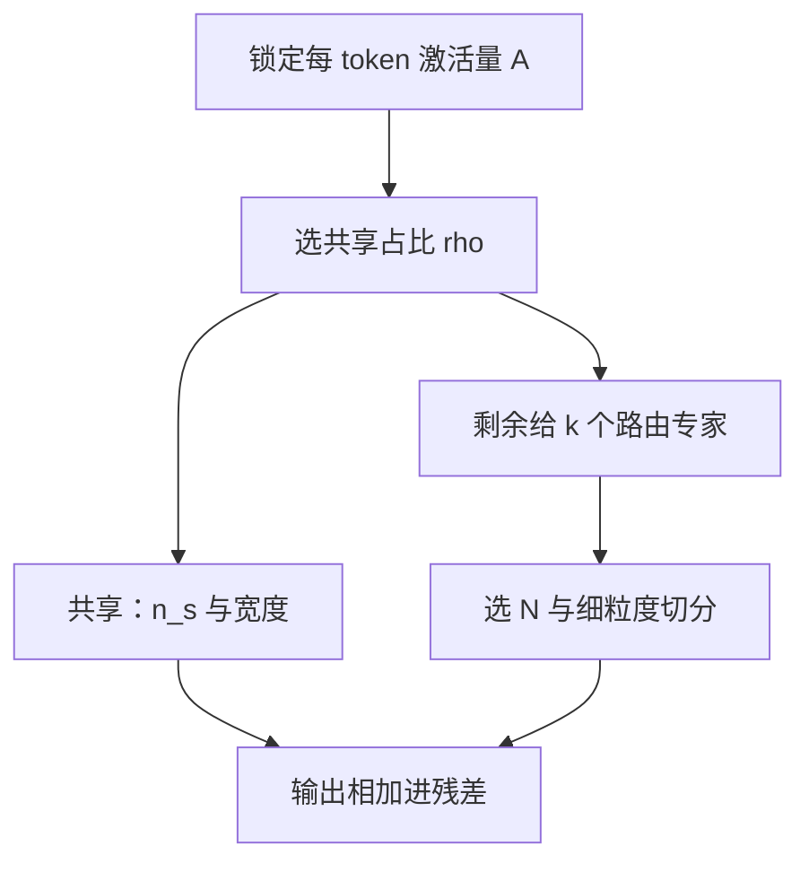

# 共享专家与路由专家的配比

激活量对齐之后，还要决定：永远在线的那一份多宽，以及路由库切成多少份小专家——两个整数一起决定组合数与公共件是否重复。

<footer>—— DeepSeek-V2 / V3 技术报告中的共享专家与细粒度路由专家；对照 Mixtral 的对称专家</footer>

[路由器梯度](/llm/moe-router-gradient)说明离散选择如何学习；[共享专家与细粒度专家](/llm/shared-expert-moe)已经区分两类参数。本课把旋钮拧到**配比**：共享专家个数 $n_s$ 与宽度、路由专家个数 $N$ 与宽度、以及每 token 激活的 $k$，如何在固定激活 FLOPs 下互相换。Mixtral 是 $n_s=0$、$N=8$、$k=2$ 的对称点；DeepSeekMoE 把 $n_s\ge 1$ 且把大专家切碎。后面的长上下文课默认激活预算已经按这个和来对齐，不再争论「有没有共享专家」。

## 问题

一层 MoE 的激活参数（每个 token 真正乘到的权重）是

$$
A = n_s\cdot |E_{\mathrm{shared}}| + k\cdot |E_{\mathrm{routed}}|.
$$

设计要对齐的是 $A$，不是总参数 $n_s|E_s|+N|E_r|$。总参数决定容量与显存；$A$ 决定训练 FLOPs 与 decode 算力。同一 $A$ 可以有很多分解：一份很宽的共享 + 很少路由；或极窄共享 + 很多小路由专家、较大的 $k$。分解改的是[路由](/llm/moe-routing)要不要管句法级公共变换，以及 top-$k$ 的组合数 $\binom{N}{k}$。

配比问题因此不是「共享好不好」，而是：**在 $A$ 锁定时，$n_s$ 与 $N$、$|E_s|$ 与 $|E_r|$ 往哪边挪，公共件与专项件才都不浪费**。挪错会出现两种对称的病：共享太窄，路由器仍在为停用词打架；共享太宽，稀疏度名存实亡，路由专家变成边角料。

### 细粒度是把一份 $A$ 切成更多可组合碎片

把一个宽路由专家切成 $m$ 个窄专家，若 $k$ 也乘 $m$，激活量近似不变，组合数上升。DeepSeek 的细粒度走这条。切完之后若 $k$ 不增，激活下降，那是在减 $A$，不是纯配比实验。论文对照必须写明 $A$ 是否对齐。共享专家不进 top-k，也不进容量槽的竞争——每个 token 必算。它的宽度直接从 $A$ 里扣。先定 $A$，再定 $n_s|E_s|$ 占 $A$ 的比例 $\rho$，剩下 $(1-\rho)A$ 分给 $k$ 个路由专家，这是本课的默认记账。

## 方法

### 先锁 $A$，再拆 $\rho$

设计表上先写每 token 激活 $A$（与稠密基线对齐），再写 $\rho$，最后才填 $N,k$。倒过来先抄专家个数，激活量会悄悄翻倍，对照作废。

记 $\rho = n_s|E_s|/A$。经验起点：

- $\rho=0$：Mixtral 式。全部激活走路由，容量因子与均衡损失压力最大，公共变换在多个专家里重复。
- $\rho\approx 0.5$：大约一半 FLOPs 给永远在线的 MLP，路由只处理残差技能。路由崩溃时质量下限仍是一个稠密半宽 FFN。
- $\rho\to 1$：接近稠密模型外挂一个可忽略的稀疏装饰，$N$ 再大也没有用。

$n_s$ 本身通常取 $1$（偶见 $2$）。两个共享专家等价于把稠密 MLP 再拆成固定的两路，没有路由，表达力来自宽度而不是组合。优先加宽 $E_s$，而不是堆共享个数，除非要实现异构共享（例如一个偏注意力输出整形、一个偏跨语言）。

路由侧在 $(1-\rho)A$ 内选 $(N,k,|E_r|)$。$|E_r|$ 太小，单个专家拟合能力不足，组合再多也是浅拼装；$N$ 太小，组合数不够。约束还有[专家并行](/llm/expert-parallelism)：$N$ 最好能被 EP 度整除，$|E_r|$ 要对齐核的 tile。

## 机制

共享通路对路由器梯度是减负：主损失里那部分「谁都需要的变换」不再强迫 $p_i$ 去选某个热专家，[乘门控](/llm/moe-router-gradient)可以专注于残差技能。$\rho$ 增大，路由熵往往上升（选择不再事关生死），专家利用率更好看，但专项容量下降。$\rho$ 减小，路由必须同时当公共件与专项件的调度器，更易塌缩，此时要更大的容量因子或 Dropless，以及更强的均衡。

细粒度改变的是 $k$ 次选择的语义：选的是碎片而不是整块 FFN。碎片之间若高度相关（切法只是把矩阵行切开、仍总是被一同选中），组合数是假的。观察「哪些专家经常共现」可以诊断假细粒度：若共现接近确定性，应合并回去加宽，而不是继续加 $N$。

推理缓存把共享专家钉在 HBM，从不淘汰。$\rho$ 大则「必驻」块大，能留给路由专家的缓存槽变少，冷路由专家更容易缺页。训练配比会改写服务期的缓存命中，不是只改损失。

### 与 Expert-choice 的配比接口

[Expert-choice](/llm/moe-expert-choice) 的零覆盖 token 若存在共享专家，仍能走 $E_s$，质量下限被托住。这时可以把 EC 的 $C$ 收得更紧、少做补分配。对称专家（$\rho=0$）上做 EC，零覆盖就是整层空转，必须补分配或加大 $C$。配比与路由模式不是独立超参。

## 边界与工程取舍

同一套 $(n_s,N,k)$ 不能无痛跨密度迁移：从稠密暖启动时，把原 FFN 拷成共享、路由专家随机初始化，是常见做法——$\rho$ 实际上被初始化成「先几乎稠密」。训练中若不对路由专家给足够学习率或足够 token，它们会一直弱，$\rho$ 的名义值骗人。应分别记录共享与路由通路的输出范数比，而不是只看架构表。

多语言、代码、数学混训时，公共件更重，$\rho$ 宜偏大；单领域继续预训练时，可把 $\rho$ 降下来把 $A$ 让给专项。这是数据配比与专家配比的耦合，不要在换语料时只改学习率。宽度还受量化与激活离群值影响：共享通路上的离群通道会被每个 token 打到，后面压缩课会再遇到；这里只需记住 $\rho$ 大则离群更「全局」。

DeepSeek-V2/V3 与 Qwen2-MoE 的具体整数是报告里的一组可行点，不是定律。复现时先锁 $A$ 与稠密基线对齐，再抄 $N$ 与 $n_s$；只抄专家个数、激活量翻倍，对照无效。

## 小结

- 配比的第一约束是每 token 激活 $A$，不是总参数；$\rho$ 是共享从 $A$ 里扣走的比例。
- $\rho$ 太小则公共件挤进路由、更易崩；$\rho$ 太大则稀疏变成装饰。
- 细粒度用同一 $A$ 换组合数；假细粒度表现为专家共现几乎确定。
- 共享必驻，会挤占推理专家缓存；EC 的零覆盖可被共享托底。
- 暖启动与混训数据会改变有效 $\rho$，要用通路范数而不是架构表验收。
- 出处：DeepSeek-V2 / V3 技术报告；Mixtral；Qwen2-MoE 的共享 / 细粒度设定。
