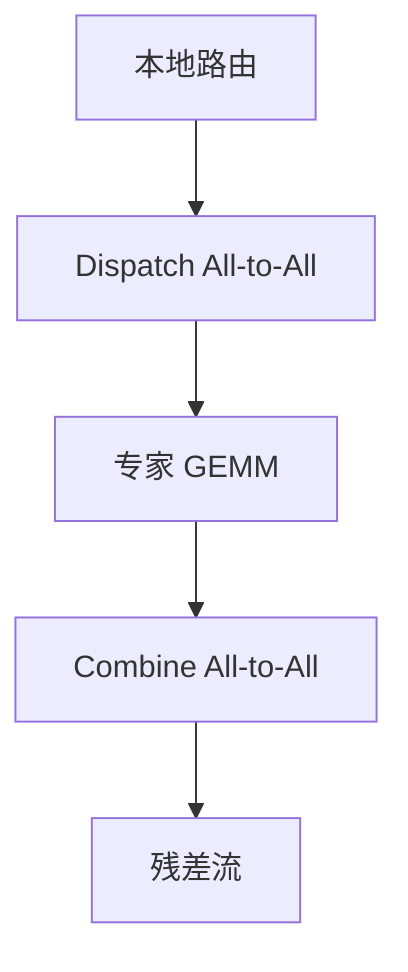

# MoE 训练 all-to-all

专家住在不同卡上时，每个微批都要把 token 按路由结果置换过去再置换回来；这两次 All-to-All 是稀疏计算换来的税，日历必须把它们算进去。

<footer>—— Lepikhin et al., GShard；Fedus et al., Switch Transformers</footer>

[上一课](/llm/grad-accum-microbatch)表明，降微批、加累积会增加集合通信次数。稠密 TP 的 All-Reduce 已经贵；[MoE 路由](/llm/moe-routing) 之后，专家并行还要在每个微批、每个 MoE 层做 dispatch 与 combine 两次 All-to-All。本课不重讲 top-$k$ 怎么打分。缺口是训练时这条置换通信如何与 1F1B / 重叠 / 累积共存，以及容量、落后者如何把税变成墙。异步检查点从下一课开始转向故障，本课先把稳态通信税付清。

## 问题

GShard 与 Switch 把专家分到设备上，token 跟着专家走。体积 $\propto b_{\mathrm{micro}}\times s\times d\times k$（再加容量空洞）。Ulysses 的 All-to-All 键是序列块；MoE 的键是专家 id，两者叠在同一模型里时，同一层可能连续打两种置换，网络队列更容易堵。1F1B 的阶段若把 MoE 层放在边界，阶段间激活发送与专家置换抢链路。

路由抖动会让每次微批的通信形状微变；实现常用固定容量 padding，把抖动变成空洞字节。空洞不参与有效 FLOPs，但参与带宽，MFU 看起来差。这是专家粒度课的通信-计算比在训练日历上的落地。

### 累积把税乘开

每个微批独立路由、独立 All-to-All。$k_{\mathrm{acc}}$ 增大，优化器虽稀，网络次数线性涨。MoE 上「用累积换显存」可能让通信成为主词，应优先重计算、优先更大 $b_{\mathrm{micro}}$、优先更少的 MoE 层跨节点。

All-to-All 不是 All-Reduce。实现错成规约会把不同专家的输入加在一起。对拍应用专家输出范数，而不只对总损失。

## 方法

把 EP 组放在 NVLink 域，跨节点只走 DP 或 PP。Tutel、DeepSpeed-MoE、Megatron-MoE 一类实现提供分组 All-to-All 与容量掩码。调度上：先算路由（本地、便宜），post dispatch，用无关计算重叠，wait 后跑专家 GEMM，再 post combine。与 DualPipe 双流叠加时，两套微批的 All-to-All 必须分缓冲，避免专家 batch 混洗。

负载均衡（辅助损失或无辅助偏置）是为了让各专家 token 数接近容量，从而让 All-to-All 体积可预测。失衡时热专家所在卡变成计算落后者，下一课的 straggler 会先打在这里。

### 与 PP、SP 的切分

MoE 层尽量完整放在一个流水阶段内，不要把 dispatch 与专家计算分到两段。Ulysses 的序列分片要在路由之前定义「token 属于哪张 SP 卡」；通常先 SP 再 EP，或采用框架已经验证的一种顺序，禁止实验里私自交换而不对拍。

Dropless MoE 取消容量丢弃，All-to-All 体积随负载上漂，日历更难重叠。需要动态形状或预留上限。

## 机制

稀疏 FFN 把 FLOPs 降到 $k$ 个专家，但把规约通信换成不规则置换。训练步的墙上时间变成 $\max(\text{稠密注意力},\text{专家 GEMM},\text{两次 A2A})$ 的组合。$k$、容量因子、$b_{\mathrm{micro}}$ 同时进入这个 max。路由崩溃时计算项变小、通信项因空洞仍在，比值恶化。

## 边界

本课不解决卡死与掉卡：A2A 是同步障碍，一卡挂则组挂。那是弹性与故障率课。也不解决检查点里专家分片如何按不同 EP 度恢复——下一课格式。稳态下若 A2A 已经占总时间一半，应减 EP 跨度或减 MoE 层数，而不是再加梯度累积。

## 小结

- 本课不重讲路由公式；只补训练日历上的两次置换税。
- 累积与双流会乘开 All-to-All 次数；EP 组应留在高带宽域。
- 容量空洞占带宽；负载均衡也是网络平滑。
- 与 Ulysses 的 A2A 键不同，顺序要对拍。
- 出处：Lepikhin et al., GShard, 2020；Fedus et al., Switch, 2021；Hwang et al., Tutel。
