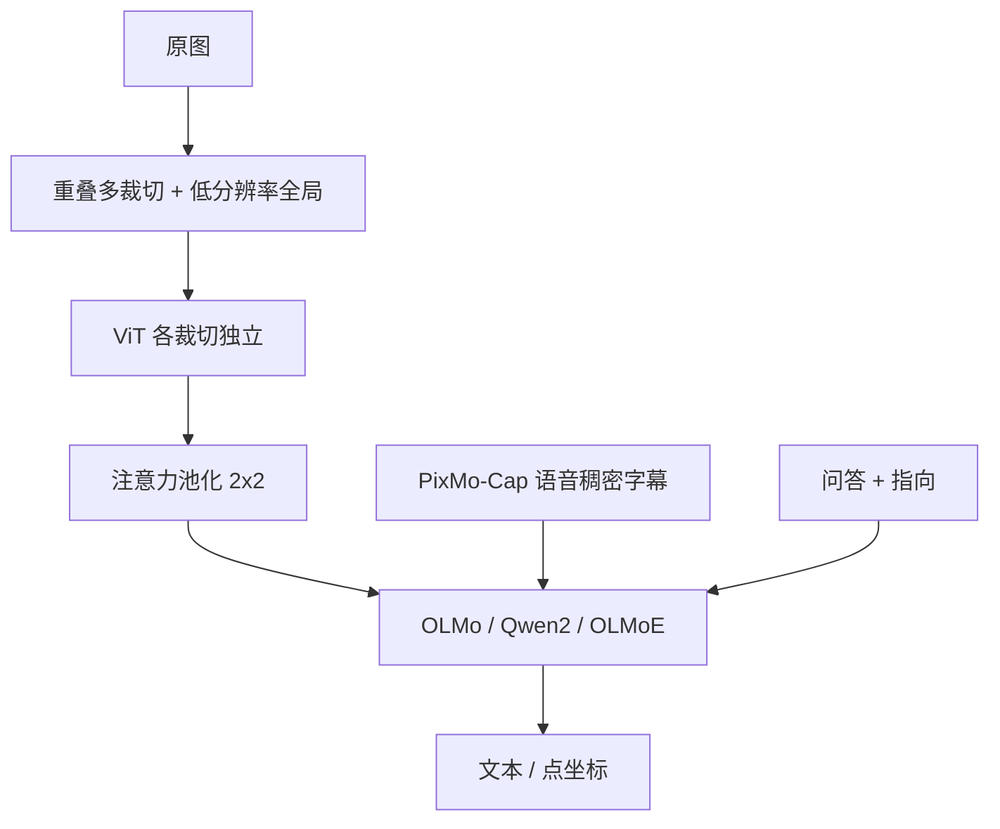

# Molmo

开源权重若靠闭源 VLM 的合成数据续命，社区仍然不知道如何从零做出能打的多模态模型；PixMo 用真人语音描述和二维指向把这条蒸馏链剪断。

<footer>—— Deitke 等，Molmo and PixMo，arXiv:2409.17146</footer>

Ai2 的 Molmo（Multimodal Open Language Model）把「开放」写成三件事同时成立：权重、代码、**视觉–语言训练数据**，且训练数据不依赖任何外部 VLM（含闭源）的合成字幕。关键资产是 PixMo：约 71.2 万张图的超长稠密字幕（预训练）、自由问答、以及 230 万级二维指向。架构并不猎奇：现成 ViT + 连接器 + 解码器 LLM。家族按开放程度与体量分档：MolmoE-1B（OLMoE-1B-7B，激活约 1B）、Molmo-7B-O（OLMo-7B，最开）、Molmo-7B-D（Qwen2-7B，演示档）、Molmo-72B（Qwen2-72B）。72B 在论文的学术均分与人类 Elo 上被写成开源数据类最强，并超过 Claude 3.5 Sonnet、Gemini 1.5 Pro/Flash，仅次于当时的 GPT-4o。本篇写 PixMo 如何采、重叠多裁切与两阶段训练，不把后续未在该文的检查点倒填进来。

## 问题

2024 年最强 VLM 仍是 API。开源权重里分数好看的，往往用 GPT-4V / GPT-4o 给图打字幕再蒸馏，等于把闭源能力洗成可下载参数。学术界因此缺少一份**可复现的从零配方**：高质量图文从哪来、连接器要不要单独对齐阶段、高分辨率切块边界怎么处理。众包写长字幕又慢又浅，标注员还会去贴闭源 VLM 的输出，恰好破坏「无蒸馏」约束。

第二个缺口是动作接口。框和掩码标注贵，智能体却需要「点这里」。若模型只能吐自然段，机器人与 GUI 代理还要另接检测头。Molmo 把指向写成一等输出：用点回答、用点计数、用点当视觉解释。

### 说话 60–90 秒，而不是写两句

PixMo-Cap 的采集把模态换成语音。标注员对图讲至少 60 秒（后期单人 90 秒），音频本身是「没用过 VLM」的收据。语音识别得到草稿，再由**纯文本** LLM 汇总、去口语。约 70 个主题的网络图，71.2 万张独特图、130 万条语音稿，成稿均长约 196 词——对照 COCO 约 11 词、Localized Narratives 约 37 词。AskModelAnything：标注员提问，流水线提供 OCR（非 VLM）与稠密字幕，文本 LLM 起草答案，人接受或打回，16.2 万问答 / 7.3 万图。PixMo-Points：指出某物、描述、穷尽每个实例，并含「图中没有」；另有 7.9 万条点解释。合成集 PixMo-Docs / Clocks / Count / CapQA 补文档、读钟、计数与字幕问答，仍不调用外部 VLM。

「不用外部 VLM」不等于不用 LLM。语音转写、把口语收成字幕、在问答里当编辑器，都是语言-only 模型。科学主张是：视觉能力不从 GPT-4o 的看图答案里抄来。评开放度时要把这一层写清楚，以免被理解成「全程无大模型」。

## 方法

图像经多尺度、多裁切送入 ViT（主用 OpenAI CLIP ViT-L/14 336px；消融里 SigLIP 与全开源 MetaCLIP 也可）。裁切按网格铺满高分辨率图，相邻裁切重叠约 4 patch（56 px），使边界 patch 能看见邻居；**重叠区的特征不送给 LLM**，传给连接器的 patch 仍恰好铺满原图。每裁切独立编码。连接器把 ViT 倒数第 3 与倒数第 10 层拼接，2×2 窗用多头注意力池化（query 为 patch 均值），再 MLP 到 LLM 隐维。特殊 token 标图像起止、行尾列标记、以及「无 padding / 部分 padding / 全 padding」以免把黑边当成真实暗角。训练常用 12 个高分辨率裁切；评测可加到 36，计数任务除外，因为指向对裁切数更敏感。

### 两阶段，没有单独的连接器预训练

预训练：全参在 PixMo-Cap 上生成字幕或其中一条语音稿，提示指定风格，90% 样本带长度暗示。连接器学习率更高、warmup 更短（约 2e-4 vs ViT 6e-6、LM 2e-5），从而跳过「冻塔只训投影 + LAION」那一阶段；论文消融认为加 LAION 对齐无增益。残差 dropout 只打在文本 token 上，逼模型看图。微调：PixMo 与一批开源 VQA/文档集按样本量平方根采样，指向数据上加权；除若干 PixMo 任务外用 style tag。指向输出为 0–100 的纯文本坐标，多点按从上到下、从左到右编号。计数则按点序列形成思维链。同一张图的多条标注会高效打包进训练。

Molmo-72B 学术均分 81.2、Elo 1077（论文表中第 2）；Qwen2-VL-72B 在同表均分 79.4、Elo 更低。不要只抽 DocVQA 单项（Qwen2-VL-72B 96.5 vs Molmo-72B 93.5）来否定全文主张。计数与 PixMo-Count 上指向优势最大。

## 机制

语音采集同时解决三个标注失败：写字太短、打字太慢、去抄闭源 VLM。长度暗示让模型学会按请求调节详细程度，消融显示它提高字幕与下游。重叠裁切修补「格边界没有上下文」：普通非重叠 AnyRes 在接缝上丢邻域，OCR 与指向首当其冲；丢掉重叠区特征则避免重复 token。注意力池化优于简单拼接，是因为 2×2 里的信息量不均，均值 query 能选。跳过连接器阶段能成立，是因为 PixMo-Cap 已经足够密、足够对齐语言，不需要用噪声网页对来「热身投影」。

指向把 grounding 从检测头收成语言：坐标是词，计数是点的枚举。智能体可以读这些点当点击目标。点解释模式用 style tag 关掉默认行为，因为该模式更不稳、只应在用户要解释时开。人类 Elo 与 11 项学术均分一起报，是因为学术集已被刷、偏好更能反映「像不像能用的看图模型」。

### 开放度分档不要混成一句「完全开源」

Molmo-7B-O + MetaCLIP 路线在「每一 bit 训练数据都可公开追溯」上最强。Molmo-7B-D / 72B 用 Qwen2，权重开、Qwen 预训练数据并不等同 OLMo。CLIP ViT 来自 OpenAI。PixMo 本身开。写许可证与复现范围时要按档：不能把 72B 的分数写进「全开源数据」那一行而不加注。MolmoE-1B 用激活 1B 换效率，论文称学术与偏好上接近 GPT-4V，那是体量叙事，不是 72B 的替代品。

评测 36 裁切、训练 12 裁切。指向类任务不要随便加裁切。附录用约 3000 步高分辨率后训练可缓解，但那是额外配方。复现官方分数必须跟裁切数与提示模板，差 10 个点往往是评测协议而不是权重坏了。

## 边界与工程取舍

无外部 VLM 不等于无偏：众包语音仍有文化与语言偏置，文本 LLM 汇总会平滑掉争议细节。合成文档与读钟提高基准，野外版式仍要单测。指向是 2D 点不是 3D 接触，也不是分割掩码。Qwen2 骨干的许可证与 OLMo 不同，再分发 72B 要读两份卡。预训练只用 71.2 万图级稠密字幕，覆盖面小于网页级十亿对；稀有实体、细粒度物种可能弱于蒸馏了闭源世界知识的模型。

论文的 GPT-4o / Claude 比较绑定当时快照与他们的评测栈。Molmo 不是动态原生分辨率：裁切数是超参。视频、多图对话不是主叙事。不要把 PixMo 被 Qwen2.5-VL 等后续报告当作指向数据来源，写成 Molmo 模型本身进入了那些训练。

## 小结

- Molmo 是 Ai2 的开源 VLM 家族：PixMo 数据无外部 VLM 蒸馏，权重与代码一并发布。
- 语音稠密字幕做预训练，指向做 grounding / 计数 / 解释；架构为重叠多裁切 + 注意力池化 + 现成 LLM。
- 两阶段全参训练，跳过噪声网页上的连接器预热；7B-O 最开，72B 最强。
- 出处：Deitke、Clark 等，*Molmo and PixMo: Open Weights and Open Data for State-of-the-Art Vision-Language Models*，arXiv:2409.17146，2024。对照 Ai2 博客 https://allenai.org/blog/molmo 。
