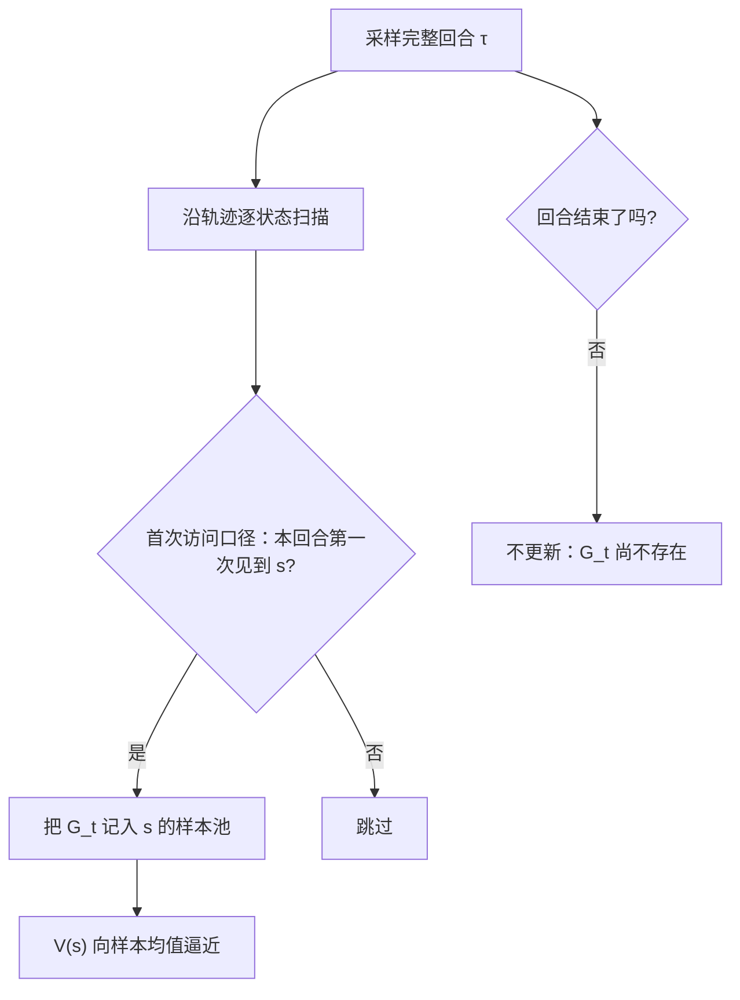

# 蒙特卡洛策略评估

无模型评估的入场券是把回合跑完：均值无偏，方差却把整条余下轨迹的随机性折进一个标量。

<footer>—— 据 Sutton & Barto, Reinforcement Learning: An Introduction, 2018, 第 5 章整理</footer>

[上一课](/llm/exploration-epsilon)把探索-利用权衡钉在动作选择上：ε-贪婪保证每个动作被反复访问，乐观初始化把「没试过」翻译成「先试试」，与 LLM 采样温度的对照说明温度只是全局缩放，不是探索的完整答案。但那一课有个未兑现的假设：价值 $v_\pi$ 已知。[值迭代](/llm/value-policy-iteration)算 $v_\pi$ 靠贝尔曼方程与转移模型，而那课的结尾已经交代：「模型已知」在 LLM 里几乎不成立——环境就是模型自己，没人给你转移概率。模型未知时，评估只能从数据里来。本课写蒙特卡洛策略评估：用完整回合的经验回报平均，替代 $r+\gamma Pv$ 的模型算式。后面的 TD(0)、SARSA 与 Q 学习，都默认你已经会分「首次访问」与「每次访问」。

## 问题

缺口是：策略 $\pi$ 固定，转移与奖励未知，只要 $v_\pi$。回报沿用[回报、折扣与价值函数](/llm/return-discounting)的定义：$G_t=\sum_{k\ge0}\gamma^k r_{t+1+k}$。数据形态是回合 $\tau=(s_0,a_0,r_1,\dots,s_T)$。动态规划的评估算子每一步都要模型；现在唯一的原料是采样出的轨迹，而 $v_\pi(s)=\mathbb{E}_\pi[G_t\mid s_t=s]$ 本来就是期望。蒙特卡洛的赌注只有一条：期望可以用样本均值来估，不需要模型。

### 首次访问与每次访问

跑 $N$ 条回合，每条从起点走到终止，沿途在每个状态记下从那里起算的回报 $G_t$。记账法有两种：**首次访问**只在本回合第一次见到 $s$ 时把 $G_t$ 记入样本池；**每次访问**每次路过都记。增量形式 $V(s)\leftarrow V(s)+\alpha\,(G_t-V(s))$ 把均值变成在线更新。首次访问的样本彼此独立，估计无偏；每次访问的样本共享同一条回合，有偏但一致性仍在，样本紧张时更省。

## 方法

估计量的构造只有三条规则。其一，回报在回合内回溯累加：从终止态倒着算 $G$，一条轨迹一遍扫描就得到全部时点的目标，不需要为每个 $(t,s)$ 单独重算。其二，样本池按状态分桶、按选定口径入账：首次访问口径下每回合至多为 $s$ 贡献一个样本，每次访问口径下贡献多次；口径在实验开始前钉死，中途切换会把两种估计量的偏差混在一起。其三，更新用固定步长或 $lpha=1/N(s)$ 的递减步长：递减到无穷才收敛到真值，固定步长则刻意保留适应性——非平稳环境里这是特性，评估平稳策略时是偏差来源。

跑 $N$ 条回合，每条从起点走到终止，沿途在每个状态记下从那里起算的回报 $G_t$。

## 机制

无偏的来源：首次访问的 $G_t$ 是 $v_\pi(s)$ 的独立同分布样本，大数定律接管收敛。高方差的来源：$G_t$ 把余下整条轨迹的随机性——每步动作抽样、每次转移、奖励噪声——折进一个数，方差随「从 $s$ 到大结局」的期望长度增长。等回合的来源：$G_t$ 的定义就要到 $r_T$ 为止的每一项，中途缺一项就没有目标。三件事同源：不拆回合，就不拆方差，也不免等待。

$\gamma=0.99$ 的有效视界约 $1/(1-\gamma)=100$ 步；一条一千 token 的生成把上千次抽样噪声折进一个标量，样本之间还不独立——「无偏」不等于「准」。Sutton &amp; Barto 2018 §5.1 只承诺收敛，不承诺快。

LLM 的回合恰好是这个形态：一次完整 rollout 几百到几千 token，[可验证奖励](/llm/rlvr)在序列末尾给一个判分——整段回报大结局才揭晓，整条 rollout 生成完才训练得动。语言模型上的 REINFORCE 一类序列级方法天然按蒙特卡洛记账，生成成本也因此成为训练成本的下界。这一课只做评估，控制（拿 $Q$ 改策略）留给后两课。

## 边界

蒙特卡洛只适用于有终止的回合制任务：持续任务没有 $T$，等不来大结局，这个缺口由下一课的 TD 接手。访问覆盖是前提：评估只覆盖被 $\pi$ 访问到的状态，上一课的 ε-贪婪是覆盖的保证，纯贪心会让没走过的格子永远停在初值。不自举是双刃：蒙特卡洛不依赖其他状态的估计，误差不沿链传播，但同一回合里相邻状态的新信息也要各自等各自的样本，学不到「一半」。对 LLM 还有一步：结果奖励只在 EOS 出现时，过程中的对错完全不进账本——中期信号要等有了自举与优势的工具才用得上。

## 小结

- 无模型评估把 $v_\pi$ 换成经验回报的样本均值，转移模型缺席不再阻塞。
- 首次访问无偏，每次访问一致；增量形式 $V\leftarrow V+\alpha(G-V)$。
- 代价成对出现：高方差、必须等回合结束——整条余下轨迹的随机性折进一个数。
- LLM 的 rollout 加结果奖励正是蒙特卡洛形态，生成完才训得动。
- 不自举免于误差传播，但也拿不到逐步信号；缺口由下一课的 TD(0) 接手。
- 出处：Sutton & Barto, Reinforcement Learning: An Introduction, 2018, 第 5 章（首次/每次访问与收敛口径）。
