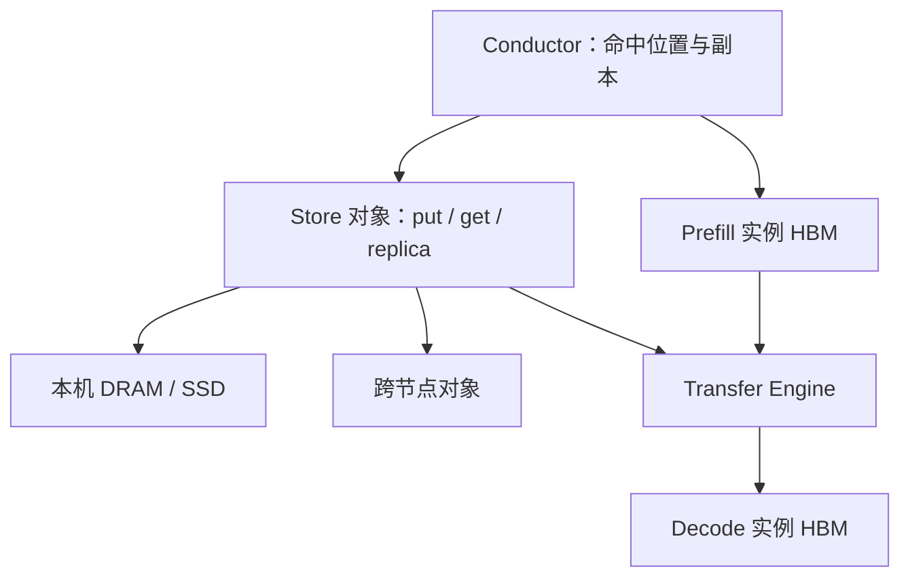

# Mooncake Store

把 GPU 节点上闲着的 DRAM、SSD 与 RDMA 收成对象池：KV 按块 put/get，热点用副本聚合带宽，调度围着命中转。

<footer>—— Qin et al., Mooncake, FAST 2025；开源说明于 2025-03 单独放出 Store</footer>

Mooncake 论文的标题是用存储换计算。换成什么存储、以什么 API 换，是 **Store** 的职责：把分页 KV 当成近 GPU 的分布式对象，而不是再做一个 POSIX 文件系统。[总述](/llm/mooncake) 写动机、不等式与和 PD 的叠放；[Transfer Engine](/llm/mooncake-transfer-engine) 写怎么搬。本篇钉对象接口、副本、放置与论文里的命中/容量数字，避免三篇写成同一段话。

## 问题

单机 radix 只能看见本卡页。请求被分到另一台，前缀命中率为零。HBM 又贵又小，放不下跨会话的系统提示与用户文档。同一台 HGX 上的主机内存、本地 SSD 和每卡数百 Gbps 网卡，在只跑模型时经常闲着。PD 分离让 KV 必须在阶段边界存在于「某一处可被解码工人拉到的地址」；若这一处只是当前前填实例的 HBM，复用范围仍是这一次交接，跨会话的第二次前填还是全价。

需要的语义不是文件：没有 POSIX 一致性，没有目录树。需要的是按块键的 `put` / `get`、按热度改副本数、以及和引擎块表兼容的粒度。错误的层位是把 KV 丢进远端对象存储再走 HTTP——不等式左边的 $B$ 会永久小于右边的重算吞吐。

### 全局命中相对本地缓存

论文对照的是「每台前填实例自己的本地前缀缓存」。全局 Store 让请求换机器后仍能按块键把前缀拉来。报告的最高命中率约 2.36 倍于本地缓存，前填时间节省约 48%。这是存储层数字，取决于会话重复度；无共享的一次性长文档，Store 主要当 PD 中转，不要期待同等倍数。端到端有效请求容量在真实对话轨迹上相对基线高 59%–498%（16 个 8×A800 节点、不同 TBT SLO），生产相对旧系统在 A800 / H800 集群上多处理 115% / 107% 的请求，日处理逾 1000 亿 token。这些是整套架构（分离 + Store + Conductor）的数字。

对象的权威位置在池里，HBM 仍只持有正在算的页。不要把 Store 理解成「decode 工作集也卸到 SSD」。TBT 路径必须以 VRAM 为主；SSD 补的是容量与冷前缀。

## 方法

接口在论文 §3.2.2：`put`、`get`、`change_replica`。KV 按 mini-block 组织成内存对象。Conductor 根据热度调副本，把全局系统提示摊到多节点，用副本数乘单 NIC 带宽。传输全部委托给 Transfer Engine：注册内存、批量 DRAM/VRAM、异步完成。淘汰与放置同时看容量和下一跳前填实例能不能就近取——纯 round-robin 放置会让全局池退化成贵的临时盘。

层级是 HBM（工作集）→ 本机 DRAM/SSD（近 GPU 缓存）→ 跨节点池。HBM 布局与 vLLM 一类块表相容，便于引擎把命中的对象映射进页表而不改注意力公式。开源时间线：2025-03-07 放出基于 Transfer Engine 的 Mooncake Store；此前 Engine 已单独被 vLLM 用于分离式前填。vLLM 的 xPyD 计划走 Store 做分离式 KV，与「只用 Engine 做一次 P→D 拷贝」不同——后者没有跨会话对象，前者有。

调度（Conductor）以 KV 为中心：先问这段前缀在不在池里、在哪几个节点、副本够不够，再决定前填工人与是否跳过计算。这和「先 round-robin 工人、再看本机有没有页」的顺序相反。顺序反了，Store 只是被动仓库，命中率回落到本地缓存。

### 副本是带宽设备，不是故事里的容错

系统提示被所有会话打中。单副本时，所有 `get` 打同一 NIC，TTFT 变成网卡队列。`change_replica` 把热对象复制到更多节点，聚合读取带宽。写入放大与淘汰变复杂是代价：冷用户文档应保持单副本甚至只留在产生它的节点。论文把多副本写成带宽手段；把 Store 当跨机房容灾存储，会在一致性与延迟上走错产品。

块键必须含模型版本、精度、RoPE、层结构、适配器。租户隔离是键前缀与 ACL，不是靠「哈希碰撞少」。精确前缀匹配在语义上不泄漏内容，但过粗的键会把不应共享的提示变体混成同一对象。

## 机制

复用的数学与 radix 相同：KV 只依赖已见前缀 token，字节级相同则张量相同。Store 把等式的作用域从「本卡」扩到「集群内任何曾经算过该前缀的节点」。加载是否划算由 $B$ 对 $G$（计算吞吐）决定，见总述篇的 6GB/s vs 19GB/s。H800 比 A800 更「愿意重算」，除非 NIC 与副本一起升级。这解释了为何 Store 必须近 GPU：远地 S3 的 $B$ 对两代卡都不成立。

与 PD 传输的关系：一次请求的 P→D 是必经边，对象可以来自刚刚算完的 HBM，也可以来自池里的历史块。没有 Store，分离仍能消除阶段干扰（DistServe）；有 Store，前填还可以少做。论文声称这是第一份展示跨会话分布式 KV 池显著收益的系统，评测钉在 Kimi 的痕迹与硬件上。

2.36× 命中是相对本地缓存的最大值，不是平均值。报告容量区间 59%–498% 随 TBT SLO 变：SLO 越紧，能用缓存换来的有效容量越显眼，因为重算更容易打爆延迟预算。

### 和 LMCache Blend 的差别

Store 复用的是**精确前缀块**，不修补跨块注意力。RAG 多段检索拼接要用 [LMCache](/llm/lmcache) 的 CacheBlend 一类选择性重算。Mooncake 的主场景是聊天机器人：系统提示 + 会话历史是前缀。把 Store 的 `get` 直接粘到非前缀块上，数值会错。反过来，Blend 不提供 RDMA 对象池；多实例 RAG 仍需要一层存放预计算块的存储，那一层可以是 LMCache 自己的 tier，也可以是 Store，但不能混用键空间。

## 边界与工程取舍

一致性：用户注销、权限变更、模型热更新必须能失效块。精确匹配不会在语义上「泄露生成内容」，但缓存住的用户文档 KV 等于缓存住了该文档的表示，跨租户命中是事故。SSD 尾延迟、写放大、与分页分配器的注册生命周期，都是运维故障的高发区。Conductor 中心化在千节点规模上要自己的可用性设计；论文写的是生产在跑，不是给出一套开源共识协议。

开源 Store 与论文中 Kimi 内部栈的功能差要当预期：副本策略、淘汰、与引擎的连接器在仓库里持续演进。不要用 GitHub README 的接口去改写 FAST 实验表，也不要用实验表去要求开源必有同等 Conductor。

不要把 Store 写成文件系统论文。没有 inode、没有 POSIX；有的是对象、副本、批量 RDMA。性能模型是「命中则少算前填」，不是「顺序读吞吐」。

出处钉 Qin et al., *Mooncake: Trading More Storage for Less Computation — A KVCache-centric Architecture for Serving LLM Chatbot*, FAST 2025 / arXiv:2407.00079；代码 https://github.com/kvcache-ai/Mooncake。总述见 [Mooncake KV 池](/llm/mooncake)，搬运见 Transfer Engine。

## 小结

- Store 用 put/get/change_replica 把 DRAM/SSD/RDMA 收成近 GPU 的 KV 对象池。
- Conductor 按命中位置调度；副本为热点聚合带宽，不为跨机房容灾叙事。
- 相对本地缓存，论文报告命中最高约 2.36×、前填时间约省 48%；容量数字属于整套系统。
- 精确前缀复用，不覆盖 RAG 非前缀融合；热路径必须走 RDMA 而不是 TCP/HTTP。
- Decode 工作集留在 HBM；Store 服务前填复用与 PD 中转。
- 出处：Qin et al., FAST 2025；`kvcache-ai/Mooncake`。
