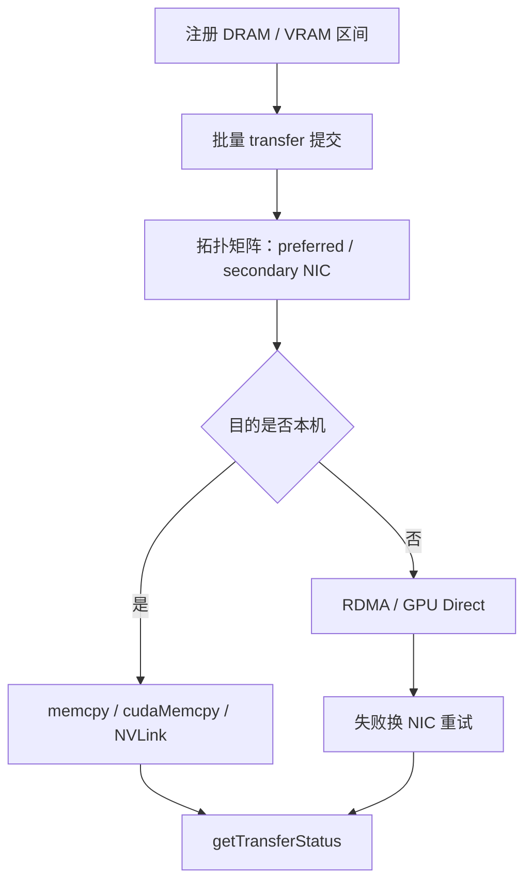

# Mooncake Transfer Engine

预先注册内存，按拓扑挑网卡，批量提交 DRAM↔VRAM 与节点间 RDMA；集合通信库不擅长的动态端点与主机内存路径，由传输引擎当成一等操作。

<footer>—— Qin et al., Mooncake, FAST 2025 §3.2；Mooncake Transfer Engine 设计文档</footer>

[PD 分离](/llm/pd-disaggregation) 之后，KV 必须搬家；[Mooncake 池](/llm/mooncake) 还要把块在 GPU、主机 DRAM、SSD 与远端节点之间复制。NCCL 面向训练期相对固定的 rank 集合，难以优雅处理工人增减，也不把 DRAM↔DRAM 当主路径。Qin、Li、He、Cui、Ren、Zhang、Wu、Zheng、Xu 的 FAST 2025 文本把 **Transfer Engine** 写成 Store 底下的批量传输层：注册、拓扑感知选路、异步完成查询。开源仓库随后把它拆成可被 vLLM / SGLang 单独链接的组件。本篇只写这一层；对象语义与副本策略见 [Mooncake Store](/llm/mooncake-store)。

## 问题

一次有用的 KV 搬运要同时满足：体积按层数×前缀长度线性涨（DistServe 给过 OPT-66B、512 token 约 1.13GB 的例子）；延迟必须叠进 TTFT 而不是另开一张墙钟；源和目的可能是 VRAM、pinned DRAM 或远端 DRAM；端点集合随 prefill/decode 工人扩缩而变。用 TCP 搬 GB 级张量，墙钟往往高过重算。用 NCCL 做点对点，动态拓扑与主机内存路径别扭。还要避开跨 NUMA / 跨 PCIe 开关的绕路：从「任意网卡都能发」到「这张卡走这张 NIC」差的是一整条 UPI 或 PCIe 的有效带宽。

Mooncake 的复用不等式把问题定量化：LLaMA3-70B、前缀 8192，8×A800 上加载带宽大约要 6GB/s 量级才比重算划算，8×H800 上大约 19GB/s——更快的 GPU 让重算变便宜，对传输更苛刻。Transfer Engine 必须把有效带宽做到这个数量级，而不是报网卡标称峰值。

### 为何预注册

RDMA 与 GPU Direct 要求内存被 pin、被网卡登记。若每次 `get` 临时注册，延迟和失败模式都不可控。引擎的契约是：调用方（Store 或 PD connector）在分配分页块或主机缓冲时就注册，传输只提交已登记区间的列表。生命周期必须与 CUDA 分配器、分页回收对齐，否则会出现「页已还、网卡仍以为可写」的远程故障。

GPU Direct RDMA 还要求 NIC 与 GPU 处于合适的 PCIe 拓扑（常见讨论里的 PIX）。经 PXB/NODE 绕行时，BAR1 带宽可能让「直接读 GPU」慢过「先拷到 pinned DRAM 再 RDMA」。引擎按拓扑选路径，不是永远 Direct。

## 方法

上层看到的是同步批量传输加异步状态：对已注册的 DRAM 或 VRAM 区间做 `put`/`get` 一类批量操作，用 `getTransferStatus` 查询进行中或出错。能走 GPU Direct 则绕过主机 bounce buffer。设计文档列出的后端包括：本机 memcpy / `cudaMemcpy`（目的其实在本地时）、TCP（DRAM↔远端 DRAM）、RDMA（多网卡池化与重试）、NVLink、HIP（AMD 上的 IPC/可共享句柄）、cuFile / GPUDirect Storage（NVMe-oF）、以及 EFA 等。失败时在优选 NIC 与备选 NIC 之间改道，而不是把整次请求打成失败给上层重算——上层仍可选择重算，但那是策略，不是传输层默认。

拓扑：每个节点生成矩阵，按内存类型（注册时声明）把 NIC 分成 preferred 与 secondary。正常情况只从 preferred 里选，使 RDMA 留在本 NUMA 或本 PCIe 开关内；失败才动 secondary。传输时根据源/目的地址解析两端 NIC、建连接、提交。环境变量如 `MC_IB_SL` 可把 KV 流量划到与专家并行 All-to-All 不同的虚拟通道，避免同 NIC 上两类流量互相排队。

仓库给出的带宽数字：约 40GB 数据（对应他们文中 LLaMA3-70B 约 128k token 量级的 KV）上，Transfer Engine 在 4×400 Gbps RoCE 约 88GB/s、8×400 Gbps 约 190GB/s，相对 TCP 约 2.4× 与 4.6×。这是传输微基准，不是端到端 tokens/s。vLLM 从 2024-12 起官方支持用 Mooncake Transfer Engine 做分离式前填的 KV 搬运；SGLang 后续也把它用于大规模 RL 的权重 RDMA 同步——同一数据面，另一种载荷。

### 和 NCCL、NIXL 的边界

NCCL 优化的是固定 communicator 上的集合与 P2P，训练拓扑变化慢。Transfer Engine 优化的是推理期**动态点对点**与**主机内存参与**的 KV/对象搬运。Dynamo 的 [NIXL](/llm/nvidia-dynamo) 目标同类：统一 HBM/DRAM/存储的非阻塞 API，后端走 UCX、GDS。生产集群应选一条数据面贯穿 P→D 与分层卸载，避免同一块内存向两套库注册。Mooncake 论文明确写：NCCL 不能妥善处理节点/NIC 动态增减，也不支持 DRAM-to-DRAM 主路径；这是他们自研引擎的动机，不是对 NCCL 训练用途的否定。

vLLM Omni 连接器文档给出对照：CPU pinned 池（GPU→主机池→RDMA→主机池→GPU）对多数拓扑更稳；GPUDirect 池要求 PIX。一份内部对照里，Mooncake Store 走 TCP 的墙钟约 810ms，Transfer Engine CPU 路径约 14ms、约 22GB/s，加速约 58×——这说明 **Store 的对象路径若降级到 TCP，会把 Engine 的带宽优势吃光**。分层时热路径必须钉在 Engine 的 RDMA 上。

## 机制

有效带宽来自三条：零拷贝（注册内存上 NIC 直接读）、多 NIC 聚合（块打散到多卡发送）、拓扑局部性（不穿过 UPI）。副本策略在 Store 层用 `change_replica` 把热点系统提示摊到多节点，传输层负责把「多副本」变成「多源聚合带宽」。没有 Engine，多副本只是多份慢拷贝；没有副本，单 NIC 先成为 TTFT 墙。

异步状态让前填工人在传输未完成时继续接下一条，解码工人在 KV 未齐时不开始注意力。这与 DistServe 的 pull 缓冲同一思想，只是实现从 NCCL 换成注册内存上的批量 RDMA。重试换 NIC 是为了尾延迟：推理 SLO 对单次超时比训练更敏感，宁可次优路径送达，不要卡在一条拥塞的 QP 上。

注册表是进程内状态。fork、CUDA context 重建、worker 崩溃重启都必须重新注册。漏注册的症状是偶发 RDMA 失败，而不是 Python 异常栈，排障要看引擎日志与 `ibv` 计数。

### 载荷不限于 KV

同一套注册与选路可以搬权重（RL 同步）、激活、甚至请求附件。语义由上层定义。把 Engine 写成「只能搬 KV」会低估它，也会在权重量级传输时误用 KV 的 QoS 队列。`MC_IB_SL` 存在，就是为了让不同载荷走不同虚拟通道。

## 边界与工程取舍

标称 400 Gbps × 8 不等于 190GB/s 对每条小消息都成立。Engine 的数字来自大块、批量提交；按 token 逐步搬会把带宽变成延迟。PD 路径应按层或按大块刷，与 [KV 传输](/llm/pd-kv-transfer) 的分层重叠一致。TCP 后端是功能降级，不能拿来验证「复用比重算便宜」的不等式。

与分页块大小的耦合：块太小，每次传输的 WQE 过多；块太大，内部碎片与调度粒度变差。Engine 不管块语义，只看见区间列表——把碎片拼成大 scatter-gather 是 Store 或 connector 的责任。GPU 分配器若频繁申请释放，注册抖动会比搬运本身更贵；实践上对 KV 池做一次大注册，再在池内划块。

不要把 FAST 论文的集群收益（请求容量 +59%–498%、生产相对旧系统 +115%/+107%）算成 Transfer Engine 微基准的功劳。那些数字是 Store + Conductor + PD 分离 + 调度的总和。Engine 的功劳是让不等式左边的 $B$ 足够大。

出处钉 Qin et al., *Mooncake: Trading More Storage for Less Computation*, FAST 2025（arXiv:2407.00079）§3.2；设计文档 https://kvcache-ai.github.io/Mooncake/design/transfer-engine/；代码 https://github.com/kvcache-ai/Mooncake。vLLM 分离式前填支持见项目 2024-12 发行说明。

## 小结

- Transfer Engine 是注册内存上的批量、拓扑感知、可重试 RDMA/本地拷贝层，服务 KV 与其它近 GPU 载荷。
- 相对 NCCL，它把动态端点与 DRAM 路径当主场景；相对 TCP，大块带宽高数倍。
- 预注册与 PCIe/NUMA 局部性决定 Direct 是否划算；拓扑不对时 pinned DRAM 中转更快。
- 它提供带宽 $B$，不提供对象语义；副本与淘汰在 Store。
- 端到端容量数字属于整套 Mooncake，不能单独记在 Engine 上。
- 出处：Qin et al., FAST 2025；Mooncake Transfer Engine 文档与仓库。
