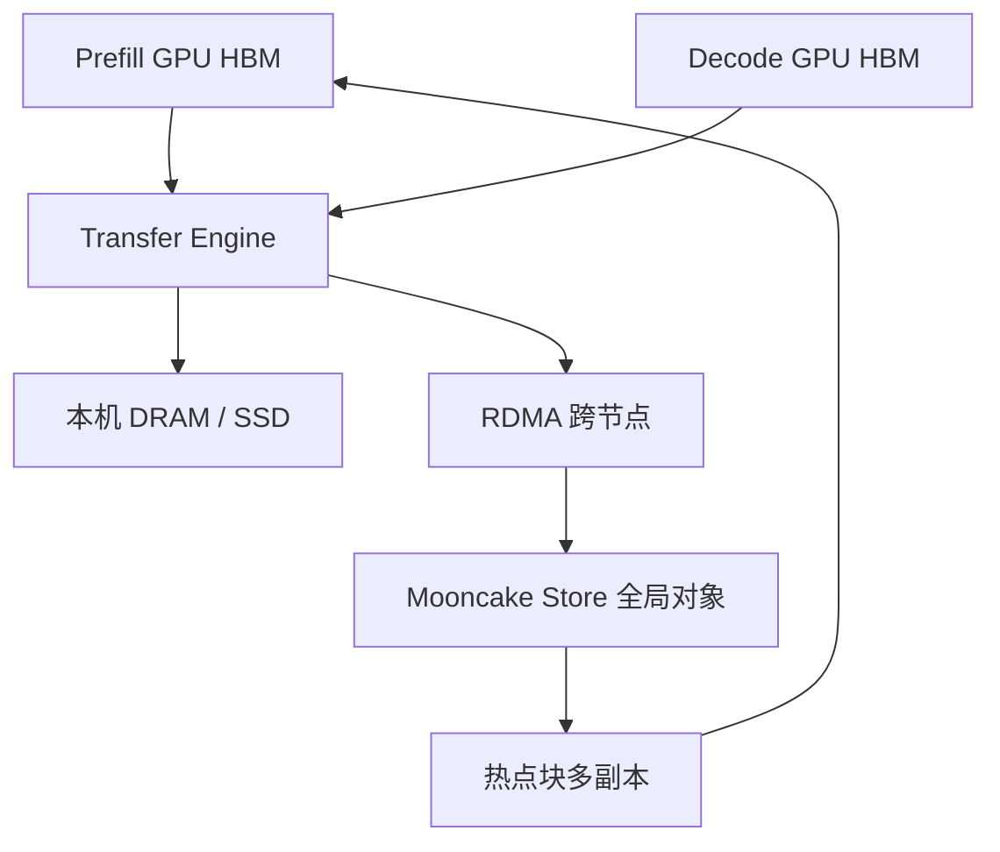

# Mooncake KV 池

    
用集群里闲着的 DRAM、SSD 与 RDMA 换更少的前填计算：KV 变成一等公民，调度围着缓存命中转，而不是围着 GPU 清单转。

    <footer>—— Qin et al., Mooncake: Trading More Storage for Less Computation, FAST 2025</footer>

月之暗面把 Kimi 的服务栈写成一篇 **KVCache-centric** 论文：不仅把 prefill 与 decode 拆开，还把 GPU 节点上未吃满的 CPU、DRAM、SSD、网卡收成一份分离的全局 KV 池——Mooncake Store。原则是用存储换计算：能命中的前缀就不要再做二次前填。Qin、Li、He、Cui、Ren、Zhang、Wu、Zheng、Xu 的 FAST 2025 文本（预印本 arXiv:2407.00079）给出带宽何时该复用的不等式、对象接口与 Transfer Engine，并报告全局缓存命中率相对本地缓存最高约 2.36 倍、前填时间节省约 48%。开源在 `kvcache-ai/Mooncake`。Kimi 如何用这套池子扛长上下文，见 [Moonshot 长上下文服务](/llm/moonshot-serving)；本篇钉池子本身。

## 问题

多轮对话与长文档的前填是二次的，但前缀大量重复：系统提示、用户上传的同一份材料、会话历史。单机前缀缓存（radix / 块哈希）只能看见本卡上的页。请求被分到另一台，命中率为零，前填全额再付。GPU HBM 又贵又小，放不下跨会话、跨实例的热 KV。与此同时，同一台 DGX/HGX 上的主机内存、本地 SSD 和每卡数百 Gbps 的网卡，在只跑模型时经常闲着。

PD 分离让 KV 必须在阶段边界移动，但「移动」还不是「池化」。若 KV 只存在于当前 P 实例的 HBM 里，复用范围仍是这一次交接。要把复用范围扩到集群，需要一个对 GPU 近、对 RDMA 友好、能按块复制与淘汰的存储层。Mooncake 把这个层叫做 disaggregated KVCache，而不是再做一个通用分布式文件系统。

### 复用何时比重算更划算

记前缀长度 $p$、模型层与宽度带来的计算与 KV 体积。复用省下大约与 $p$ 成线性（MLP）加与 $p^2$ 相关（注意力）的前填；代价是把已缓存的 KV 搬进当前 P 实例的 HBM。当聚合加载带宽 $B$ 相对计算吞吐 $G$ 足够大时，搬比算更省 TTFT。论文给出数量级：LLaMA3-70B、前缀 8192，8×A800 上大约要 6GB/s 量级，8×H800 上大约 19GB/s——因为更快的 GPU 让「重算」变便宜，带宽门槛反向上升。100Gbps 级网卡在他们的测量里可以跨过 A800 那一档；宣传页上的峰值不够，要用有效带宽代进不等式。

「用存储换计算」不是把 KV 丢到远地对象存储再走 HTTP。路径必须是近 GPU 的 DRAM/SSD 加 RDMA / GPU Direct。远地 S3 式延迟会让不等式永远不成立。

## 方法

Mooncake Store 把 KV 按块做成内存对象，提供 `put` / `get` / `change_replica` 一类接口。Conductor 可以按热度调整副本数，把热点系统提示摊到多个节点上，用副本聚合带宽。传输层是 Transfer Engine：预先注册内存，批量提交 DRAM↔VRAM、节点间 RDMA，用异步状态查询完成。能走 GPU Direct RDMA 时绕过主机 bounce buffer。淘汰与放置要同时顾容量与「下一跳 P 实例能不能就近取」。

存储层级是 HBM（正在算的页）→ 本机 DRAM/SSD（近 GPU 缓存）→ 跨节点池。HBM 仍然用分页，与 vLLM 一类块表相容；池子缓存的是可复用前缀，不是把整个 decode 批的工作集都卸到 SSD。SSD 补的是容量，不是延迟敏感的 decode 路径。Decode 实例的 KV 仍以 VRAM 为主，SLO 是 TBT；P 侧才是「能命中则少算」的主战场。

### 全局池相对本地缓存

每个 P 实例仍有本地前缀视图，但对象的权威位置在池里。请求被调度到另一台时，仍能按块键把前缀拉过来。论文对照本地缓存：全局设计把命中率最高做到约 2.36 倍，前填时间节省约 48%。这是存储层的数字，不是端到端容量的数字；端到端见长上下文服务篇。开源仓库后来把 Transfer Engine 与 Store 拆成可被 vLLM / SGLang 接入的组件，论文写的是 Kimi 生产里那一套中心化 Conductor + 池。

块键必须包含模型版本、精度、RoPE 位置与适配器身份。只对 token 字节做哈希，会把 A 模型的 KV 喂给 B。池子放大了错误缓存键的爆炸半径：错一次，全集群都在复用错的前缀。

## 机制

Transformer 的 KV 只依赖已经看见的前缀 token。因此字节级相同的前缀，键值张量可以精确复用，不改变采样分布。池化把这条等式的作用域从「本卡 radix 树」扩到「集群里任何一台曾经算过这段前缀的节点」。副本是为了带宽而不是为了容错叙事：系统提示被所有人打中，单副本 NIC 会先成为 TTFT 墙。

不等式 $B$ vs $G$ 解释了为什么必须近 GPU、必须 RDMA。H800 比 A800 算得快，同样前缀更愿意重算，除非加载带宽也按比例涨。这与「卡越新越该上 KV 池」的直觉相反：新卡对池子的带宽更苛刻。工程上要同时扩 NIC 与副本，而不是只扩 SSD 容量。

### 和单机 radix、PD 传输的分工

[RadixAttention](/llm/sglang) 解决单运行时内的自动前缀索引；Mooncake Store 解决索引命中之后**数据在哪台机器、走哪条 RDMA**。PD 传输是一次请求生命周期里的必经边；池化让这条边可以命中历史请求留下的对象。没有全局池，PD 分离仍能消除阶段干扰；有了全局池，前填还可以少做。两者叠在 Kimi 的架构里，但论文把「第一份展示跨会话分布式 KV 池显著收益」写成自己的声称。

命中率 2.36× 是相对本地缓存的对照，取决于会话重复度。无共享的一次性长文档，池子只是给 PD 交接当中转，不要期待同等倍数。

## 边界与工程取舍

池子引入一致性与安全性问题：用户文档的 KV 不能跨租户命中；注销与权限变更要能失效块。精确前缀匹配不会在语义上泄漏，但块键若过于粗，可能把不应共享的系统提示变体混在一起。SSD 路径的尾延迟不适合 decode；把 decode 工作集也卸到池里，TBT 会先坏。

Transfer Engine 要预注册内存，与 CUDA 分配器、分页块的生命周期绑定；泄漏或重复注册会在 RDMA 域里变成难查的故障。多副本提高命中与带宽，也提高写入放大与淘汰复杂度。调度若不顾缓存位置、只做 round-robin，全局池退化成「贵的分布式临时盘」。

不要把 FAST 论文写成文件系统论文。语义是 LLM KV 块，API 围绕 put/get/replica 与批量传输，不是 POSIX。数字随 Kimi 当时的痕迹与硬件，换一套无多轮、无系统提示的负载，收益结构会变。

出处钉 Qin 等 *Mooncake: Trading More Storage for Less Computation — A KVCache-centric Architecture for Serving LLM Chatbot*，FAST 2025；预印本 arXiv:2407.00079。开源 https://github.com/kvcache-ai/Mooncake。不要另编一篇「月之暗面内部 KV」的第二 arXiv。

## 小结

- Mooncake Store 把 CPU/DRAM/SSD/RDMA 收成近 GPU 的全局 KV 池，用存储换前填计算。
- 复用划算与否由加载带宽相对 GPU 算力决定；更快的 GPU 对 NIC 更苛刻。
- Transfer Engine 做注册内存上的批量 RDMA / GPU Direct；热点块用多副本聚合带宽。
- 相对本地缓存，报告命中率最高约 2.36×、前填时间约省 48%。
- 池化叠在 PD 分离与单机前缀索引之上，不替代它们。
- 出处：Qin et al., FAST 2025 / arXiv:2407.00079。
