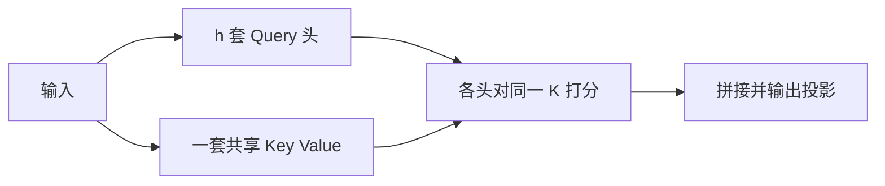

# Multi-Query Attention

在多头自注意力里，键和值可以在所有查询头之间共享；解码时每步只需写出并读回一套 KV，带宽随头数下降。

<footer>—— Shazeer, Fast Transformer Decoding: One Write-Head is All You Need, 2019</footer>

多头注意力为每个头准备独立的键、值投影，质量好，但自回归解码被显存带宽卡住：每生成一个词，都要把历史里 $h$ 组键值从 HBM 读进计算单元。Shazeer 在 2019 年指出，查询头可以保持多套，键值头减到一套——Multi-Query Attention（MQA）。它针对的是解码流量，不是前填 FLOPs，也不是二次阶本身。GQA 后来在「一头 KV」与「每头独立 KV」之间插入分组；MLA 则改走低秩压缩。本篇只把 MQA 这条极值走完。

## 问题

解码第 $t$ 步的新查询只有一条（每头各一条向量），点积次数是 $t\cdot h$，相对前填的 $t^2$ 已经小很多。真正贵的是加载 $K_{1:t},V_{1:t}$。完整 MHA 的缓存布局是 $[t, h, d_k]$ 的键加同样形状的值，字节数与 $h$ 成正比。头数随模型变宽而增加时，单步延迟越来越像「搬历史」而不是「做点积」。批大小一大，缓存更是容量杀手：并发请求数乘以 $h$。

Shazeer 的观察是：许多任务上，各头的查询方向差异比键值方向差异更重要。查询负责「这一头在问什么」，键值负责「上下文里有什么可被问」。后者在头之间高度相关，独立存储的收益递减，读取成本却线性上涨。MQA 把这一观察做成硬约束：键值头数等于 1。

### 带宽界而不是算术界

令带宽为 $B$ 字节每秒，单步要读 $2\cdot t\cdot h\cdot d_k\cdot b$ 字节（$b$ 为每元素字节）。算术量大约是 $2\cdot t\cdot h\cdot d_k$ 次乘加。算术强度随实现细节变化，但对解码往往低到被带宽饱和。把 $h$ 换成 $1$，读量降到约 $1/h$，算术量若查询头仍为 $h$ 则点积次数不变——查询仍有 $h$ 条，只是它们点积同一份 $K$。于是算术强度上升，计算单元开始吃得饱。这是 MQA 的直接目标。

MQA 不缩短序列，也不改变 softmax 对 $t$ 个位置求和这一事实。第 $n$ 步仍与 $n$ 成线性关系。它削减的是线性项的系数里与头数相乘的那一段。窗口注意力减的是 $n$，MQA 减的是 $h_{\mathrm{KV}}$，两者正交，可以叠用。

## 方法

设查询头数为 $h$，键值头数为 1。输入 $X$ 仍投影出 $Q\in\mathbb{R}^{n\times h\times d_k}$，但

$$
K=XW^K,\qquad V=XW^V,
$$

$W^K,W^V\in\mathbb{R}^{d\times d_k}$，得到 $K,V\in\mathbb{R}^{n\times 1\times d_k}$。每个查询头 $i$ 计算

$$
\mathrm{head}_i=\mathrm{softmax}\left(\frac{Q_i K^\top}{\sqrt{d_k}}\right)V,
$$

即 $h$ 套分数、同一份键值。拼头后的 $W^O$ 与 MHA 相同。因果掩码、缩放规则都不改。训练时 $K,V$ 在序列维上仍可一次算完；解码时缓存只追加形状 $[1,d_k]$ 的一对向量，而不是 $[h,d_k]$。

### 从已有 MHA 检查点出发

若直接随机初始化 MQA 训练，当然可以。若要从已有多头检查点改，需要把 $h$ 组 $W^K_i,W^V_i$ 收成一组。简单平均或只保留一头都会造成瞬时质量下跌，通常要再做一段上训练（uptraining）让查询头适应共享记忆。Shazeer 原文的设定是为加速解码而设计的结构，不一定从 MHA 蒸馏；后来的 GQA 论文把「从 MHA 平均 KV 头再短训」变成标准工序。MQA 可以看成 GQA 在组数等于 1 时的端点。

## 机制

共享 KV 意味着所有查询头在同一个键几何里检索。头与头的差异只能来自 $Q_i$ 与 $W^O$ 的对应块：它们可以对同一组键打出不同的分数分布，从而读出不同的值混合——注意值也只有一份，不同混合来自不同权重，而不是来自不同的值子空间。与 MHA 相比，值侧的子空间多样性被关掉，路由多样性还在。这解释了为何质量往往「可用、但略差」：内容库变薄，提问方式仍多。

梯度上，$W^K,W^V$ 会收到全部查询头的误差总和，更新更稳、也更折中。某个头若需要一种很偏的键方向，会与其他头打架。训练初期这种打架表现为损失略高、需要稍长的步数；训练后期则表现为某些细粒度对齐（稀有标记、精确位置）变弱。对解码器只语言模型，损失差通常小于翻译这类强对齐任务，这也是 MQA 先在自回归解码文献里站稳的原因。

实现时要把共享的 $K,V$ 广播到 $h$ 个头再做批量化点积，或使用允许「查询头多、键头少」的注意力核。错误地把 $K$ 也扩成 $h$ 头却共享存储指针，容易在反向里重复累加梯度。正确语义是：正向广播，反向对 KV 投影求和。

### 前填收益有限、解码收益显著

前填阶段 $Q,K,V$ 都从当前序列现场算，HBM 上的 KV 还不必反复读历史。MQA 减少的投影量只有 $K,V$ 两张矩阵的宽度，前填加速通常是几个百分点。解码阶段历史只读不写投影，加速可以接近头数比。因此 MQA 是服务侧结构，不是训练吞吐结构。若工作负载几乎全是训练或超长前填、很少生成，MQA 的动机变弱。

## 边界与工程取舍

质量回归是核心代价。头数很大的模型把 KV 压到 1 头，等于让上百个查询共享一个内容库，困难任务、长依赖、需要多角度复制上下文的场景会先受伤。批很小、长度很短时，解码本就不是带宽界，MQA 几乎白付质量。批很大、长度很长时，缓存容量按 $1/h$ 下降，同卡可服务的并发显著上升——产品上这往往比单请求的一点点困惑度更值钱。

GQA 的出现说明业界不愿长期停在 MQA 这个端点：用 8 个 KV 头而不是 1 个，常能收回大部分质量，仍把缓存降到 MHA 的 $8/h$。MLA 则不愿共享头，而愿把每 token 的 KV 压进潜向量。选择 MQA，意味着明确接受「单内容库、多提问」。

MQA 与张量并行交互时，KV 头只有 1，不能再按头切分到多卡。查询头仍可切。这会让并行策略在注意力子层变得不对称。单机服务无此问题；多卡解码需要改切分方案或把 KV 复制到各卡。

## 小结

- MQA 保留多套查询头，全头共享一套键值，解码 KV 缓存约为 MHA 的 $1/h$。
- 目标是提高解码算术强度、降低带宽与容量，不改变 softmax 对序列长度的二次/线性逐步结构。
- 各头仍可对同一 $K$ 打出不同分数，但值子空间不再按头分化，这是质量损失的来源。
- 前填加速有限，生成越长、并发越高，收益越大。
- 从 MHA 改造通常需要合并 KV 投影并上训练；GQA 后来把合并成可调组数。
- 张量并行难以按 KV 头切分，服务栈要单独处理。
- 出处：Shazeer, *Fast Transformer Decoding: One Write-Head is All You Need*, 2019。
