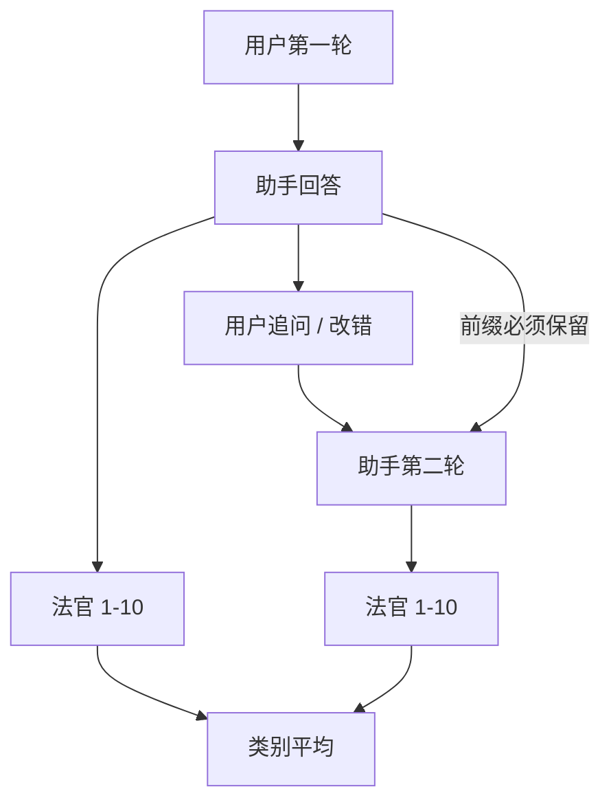

# MT-Bench 多轮

单轮把助手当成一次作文；第二轮才问它能不能接住追问、改错、收紧约束。用八十条分八类的对话，让强模型按十分制打分，可以快速画一张多轮画像——也把法官的偏差一起画进去。

<footer>—— Zheng et al., Judging LLM-as-a-Judge with MT-Bench and Chatbot Arena</footer>

Zheng 等人把两件事写进同一篇工作：Chatbot Arena 的人类成对票，以及 MT-Bench 这张**可复现的多轮卷**。八个类别（写作、角色扮演、抽取、推理、数学、编程、知识的 STEM 与人文等）各十条，每条两轮：第一轮开放作答，第二轮追问、加约束或要求修正。法官（原文以 GPT-4 为主）对每一轮打 1–10，再平均。它比 Arena 便宜、题面固定，比单轮指令集多一个时间维：模型是否把上一轮自己的答案当真、会不会在追问下自相矛盾。本篇把 MT-Bench 当作多轮协议与 LLM 绝对打分的交点；成对代理见 [Arena-Hard](/llm/arena-hard)，绝对量表的毛病见 [Likert 与绝对评分](/llm/absolute-rating-prefs)。

## 问题

指令微调评测长期停在单轮：给一个提示，看一条回答。产品会话却几乎总有第二句——「改短」「用 Python 而不是伪代码」「你刚才的第三点是错的」。单轮高分可以来自漂亮的开场；第二轮才暴露状态：有没有记住自己的承诺、会不会拒绝修正、会不会把追问当成新题从头编。需要一套题把第二轮写进标准，而不是指望随机用户来补。

八十题谈不上覆盖真实分布，但它把类别做成剖面：写作与角色扮演吃文风，数学与编程吃对错，抽取吃服从。总分平均之后，专长会被抹平，所以 MT-Bench 的正当用法是**分项加两轮**，不是再造一个单一 Elo。

### 第二轮测的是条件化，不是「更难的第一轮」

把第二轮题单独拿出来当单轮考，命题变了：模型没有自己的前序回答当上下文，谈不上改错。必须保留第一轮输出作为第二轮前缀，包括错误。第一轮算错、第二轮能改，与第一轮对、第二轮改崩，是两种能力。只报两轮平均，会把「稳定的平庸」和「高方差的会改错」混在一起。应分列 turn-1、turn-2、以及条件于 turn-1 对错的 turn-2。

八十题、每类十题，统计误差很大。零点几分的总分差通常没有意义。看的是类别剖面和两轮落差，不是排行榜上的第三位小数。

## 方法

标准协议：固定八十条，两轮生成，解码参数冻结。法官看到题、看到模型回答，输出 1–10 分，可附评语。Zheng 等人系统测了 LLM 法官的三种偏差：**位置**（成对时偏先出现的）、**冗长**（偏长）、**自我增强**（偏同家族）。MT-Bench 主设定是绝对分而不是成对，位置偏差会减轻，但冗长与自我增强仍在。实践中有人改成对同一题的两个模型做对决，那是在把 MT-Bench 题拿去做迷你 Arena，须另标，不能与原文十分制混表。

$$
\bar{s}_c=\frac{1}{|Q_c|}\sum_{q\in Q_c}\frac{s_{q,1}+s_{q,2}}{2}
$$

类别 $c$ 的 $\bar{s}_c$ 应全部公布。抽取、编程、数学若允许外部工具或约束解码，必须分表。温度对写作与角色扮演影响大，对抽取影响是格式稳定性；不要一套解码打完全部八类还声称公平——至少锁定，并承认这是折中。

参考答案：部分题有较明确的对错（数学、代码），法官仍可能给流畅的错解打高分。应用程序核对的子集应另跑确定性检查，与法官分对照。这正是原文用 MT-Bench 研究「法官可不可信」的原因：它既是基准，也是法官误差的显微镜。

### 生成必须接到同一条对话上

实现上第二轮的 `messages` 要包含用户1、助手1、用户2，禁止把两轮作成两次独立 completion。聊天模板、系统提示、是否暴露模型名，都会改分。评测包若自己重新实现对话拼接，应与官方脚本对拍。截断造成的第二轮残缺，要记成协议失败，而不是模型「不会多轮」。

## 机制

多轮失败常见三种。一是**遗忘**：第二轮当新题，推翻自己刚给出的设定。二是**过度服从追问**：用户错误地要求改一个已经正确的答案，模型立刻改错——服从与正确性冲突。三是**表面衔接**：先说「好的，我改」，正文却几乎不动。法官对第三种有时打不出来，因为开头像那么回事。确定性抽取（第二轮是否仍含第一轮的关键句、数值是否变化）可以补一刀。

类别机制不同。写作第二轮「改成更正式」主要是风格迁移；数学第二轮「检查你的计算」接近自检；编程第二轮「加上边界条件」接近增量补丁。把八类平均，等于宣称这些是同一能力。它们不是。发布模型时应指出产品在意的那两类的两轮分，而不是只贴总分。

### LLM 十分制在测法官，也在测模型

绝对分把校准问题交给法官：7 分和 8 分在不同天、不同上下文含义不同，见绝对评分专篇。MT-Bench 仍然用它，是因为类别多、要对每一条给一个可平均的数，成对在八十题×多模型上组合爆炸。权衡是：序可能粗、分数间隔不可认真解释。纵向比较同一法官版本还可以；跨论文减 0.2 分没有意义。

自我增强在绝对分上仍存在：法官给「像自己」的结构打舒适分。换一个家族的法官做对照，剖面若大洗牌，原表更多是在奖某一家的文风。

## 边界与工程取舍

题量小、英语为主、两轮不是真实会话的长尾（没有二十轮客服、没有工具观察）。角色扮演与写作高度主观，法官方差大。数学与代码应用程序分把关，否则 MT-Bench 会与 [MATH](/llm/math-bench)、HumanEval 叙事冲突——法官说好、单测说挂。

污染：八十条早已在网上、在合成对话里。高分可能是背题。应用内部平行的多轮脚本（同类别、新题面）做门禁，MT-Bench 只作与文献对表。动态补充见 [动态基准](/llm/live-benchmarks)。

不要把 MT-Bench 当 Arena 的替代。Zheng 等人的论点是二者互补：前者可控、后者真实。后来的 Arena-Hard 补了「固定难题 + 成对法官」这一档。三张表测的偏好相近但不相同；只优化 MT-Bench 十分制，会得到会写长而稳的第二轮套话的模型。

官方分数常把两轮平均。若你的产品几乎全是单轮（一次 API 补全），turn-1 才是对口指标；硬把总分当发布门禁，是在为用不到的第二轮付优化成本。

## 小结

- MT-Bench 用八类八十题、两轮对话和 LLM 十分制，测多轮衔接与类别剖面，不是又一个 Elo。
- 必须保留第一轮前缀；应分列两轮，并在有对错的子集上加程序核对。
- 法官有冗长与自我增强偏差；零点几分的总分差通常无意义。
- 题量小、易污染、偏英语，不能替代 Arena 或工具 / 知识基准。
- 它既是助手基准，也是 LLM-as-judge 误差的实验场。
- 出处：Zheng et al., *Judging LLM-as-a-Judge with MT-Bench and Chatbot Arena*。
