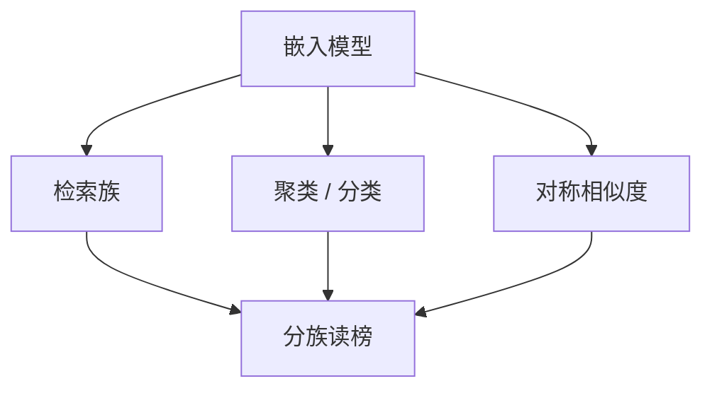

# MTEB

检索、聚类、分类、改写、语义相似度不是同一个几何。一张嵌入榜必须分任务报，禁止用单任务召回签发通用嵌入。

<footer>—— Muennighoff 等, MTEB</footer>

[上一课](/llm/splade)学习稀疏词表权重，倒排可含扩展词；稀疏正则是可用性条件，常作混合一路。前课从 InfoNCE、难负例、嵌套维、指令、多向量、BM25、SPLADE 堆出一排配方。缺口是比较协议：不能只用单任务召回签发通用嵌入。Muennighoff 等人的 MTEB 把多种任务收成套件；本课写怎么读这张榜，不重推 SPLADE 的正则。后课长文档嵌入默认：MTEB 多数任务偏短文，长文要另测。

## 问题

只在 MS MARCO 上刷召回，会选出非对称检索模型，聚类与 STS 可能很差。只在 STS 上刷，会选出对称相似度模型，检索标识符弱。MTEB 的点是强制多任务：检索、重排、聚类、分类、对相似度、摘要等。总分平均会重演 MMLU 课的陷阱——专长被抹平。应看任务族，尤其是与产品同构的那一族。

指令嵌入必须用官方任务指令；不用指令的模型与用指令的模型分表。多语言子集（MMTEB 等扩展）与英文主表不可互换，见[多语言基准](/llm/multilingual-benchmarks)同一纪律。

MTEB 分数绑定评测脚本版本与是否归一化、是否用特定池化。换脚本等于换榜。

## 方法

发布：按任务族报，附模型类型（稠密双塔 / 稀疏 / 多向量）、最大输入长度、是否指令。不要把交叉编码器的重排分写进双塔表。污染：部分任务来自公开数据集，可能进过对比训练；应披露训练任务列表，与评测重叠的任务降级为回归。

## 机制

不同任务对应不同的「正对」定义。检索正对是相关文档，聚类正对是同类，STS 正对是同义句。同一 InfoNCE 无法同时最优，指令与多任务采样是在帕累托面上选点。MTEB 平均分奖励折中模型；产品应在面上选自己的点，而不是选平均冠军。

## 边界

套件对长文档、代码、法律条款、多模态覆盖不足。下一课补长文档；再后课补多模态嵌入。不要用 MTEB 总分代理 RAG 端到端。

## 小结

- MTEB 是多任务嵌入协议，按族读，不单报总分。
- 指令、长度、模型类型必须与分数绑定。
- 训练任务与评测重叠要披露。
- 出处：Muennighoff 等 *MTEB*。
