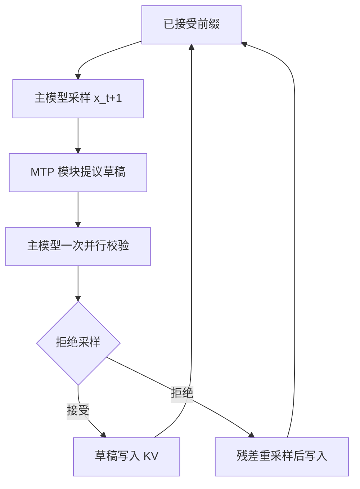

# MTP 验证闭环

    
主模型写出下一个 token，MTP 模块接着提议再往后的 token；目标模型一次并行校验，拒绝则从残差重采样——闭环保证写出的序列仍来自目标分布。

<footer>—— DeepSeek-AI，DeepSeek-V3 技术报告中的 MTP 投机用途；接受规则同 Leviathan 等投机解码与 Chen 等投机采样</footer>

DeepSeek-V3 的多 token 预测首先是训练目标：每个位置除下一词外再顺序预测更后面的词，模块可在推理时整段卸掉。报告同时写明第二条路：把 MTP 当草稿，结合投机解码框架，第二 token 接受率约 85%–90%，吞吐大约 1.8×。闭环指的不是训练图，而是推理循环：**提议 → 目标一次前向校验 → 按似然比接受或残差重采样 → 把已接受前缀写回 KV，再开下一轮**。缺任何一环，要么分布漂，要么加速数字对不上。训练侧公式见 [MTP](/llm/mtp)，一致性证明见 [投机采样](/llm/speculative-sampling)。

## 问题

朴素「MTP 头argmax 当输出」会把分布拧到草稿爱写的模式上。Leviathan、Kalman、Matias（ICML 2023，arXiv:2211.17192）与 Chen 等（arXiv:2302.01318）给出的修正拒绝采样，要求对每个草稿 token $x$ 以 $\min(1,p(x)/q(x))$ 接受；拒绝后从 $\propto\max(0,p-q)$ 再抽，而不是从 $p$ 再抽。V3 的顺序 MTP 给出的 $q$ 来自深度模块的输出头，目标 $p$ 来自主模型在同一前缀上的前向。闭环必须用**同一套**温度与截断（nucleus 等）后的 $p,q$ 比，否则一致性对的是用户从未声明的分布。

$D=1$ 时草稿只有一个额外 token：主模型已经合法写出 $t_{i+1}$，MTP 猜 $t_{i+2}$，校验一次最多前进两步，外加拒绝时的修正 token。这与 Medusa 多头、EAGLE 深树不同，验证便宜、接受率高，1.8× 与「每轮大约走两步、草稿几乎免费」同量级。工程上容易漏的是：MTP 前向要用已采样的 $t_{i+1}$ 嵌入拼进模块（顺序因果链），却用主模型尚未更新的特征；或者校验时没把 MTP 提议放进同一因果掩码。

### 训练可丢、服务不可混

报告消融在推理不加载 MTP 时仍看到主模型变强，证明训练收益不依赖服务走投机。产品若要 1.8× TPS，必须加载约 14B 量级模块并实现校验循环；只加载主模型就只有质量、没有那档吞吐。反过来，校验循环若在拒绝后把错误草稿写入 KV，后续步全部污染——闭环的「写回」只允许已接受（含修正）token。

Hugging Face 上 V3 权重大于 671B，因为含 MTP。服务进程应把「主模型图」和「MTP 草稿图」分成可关的子图。不用投机时卸载模块，避免与 MLA 省下的 KV 抢 HBM。

## 方法

### 一轮闭环的四步

设当前前缀为已接受序列。第一步：主模型对前缀做标准解码步，得到 $p(\cdot\mid\mathrm{prefix})$，采样（或贪心）得到 $x_{t+1}$，追加到 KV。第二步：MTP 模块取主模型该位置表示与 $\mathrm{Emb}(x_{t+1})$，经 $\mathrm{TRM}_1$ 得到 $q(\cdot\mid\mathrm{prefix},x_{t+1})$，采样草稿 $\tilde x_{t+2}$。第三步：目标（仍是主模型）以 $[x_{t+1},\tilde x_{t+2}]$ 为延伸做一次并行前向，读出 $p(\tilde x_{t+2}\mid\mathrm{prefix},x_{t+1})$。第四步：按投机采样规则接受或拒绝；接受则把 $\tilde x_{t+2}$ 写入 KV，拒绝则从残差抽 $x_{t+2}$ 写入。然后回到第一步。$D\gt 1$ 时在第二步展开更深，第三步一次校验整段草稿，在第一个拒绝处截断。

并行校验利用因果 Transformer 一次吃整段草稿：位置 $t+1$ 的表示不依赖尚未接受的 $t+2$，但 $t+2$ 的表示依赖草稿假设。拒绝点之后的 KV 必须丢弃或根本不提交。这与树状草稿相同，只是 V3 默认深度为 1，树退化成一条短链。

### 与独立头草稿的差别

Gloeckle 等的独立多 token 头、Medusa 头，条件里看不见中间离散选择，校验时 $q$ 与真自回归 $q$ 不一致，接受率通常更差。V3 明确保持因果链，接近 EAGLE「特征加已选 token」的精神，但模块是预训练图的一部分，共享词嵌入与输出头。闭环里 $q$ 必须来自这个顺序模块，不能改成「主模型同一 $h_t$ 上另挂一个线性头」还宣称在跑 V3 MTP。

## 机制

### 接受率如何变成墙钟

Leviathan 等在独立同分布接受率 $\alpha$、草稿长度 $\gamma$ 下给出期望前进长度

$$
\tau=\frac{1-\alpha^{\gamma+1}}{1-\alpha}
$$

（$\alpha=1$ 时 $\tau=\gamma+1$）。每轮成本约一次目标前向加一次草稿前向。$D=1$ 则 $\gamma=1$，$\alpha\approx 0.85\text{–}0.90$ 时 $\tau\approx 1.85\text{–}1.90$，与报告约 1.8× TPS 相符——前提是 MTP 前向相对主模型足够便宜（一块 Transformer 对 671B MoE 骨干）。$\alpha$ 随主题变：代码、模板高，开放聊天低；闭环应监控逐步接受率，而不是锁死 1.8。

残差采样保证逐步分布是 $p$，因此序列分布是 $p$。实现若在温度为 0 时退化成「一致则接受、否则写目标 argmax」，与贪心目标一致，仍无损。温度为正却忘记残差，是静默的分布漂移。

MTP 校验不要和「训练时的 MTP 损失」共用一个开关。训练 $\lambda$ 加权的是额外交叉熵；推理接受率是 $p$ 与 $q$ 的点态关系。$\lambda$ 大不保证 $\alpha$ 高，只保证训练更用力对齐未来 token。

### 批处理与 KV 提交点

连续批里，不同请求的接受长度不同，下一轮对齐会变成「有的请求已经多写了一个 token」。调度要么按最短接受切齐，要么允许变长提交（更难的块表）。这把闭环接到 [接受长度调度](/llm/acceptance-length-sched)：$\tau$ 不仅是加速比，也是批内参差。共享系统提示时，校验前向的前缀注意力可走 [Hydragen](/llm/hydragen)，但提交规则不变。

## 边界与工程取舍

$D=1$ 的 1.8× 不能外推到 $D=4$：更深则模块更重、$\alpha$ 通常下降、校验序列变长。长思维链上逐步 $\alpha$ 会掉，TPS 增益不是常数。MTP 与 EP/MLA 核争 SM、争 HBM；低延迟解码若已经把 SM 分给 DeepEP，再加一块 MTP 前向要重新量。不要在未实现残差采样时宣传「无损投机」。

出处必须分开写：架构与 85%–90% / 1.8× 来自 DeepSeek-V3 技术报告（arXiv:2412.19437）；接受规则来自 Leviathan 等与 Chen 等。不要把 Gloeckle 等 2024 的独立头 MTP 论文当成 V3 的推理闭环。

贪心解码下闭环退化成串比对，实现更简单，评测也更稳；采样产品必须走完整拒绝采样。A/B 时用同一随机种子比较「关 MTP 投机」与「开闭环」，不要用不同温度。

## 小结

- MTP 验证闭环 = 顺序模块提议 + 主模型并行校验 + 投机拒绝采样 + 只提交已接受 token。
- $D=1$ 时报告接受率约 85%–90%、约 1.8× TPS，与 $\tau\approx 1+\alpha$ 同量级。
- 训练可丢模块；服务要吞吐就必须加载并实现残差重采样。
- 批内接受长度参差是调度问题，不是核问题。
- 出处：DeepSeek-V3 报告；Leviathan 等 ICML 2023；Chen 等投机采样。
