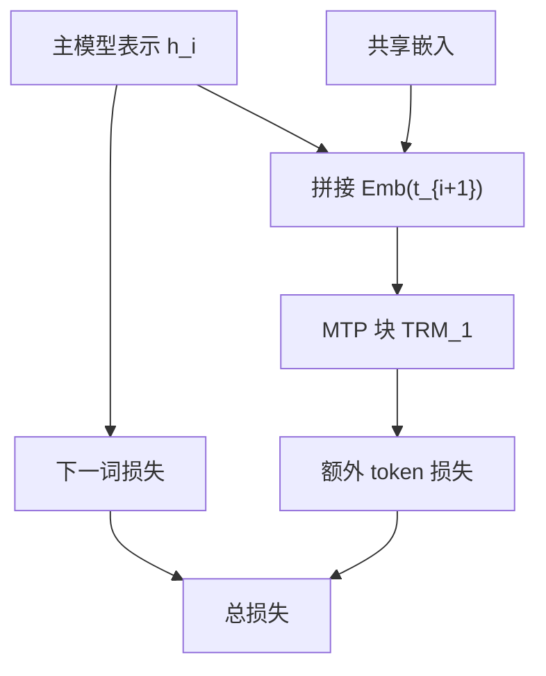

# MTP 多 Token 预测

    
每个位置不但预测下一个 token，还顺序地预测更后面的 token，并保持完整因果链：这首先是训练目标，其次才是可复用的投机草稿。

    <footer>—— DeepSeek-AI, DeepSeek-V3 Technical Report, 2024</footer>

标准因果语言模型每个位置只对 $t+1$ 算交叉熵，位置 $t$ 的表示只要对「下一词」可分。Gloeckle 等人 2024 年把目标扩成同时预测多个未来 token，用互不依赖的独立头并行打分。DeepSeek-V3 采纳多 token 预测（MTP），但改成**顺序模块**：第 $k$ 个模块看见上一深度的表示，以及已经进入因果链的后续 token 嵌入，而不是几个头共享同一个 $h_t$。报告写明两项目的：稠密化训练信号、让表示预先规划未来 token；推理时模块可以丢掉，主模型独立工作，也可以改去当投机解码的草稿。本篇写 V3 的顺序 MTP，对照独立头与 [EAGLE](/llm/eagle)，不把 671B/37B 的 MoE 故事再写一遍，那是 [DeepSeek-V3](/llm/deepseek-v3) 专文。

## 问题

下一词损失在长序列上已经很密，但每个表示只被一条标签拉动。若表示还能解释 $t+2$，梯度更稠，数据效率可能更高；表示也可能被迫记住「还要说什么」，而不是当步能敷衍过去就行。独立多头（Gloeckle 等，以及推理侧的 [Medusa](/llm/medusa)）实现简单：同一 $h_t$ 分出 $D$ 个词表分类器。结构性代价是第 $k$ 个头条件独立于中间那些离散选择——这正是 EAGLE 称为特征不确定性的那类缺口。

V3 要的是预训练期就成立的目标，不是推理插件。它必须与共享词嵌入、共享输出头、流水线里浅层与深层放在同一 PP 秩上等工程约束兼容，还不能让主模型推理依赖这些模块。问题因此是：如何做多 token 监督，既保持因果链，又让推理可把模块整段卸掉。

### 独立头与顺序深度

独立头：$\mathrm{P}(t_{i+k}\mid h_i)$，中间 token 不出现在条件里。顺序深度：第 $k$ 步的条件里包含 $t_{i+k}$ 的嵌入以及 $h_i^{k-1}$，再过一个 Transformer 块得到 $h_i^k$。后者每增加一深度就多一块可学习层，参数不再是「几个线性头」，但条件与真正自回归一致。V3 明确说保持因果链的原则类似 EAGLE，主目的却是训练而非投机。读论文时不要把「像 EAGLE」理解成「推理默认走 EAGLE 树」。

Hugging Face 上 V3 权重约 685B，其中主模型 671B、MTP 模块约 14B。磁盘体积不是「每 token 激活 37B」。不用投机时，服务进程应卸载这 14B，避免常驻 HBM。

## 方法

设深度为 $D$，即每个位置额外预测 $D$ 个未来 token。第 $k$ 个 MTP 模块含：与主模型共享的 $\mathrm{Emb}$、共享的 $\mathrm{OutHead}$、本深度的 Transformer 块 $\mathrm{TRM}_k$，以及把拼接向量投回隐空间的 $M_k\in\mathbb{R}^{d\times 2d}$。对输入 token $t_i$，深度 $k$ 先把 $h_i^{k-1}$ 与 $\mathrm{Emb}(t_{i+k})$ 拼接，经 $M_k$ 得到 $\mathbf{h}_i^{\prime k}$，再

$$
\mathbf{h}_i^k=\mathrm{TRM}_k(\mathbf{h}_i^{\prime k}).
$$

$k=1$ 时 $h_i^{0}$ 即主模型该位置表示。$\mathrm{OutHead}$ 把 $\mathbf{h}_i^k$ 映射为第 $k$ 个额外 token 的分布。主模型自己的下一词损失不变；MTP 损失对每个深度做交叉熵再平均：

$$
\mathcal{L}_{\mathrm{MTP}}=\frac{\lambda}{D}\sum_{k=1}^{D}\mathcal{L}_{\mathrm{MTP}}^{k}.
$$

预训练配置里 $D=1$：除精确下一词外，每个位置再预测一个额外 token。$\lambda$ 是权重系数，以报告为准。DualPipe 把最浅层（含嵌入）与最深层（含输出头）放在同一流水线秩，使 MTP 与主模型的共享嵌入/输出头能在物理上共用一份参数与梯度。

### 推理：可丢，也可当草稿

报告写：MTP 主要为提高主模型质量，推理可直接丢弃模块，主模型单独工作。消融在两档基线上进行（约 15.7B 总参训 1.33T，以及约 228.7B 总参训 540B），加上 1 深度 MTP 后多数评测上升；比较时推理都不加载 MTP，故增量来自主模型表示，不是来自多算一个头。另外也可以把模块改去投机：主模型给出 $t+1$，MTP 给出候选 $t+2$，目标模型一次验证。V3 报告在不同生成主题上，第二 token 接受率约 85%–90%，结合投机解码框架可把 TPS 提到约 1.8 倍。后续硬件综述里也引用过同类 80%–90% 与约 1.8× 的实践数字；写系统对比时仍应钉技术报告正文，并写清 $D=1$。

## 机制

顺序 MTP 让 $h_i$ 不仅要对 $t_{i+1}$ 可分，还要为下一深度提供可拼接的条件。梯度从额外交叉熵流回主模型块，表示被要求「预留未来」。共享输出头迫使 MTP 深度与主模型活在同一词表几何里，避免再学一套 $W_2$。这与 Medusa 为每个头单独学 $W_2^{(k)}$ 不同，也与 EAGLE 冻结原 LM 头、另训浅外推层的分工不同：V3 的 MTP 块是预训练图的一部分，不是事后插件。

$D=1$ 时投机草稿只有一个额外 token，树很浅，验证便宜，接受率高，1.8× 量级与「每次验证前进约两步、草稿几乎免费」相符。不要用它外推 $D=4$ 的加速：深度增加则因果链更长、模块更重、接受率通常下降，报告并未把旗舰配置设成大 $D$。

消融里「推理丢 MTP」是为了证明主模型变强，不是为了否定投机用途。产品若要 1.8× TPS，必须加载模块并实现验证闭环；只加载主模型就只有质量收益、没有那一档吞吐。

### 和 Medusa、EAGLE 的对照

| 维度 | Medusa | EAGLE | V3 MTP |
| --- | --- | --- | --- |
| 主场景 | 推理加速插件 | 推理加速插件 | 预训练目标（可兼加速） |
| 条件 | 独立头共享 $h_t$ | 特征+已选 token | 顺序块+已选 token 嵌入 |
| 推理 | 头必须在 | 草稿必须在 | 可丢 |

三行不能合并成「都是多 token」。MTP 若做成独立头，就回到 Gloeckle / Medusa 的条件独立；报告明确拒绝了那条实现。

## 边界与工程取舍

MTP 不是免费的。训练要多一块（$D=1$ 时一块）Transformer、多一份激活；PP 布局要让共享嵌入与输出头能物理共享，否则内存账对不上 DualPipe 叙述。推理加载 14B 级模块会占显存，与 [MLA](/llm/mla) 省下的 KV 抢 HBM。投机路径的 1.8× 是第二 token 高接受率下的 TPS，不是 TTFT，也不是长思维链里每步都能维持同一接受率。

不要给 MTP 伪造独立 arXiv 号，它写在 DeepSeek-V3 技术报告（arXiv:2412.19437）里。Gloeckle 等 2024 是独立工作，引用时写作者与年份，不要把 V3 的顺序模块安到他们的独立头上。服务框架是否默认开 MTP 以仓库说明为准；开源栈的 MTP 支持曾长期处于开发中，测延迟必须写清开还是关。

接受率 85%–90% 是报告对「额外预测的那个 token」的评估，不是整段回复的 token 准确率，也不是 [spec-acceptance-rate](/llm/spec-acceptance-rate) 文里草稿长度 $\gamma=5$ 的链接受率。用错统计量会把 1.8× 说成 5×。

## 小结

- DeepSeek-V3 的 MTP 用 $D$ 个顺序模块预测 $D$ 个额外 token，保持因果链；旗舰预训练 $D=1$。
- 嵌入与输出头与主模型共享；损失是各深度交叉熵的平均再乘 $\lambda$。
- 主目的是训练信号与表示质量；推理可丢模块。消融显示丢模块后主模型仍然更强。
- 模块也可作投机草稿：第二 token 接受率约 85%–90%，报告称约 1.8× TPS。
- 与 Gloeckle / Medusa 的独立头、与 EAGLE 的推理外推，条件结构与部署语义都不同。
- 出处：DeepSeek-AI, *DeepSeek-V3 Technical Report*，arXiv:2412.19437，2024；独立多头对照见 Gloeckle et al., 2024。
