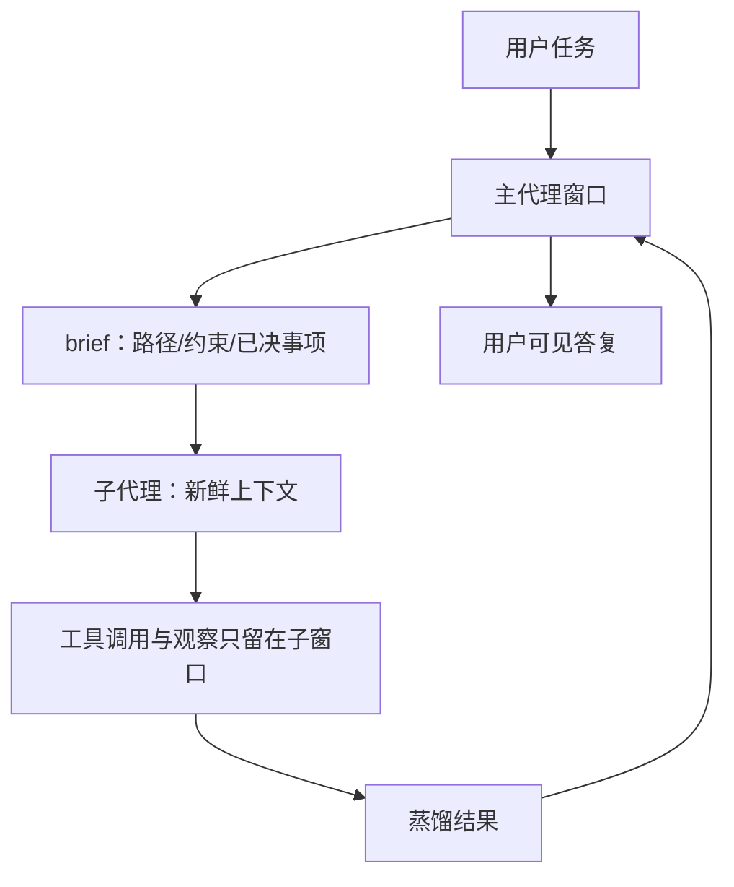

# 多智能体上下文隔离

    
子代理在自己的新鲜对话里跑：中间工具调用留在子窗口，只有最终消息回到父代理。父到子的通道就是那条 prompt 字符串。

    <footer>—— Anthropic，Claude Agent SDK / Subagents 文档；原则见 Effective context engineering for AI agents，2025-09-29</footer>

单窗口代理把探索、失败栈与最终答案混在同一条历史上，主上下文被 grep 输出和错误分叉填满，这就是 [上下文腐烂](/llm/context-rot) 的多智能体版本。**上下文隔离**把子任务放到独立窗口：子代理不自动继承父对话，也不在两次调用之间保留记忆；需要知道的事实必须写进调用时的提示。Anthropic 把子代理的收益写成：隔离上下文、并行分析、专用指令而不膨胀主提示。这与 [多代理编排](/llm/multi-agent-orchestration) 的「谁说话」不同：编排管调度，隔离管**每个说话者看见什么**。本篇写通道、泄漏模式与协议层不共享记忆，不写如何绕过权限。

## 问题

父窗口若把「读遍仓库」和「写补丁」放在一起，工具结果会永久占位，后续规划被过期文件片段锚定。Anthropic 工程文把子代理写成另一种压缩：子代理消耗数万 token 探索，只回传约 1k–2k 蒸馏结果，主窗口保持干净。那是空间隔离，不是时间上的 [Compaction 摘要](/llm/compaction-summarize)。失败模式对称：隔离过度时，子代理看不到会话里刚定的接口名，会重造一套；隔离不足时，子代理带着父历史里的错误假设开工。

AutoGen（Wu 等，arXiv:2308.08155）把代理做成可对话行动者，群聊默认有广播压力：每人每轮看见全量日志，费用随角色数超线性涨。CAMEL、MetaGPT 用角色提示分区，但若实现上仍拼接同一条 `messages` 数组，提示分区只是幻觉。隔离必须是**运行时窗口边界**，不是人设段落。

### 默认新鲜窗口，而不是默认 fork

Claude Agent SDK 写明：子代理上下文从空白开始，不含父对话；父到子的唯一通道是 Agent 工具的 prompt。子代理有自己的系统提示、工具子集、可选技能；项目 `CLAUDE.md` 是否加载取决于 `settingSources`。两次调用同一 `research-assistant` 也不共享上次读过的文件，除非你把路径写进新 prompt，或把笔记落到工作区文件。这强迫协调器做结构化交接：问题、约束、相关路径、先前结论，全部显式。

产品后来加了 `context: fork`：子代理继承父对话全文，但子侧工具噪声仍不回写父窗口。fork 适合依赖会话细微差别的任务；可写清的独立子任务应保持新鲜窗口，以免把腐烂一并继承。

## 方法

最小隔离合同：协调器持有用户目标与共享工件指针（文件、票、PR）；每个子代理收到一份自包含 brief；返回值是摘要或产物路径，不是原始工具轨迹。并行时各子窗口互不可见，避免两个检索代理在同一条 KV 里互相污染。工作区隔离（如独立 git worktree）是文件系统边界，与 token 窗口隔离正交：可以窗口隔离但共享磁盘，也可以两者都隔离。

评测应分开报：主窗口峰值 token、子窗口峰值、回传字节、任务成功率。只报最终对错会掩盖「主窗口被探索日志撑满」或「子代理因 brief 缺字段而幻觉接口」。Anthropic 强调子代理适合探索性、可丢弃的路径；不可逆的生产写操作应留在权限更严的父代理或人在环。

### 交接必须可归因

隔离之后，错误会变成「谁说的」。brief 应带来源：哪次用户原话、哪份文件、哪次子代理结论。回传应区分事实（读到的签名）与推断（「可能是竞态」）。否则父代理会把子代理的猜测提升成下一回合的前提。这与 [A2A 协议](/llm/a2a-protocol) 的不透明协作一致：智能体之间不共享记忆与工具，只交换任务、消息与产物；生产多智能体更接近协议隔离，而不是共享一块黑板。

## 机制

隔离改变的是条件前缀的分区。每个子前向只看见 brief + 自己的工具定义 + 自己的观察。注意力不再被父任务的无关文件切碎，[中间丢失](/llm/lost-in-middle) 的受害范围缩到子轨迹。回传相当于一次有损编码：编码失败就是丢失字段或写入未发生的决策。协调器要用清单（接口名、复现命令、未跑测试）检查回传，而不是只看文风。

并行隔离还有调度含义：两个子代理同时改同一文件会冲突。窗口隔离不自动提供锁。共享状态应落在可合并的工件（分支、票）上，由父代理串行合并。群聊式编排若每轮全量广播，隔离被抵消——那是 AutoGen 群聊要靠摘要路由才能控费用的原因。

费用近似为各窗口 token 之和，不是主窗口单独的长度。十个隔离探索各自 20k，主窗口仍可能只有 4k 回传，但账单按 200k 计。报「主上下文变干净」必须同时报总 token。

### 记忆层不要偷偷打破隔离

若所有代理读写同一块 [Mem0](/llm/mem0-layer) 或 [Zep](/llm/zep-graphiti) 库且不做租户/角色过滤，窗口隔离只是表演：子代理会检索到父会话里的私有笔记。记忆写入要带来源代理身份与可见性；跨代理共享应是显式工件，而不是默认可搜全库。这是架构约束，不是检索技巧。

## 边界与工程取舍

SDK 文档描述的是 Claude 产品线的默认；其他框架可能把整个 `messages` 传给每个角色。引用时写清实现。fork 与新鲜窗口是两种合同，不要在同一路由里混用而不标注。法律或审计场景需要保留子轨迹全文，隔离压缩会破坏取证——应把子会话日志另存，而不是只留摘要。

不要把隔离当成越权手段：子代理工具白名单应比父更窄，而不是更宽。本篇只讨论上下文分区与回传合同。

出处：Anthropic Agent SDK *Subagents*；Anthropic Applied AI，*Effective context engineering for AI agents*，2025-09-29。编排对照 Wu 等 AutoGen，arXiv:2308.08155。协议层不共享记忆见 Google A2A 公告。子代理数字「数万 token 进、1k–2k 出」来自该工程博文，不是对照实验表。

## 小结

- 多智能体上下文隔离让子任务在新鲜（或显式 fork 的）窗口运行，中间噪声不回写父历史。
- 父到子的通道是 brief；两次调用默认不共享记忆，除非写入工作区或记忆库。
- 回传是有损编码，必须可归因；共享记忆库会静默打破窗口隔离。
- 评测要报主/子峰值与总 token，不能只报主窗口变短。
- 出处：Anthropic Agent SDK 与 2025-09-29 工程文；AutoGen arXiv:2308.08155。
