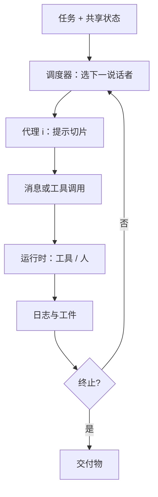

# 多代理编排

    
把复杂任务拆成可对话的角色：每个代理有工具与人设，编排器决定谁在何时说话、消息如何写入共享状态，直到停机条件成立。

    <footer>—— 对照 Wu 等 AutoGen（arXiv:2308.08155）；Hong 等 MetaGPT（arXiv:2308.00352）；Li 等 CAMEL（arXiv:2303.17760）</footer>

单代理工具循环（ReAct / function calling）把「选下一个动作」交给同一个上下文。任务一旦同时需要写代码、查文档、批评补丁、向人提问，单一提示会膨胀，角色污染，失败不可定位。**多代理编排**把这些职责拆成多个 LLM（或同一模型的多份提示），用对话、消息总线或工作流图来调度。它不是新的基座模型，而是控制面：谁持有哪些工具、共享什么记忆、如何终止。本篇写编排原语与评测该看什么。不把「多个代理」当成自动获得正确性的理由。

## 问题

CAMEL（Li 等，arXiv:2303.17760）演示角色扮演：用户代理与助手代理靠 inception prompting 维持任务对齐的对话，用于生成合作轨迹、观察交际行为。固定两人、弱工具，适合研究对话动力学，不适合当通用运行时。MetaGPT（Hong 等，arXiv:2308.00352）把软件工程 SOP 写进提示：产品经理、架构师、工程师、评审按流水线交工件，口号是「代码 = SOP(团队)」。结构强、跑题少，换到非软件任务要重写 SOP。AutoGen（Wu 等，arXiv:2308.08155）把代理做成可对话、可定制的行动者：可用 LLM、人、工具的任意组合回复，用代码或自然语言定义对话模式（二人、群聊、嵌套），作为通用基础设施而不是单一 SOP。

编排要解决的具体失败是：无终止的互相吹捧、两个代理改同一文件、工具权限漏到不该持有的角色、以及把群聊全文每轮塞给所有人导致费用平方涨。评测若只报「最终答案对不对」，会藏过这些过程失败。需要把**对话轮数、工具调用次数、人工介入次数、是否违反角色权限**写成一等指标，再谈任务分数。

### 三种常见拓扑

**流水线**：A 的输出是 B 的唯一输入，如 MetaGPT 的 SOP 链。易审计，不能回头，除非显式加评审环。**对话图**：谁回复谁由下一说话人策略决定，AutoGen 的群聊属于此类；动态但难保证公平与终止。**层次**：规划者拆子任务，执行者只看见子目标，结果汇总后再计划。层次清晰，规划者成为单点幻觉源。真实系统常混合：外层图、内层二人对话。不要把 CrewAI、LangGraph、ChatDev 的产品名当成新的数学对象——它们是这些拓扑上的工程封装。

Guo 等人的综述（arXiv:2402.01680）把 AutoGen、MetaGPT、CAMEL 并列为早期开源框架。写相关工作时引用原论文，不要用综述的转述数字替代原表。

## 方法

最小编排状态包括：代理注册表（人设、工具子集、模型名）、消息日志、共享工件（文件、票、数据库行）、终止谓词（最大轮数、任务完成标记、人 Stop）。每步：调度器选下一个说话者 → 该代理消费允许看见的切片 → 产出消息或工具调用 → 宿主执行工具 → 观察写回日志。人可以是一种特殊代理（AutoGen 强调 LLM / 人 / 工具混合模式），这比「全自动」更接近可上线系统。

评测协议应按任务家族分开。软件工程：同一仓库、同一隐藏测试、限制是否共享测试日志，对照单代理 SWE-agent / OpenHands，看多代理是否真的提高 resolved，还是只提高 token。数学与编码竞赛：AutoGen 论文用示例应用说明框架能力，那是案例，不是 SWE-bench。角色扮演数据生成：CAMEL 看对话是否维持角色与任务，而不是下游准确率。全局问答：多代理检索—写作—批评，要报是否比单次 RAG 在事实性上更好，而不是只报更长。任何「多代理赢」必须有单代理、同模型、同工具的对照，否则多出来的只是更多采样。

### 对话编程相对静态图

AutoGen 把「对话模式」当成可组合原语：二人聊天、群聊、嵌套聊天可以拼进更大应用。静态图（后来的 LangGraph 一类）把边写死，可复现性强，改流程要改图。SOP（MetaGPT）是领域特化的静态图，节点是角色。选型等于选失败：动态对话会循环恭维；静态图会在未建模的异常处卡死。工程上常动态对话外包一层最大轮数与「批评者必须引用工件 diff」，把 SOP 的硬约束嵌进图。

## 机制

多代理并不增加模型的参数，它改变的是**条件化上下文的分区**。每个角色只看见与职责相关的工具说明和近期消息，降低指令冲突。批评者角色把「找错」写成目标，比同一模型在同一提示里既生成又自检更不容易自我开脱——这是角色提示的归纳偏置，不是定理。共享黑板（文件、票据）让通信走工件而非口头转述，减少电话游戏。心跳与超时防止死锁。

机制失败：角色漂移（工程师开始改需求）；权限泄漏（检索代理拿到写生产库的工具）；上下文爆炸（群聊每轮全量广播）；共谋式幻觉（两人互相确认错误事实）。缓解是工具 ACL、消息路由（只广播摘要）、以及把关键状态放进结构化票而不是散文。记忆若跨代理共享，要有写入者身份，否则 A 的错误笔记会变成 B 的前提；这与 [MemGPT](/llm/memgpt) 的分层记忆、[A-MEM](/llm/amem-agent-memory) 的笔记链接是不同层——编排解决谁说话，记忆解决说完后什么被保存。

费用模型近似为 $\sum_i$ 轮次$_i$ $\times$ 上下文$_i$。群聊若不做摘要，上下文随轮数线性涨、总费用超线性。报多代理收益时必须报 token 倍数，否则不可与单代理 Best-of-N 比较。

## 边界与工程取舍

### 编排不能替代工具正确性

浏览器、shell、数据库工具的安全边界仍在宿主，见 [OpenHands](/llm/openhands) 与 GUI 代理文。多代理只会让越权路径更难审计：一次「内部消息」可能触发另一个角色的危险工具。默认最小权限：每个代理一张白名单。不要为了「更像团队」给所有人同一把钥匙。

评测污染：用同一教师模型既当生成者又当自动评委，多代理的冗长答案容易赢「全面性」而输事实。应用 LLM-as-judge 时要固定评委模型、盲序、以及与任务相关的标准（正确性优先于文采）。MetaGPT 的 SOP 对软件演示强，不自动迁移到客服。CAMEL 的 inception prompting 是研究装置，生产里要用显式终止与人审替代「希望他们一直合作」。需要单代理工具循环时读 [ReAct](/llm/react)；需要 IDE 里的人在环时读 [代理编码](/llm/agentic-coding)。

出处：Wu et al.，*AutoGen: Enabling Next-Gen LLM Applications via Multi-Agent Conversation*，arXiv:2308.08155；Hong et al.，*MetaGPT*，arXiv:2308.00352；Li et al.，*CAMEL*，arXiv:2303.17760。综述：Guo et al.，arXiv:2402.01680。

## 小结

- 多代理编排是控制面：角色、工具 ACL、调度、共享工件与终止条件。
- CAMEL 研究角色对话；MetaGPT 把 SOP 流水线化；AutoGen 提供可组合对话运行时。
- 评测必须有同模型单代理对照，并报告轮数、token 与权限违规。
- 拓扑选流水线、对话图或层次，等于选卡死方式与费用形状。
- 出处：Wu et al. arXiv:2308.08155；Hong et al. arXiv:2308.00352；Li et al. arXiv:2303.17760。
