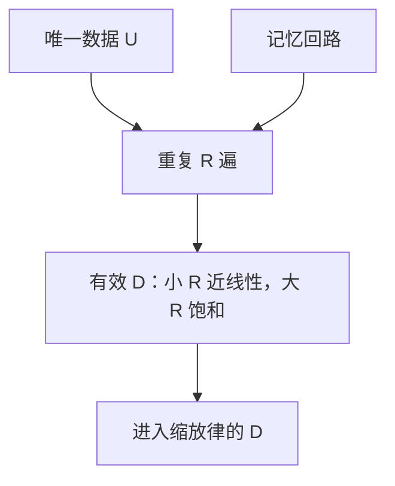

# 多 epoch 与重复数据

重复出现的数据先贡献、再伤害：少量重复几乎像新数据，过多重复把曲线从幂律拧成过拟合，解释性上还会长出「背下来」的回路。

<footer>—— Hernandez et al., Scaling Laws and Interpretability of Learning from Repeated Data, 2022；数据受限设定见 Muennighoff et al., Scaling Data-Constrained Language Models, 2023</footer>

[上一课](/llm/sequence-length-warmup)假设窗口在变、数据仍是「新 token」。缺口是：唯一字节不够 Chinchilla 配额时，要不要把同一文档看 $R$ 遍。Hernandez 等人测量重复对损失与可解释回路的影响；Muennighoff 等人在数据受限制度下拟合：重复若干 epoch 仍接近新数据，超过某个 $R$ 收益崩掉。本课把「多 epoch」写成缩放轴，而不是默认单遍。后课拟合定律时，重复数据不能当 $D$ 的线性增量。

## 问题

Chinchilla 的 $D$ 常被读成唯一 token。唯一数据 $U$ 小于计算最优 $D^*$ 时，选项是：减小 $N$、去找更多数据、或重复到 $D=R U$。Hernandez 的观察：小 $R$ 时重复几乎等价于新数据；$R$ 大时测试损失变差，并且模型对重复序列形成更强的可记忆回路。Muennighoff 等人给出经验：大约 4 epoch 量级内，重复仍有用，再多则饱和——数字随数据与模型变，本课只取「先几乎等价、后饱和伤害」的形状。

网页抓取里还有**无意重复**：同一页出现在多个分片。无意 $R$ 与有意多 epoch 叠加，真实 $R$ 被低估。去重策略改变有效 $U$，必须在缩放大本上声明。

验证集若与训练集撞车，多 epoch 会把污染读成「还在降损失」。BPB 课要求固定评测字节；本课要求那些字节与训练唯一文档的重叠率有上限。

## 方法

记账：

- $U$：去重后唯一 token（或字节，与词表课一致）。
- $R$：有意重复遍数；另报无意重复的估计。
- 有效数据：$D_{\mathrm{eff}}=U\cdot f(R)$，$f(R)\approx R$ 当 $R$ 小，$f(R)$ 饱和当 $R$ 大。拟合 $L(N,D)$ 应用 $D_{\mathrm{eff}}$ 而不是 $RU$。

实践：数据受限时优先用满约几个 epoch，而不是把 $N$ 加到按 $U$ 算已经过度的大小（Muennighoff 的主建议方向）。有意重复应打乱顺序，避免同一顺序的 epoch 强化同一梯度方向。高质量子集（书、代码）的 $R$ 可以高于低质量网页，等于配比，不是全局一个 $R$。

与稳定性：重复后期梯度变小、$v$ 更低，$\beta_2$ 尖峰与「背诵」尖峰（同一序列极低损失以外的分布）都更常见。传感器要按 epoch 打事件标记。

## 机制

第一次见文档，梯度大，学的是可泛化统计。第 $R$ 次，模型已能低损失预测，梯度指向记忆残差。记忆对训练 CE 有利、对测试 BPB 有害，并在机制上表现为对特定字符串的强注意力回路——Hernandez 把这与可解释性联系起来。因此「训练 CE 还在降」在高 $R$ 下不是继续加 epoch 的理由。

无意重复相当于把某些文档的 $R$ 提前用满，模型对它们过拟合，对其余欠拟合，平均损失掩盖了不均。去重是缩放实验的数据卫生，不是预处理美感。

## 边界

本课不处理版权与污染治理的法律细节。合成数据若来自同一模型，重复结构更强，$f(R)$ 更差，不能用网页上拟合的 $f$ 去套。下一课写如何拟合 $L(N,D)$：把 $D_{\mathrm{eff}}$、阶段、尖峰剔除都写进回归，否则指数 $b$ 被脏点拉动。

## 小结

- 小 $R$ 的重复接近新数据；大 $R$ 伤害测试并强化记忆回路。
- 缩放用 $D_{\mathrm{eff}}=U f(R)$，不要把 $RU$ 当 Chinchilla 的 $D$。
- 无意重复与有意 epoch 必须一起记账；验证集重叠要有上限。
- 数据受限时先用满有限 epoch，再考虑加 $N$。
- 出处：Hernandez et al., 2022；Muennighoff et al., 2023。
