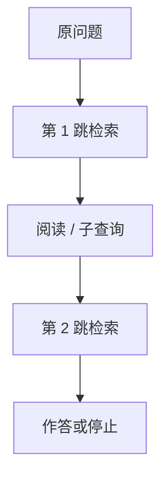

# 多跳检索

答案不在单段里。第一跳找到桥接实体，第二跳才拿到事实。单次 Top-k 只会返回与问句表面相近的段。

<footer>—— 对照 HotpotQA 的多跳设定；IRCoT 把检索写进推理循环</footer>

[上一课](/llm/query-rewrite-hyde)优化单跳查询。有的问题必须组合两段证据（「导演的出生城市的市长是谁」）。本课写多跳检索。缺口是迭代：下一查询由上一轮阅读决定。后课引用默认：多跳更容易张冠李戴，归因必须按跳检查。

## 问题

单跳检索最大化与问句的表面相关，桥接段可能不含问句里的词。Yang 等 HotpotQA 把这类题做成基准。策略：先检索，读出中间实体或子问题，再检索。IRCoT 一类把思维链与检索交错：每步生成要用的查询。失败是误差累积——第一跳错实体，后面全错——以及把多跳做成「把 k 加到 50」的假多跳。

与[长上下文是否取代 RAG](/llm/long-context-vs-rag) 的关系：窗口能放下多段时，仍要**选对段**；只靠更长窗口会把桥接淹没在相似噪声里。

多跳次数应有上限。无限循环会把延迟与幻觉查询写成「更努力的检索」。

## 方法

协议：最大跳数、每跳 $k$、停止条件（阅读器声称可答或证据不足）。查询生成必须条件于已检索块，避免重复同一查询。评测：支持事实是否都在证据链上（HotpotQA 的 supporting facts），不只看最终答案——最终答案可猜对。图检索（实体链）是结构先验，与纯向量迭代互补，见主干 GraphRAG 一类工作，本课不重写。

## 机制

每跳更新的是查询条件分布。阅读器从块中抽出桥接词，相当于把隐变量实例化再查询。这比一次性改写更强，因为桥接词往往不在用户问句里。代价是把阅读器错误写进下一查询。因此中间步应保守：抽实体用约束解码或短抽取，而不是再生成一篇 HyDE。

## 边界

两跳以上的开域问题稀疏，评测集小，易过拟合 HotpotQA 文风。下一课引用：无论几跳，读者可见的出处必须可解析。

## 小结

- 多跳是迭代「检索–读–再查询」，不是加大 $k$。
- 要用支持事实评估链条，防止猜对最终答案。
- 跳数封顶；中间抽取宜短，避免误差放大。
- 出处：Yang 等 HotpotQA；Trivedi 等 IRCoT。
