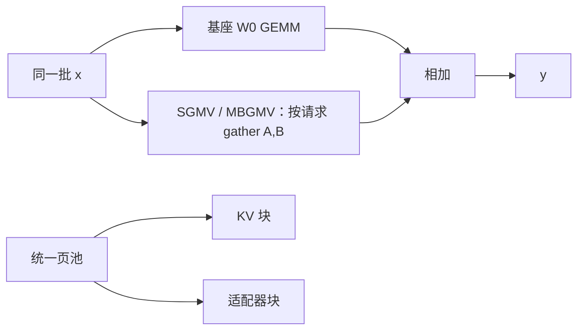

# 多 LoRA 服务

基座只留一份，适配器按请求换上。核要能在同一 batch 里对多个秩、多块不连续的 $A,B$ 做乘法，否则「多 LoRA」只是多进程。

<footer>—— Chen 等，Punica: Multi-Tenant LoRA Serving，MLSys 2024；Sheng 等，S-LoRA: Serving Thousands of Concurrent LoRA Adapters，MLSys 2024</footer>

[LoRA](/llm/lora) 把更新写成 $\Delta W=BA$，推理可以合并进 $W_0$，延迟与基座相同。合并在「一个适配器、长期服务」时是对的；一旦租户数涨到几十、几千，为每个 $BA$ 存一份合并后的满秩权重，显存按租户线性爆炸，切换还要重载数 GB。Punica 与 S-LoRA 把问题反过来：GPU 上常驻一份基座，KV 与适配器权重按需进同一类分页池，用特制 CUDA 核把**不同 LoRA 的请求做进同一个连续批**。本篇写这条服务形态，不把 QLoRA 训练或 AdaLoRA 秩分配展开成全文。

## 问题

朴素做法有三条，都不尺度。一是每租户一个引擎进程，基座复制 $N$ 份，内存先爆。二是请求到来时把 $BA$ 合并进 $W_0$，再跑；合并本身是一次大 GEMM，租户一抖就合并风暴，且不能在同一 batch 里混租户。三是不合并、用框架的循环对每个样本做小矩阵乘：基座部分仍可成批，但 LoRA 路径在 Python 里打散，decode 的 GEMV 小到吃不满 Tensor Core，吞吐掉回「几乎没批」。

Punica 指出的计算事实是：基座的 $W_0x$ 对所有租户相同形状，可以正常批处理；差异只在 $BAx$。若能把许多不同的 $A,B$ 收进一次核里，多租户的边际成本就是低秩部分，而不是整网。S-LoRA 进一步指出：适配器秩不同、KV 长度不同、权重还要从 CPU 换入时，内存碎片会在核之前先把「几千个适配器」卡死。问题是调度 + 内存 + 核三条一起解，只优化其中一条会在另一条上见顶。

### 低秩增量在服务期不能当「又一层 Adapter」

[Adapter 层](/llm/adapters) 是插入的小 MLP，改变计算图。LoRA 不改变图，只在现有线性上加 $BAx$。服务期若把 LoRA 实现成 Python 里的额外模块循环，就退回 Adapter 的调度税，却没有 Adapter 那种独立残差的隔离叙事。正确的服务实现是：基座 GEMM 一次，LoRA 用 gather 式的 grouped GEMV/GEMM 一次，再逐元素相加。

合并与不合并是产品开关。单租户、延迟敏感、适配器不变，合并。多租户、适配器热更新、要在同一卡上混批，不合并。不要在高峰期对热租户做在线合并，那会把写权重与读权重打到同一块 $W_0$ 上。

## 方法

记一批里第 $i$ 条请求使用适配器 $(A_i,B_i)$，秩为 $r_i$。基座计算 $y_0=W_0x$ 与租户无关。LoRA 分支为

$$
y = y_0 + \frac{\alpha}{r_i} B_i A_i x.
$$

Punica 的核是 Segmented Gather Matrix-Vector Multiplication（SGMV）：按请求把 $x$ 分段，gather 到各自的 $A_i,B_i$，在同一 kernel 里完成多租户的低秩乘。于是 batch 维对基座是「真 batch」，对 LoRA 是「分段 gather」，不必为每个租户 launch 一次小核。调度器把请求尽量堆到已加载该 LoRA 的 GPU 上，冷适配器只从主机把 $A,B$ 搬进 HBM——体积是 $r(d_{\mathrm{in}}+d_{\mathrm{out}})$ 量级，相对基座是百分之一左右。论文报告在固定集群上，相对「每个 LoRA 当完整模型来服」可达约 12 倍吞吐，每 token 额外延迟约 2 ms；这是他们评测设定下的数字，不是跨硬件的定律。

S-LoRA 的内存答案叫 Unified Paging：KV 块与适配器权重块从**同一页池**分配，降低两种对象互相碎片化。异构批（不同 $r$、不同序列长度）用定制核：prefill 侧 Multi-size Batched Gather Matrix-Matrix Multiplication（MBGMM），decode 侧 MBGMV。实现上他们既写了 Triton 分块版，也改过早期 Punica 核以支持非连续内存与同批多秩；实验中后者更快。张量并行时，LoRA 的通信要叠在基座 TP 之上，避免为 $BA$ 再付一次与 $W_0$ 同量级的 All-Reduce——S-LoRA 把 LoRA 通信调度成相对基座的小增量。

### 与 OpenAI 兼容层的对接

HTTP 上通常加 `lora` / `adapter` 字段，或把 `model` 当成「基座+适配器」别名。未声明时走基座或默认适配器，必须写进契约，否则租户会静默落到彼此的风格上。[OpenAI 兼容协议](/llm/openai-compat-api) 本身没有标准化 LoRA id，这是引擎扩展。路由指纹必须包含适配器 id，见 [KV 感知路由](/llm/kv-aware-routing)：KV 是过了该 LoRA 之后的键值，不能跨适配器复用。

加载失败（适配器文件缺失、秩与配置不符）应 4xx，不要用基座顶上并 200。热更新适配器时，进行中的请求应钉住旧版本页，直到 decode 结束，避免 $A$ 与 $B$ 来自两个版本。

## 机制

基座 GEMM 的屋顶线仍是 decode 的权重带宽：$W_0$ 每步读一遍，摊到 batch 里所有租户。LoRA 核的屋顶线是小矩阵的访存与 gather 不规则性。SGMV 值钱的地方是把不规则 gather 留在一个核里，而不是用许多 launch 去喂 Tensor Core 吃不饱的 GEMV。秩 $r$ 增大，LoRA 部分相对基座的时间比例上升；当 $r$ 大到接近「再训一小层」时，多 LoRA 批处理的优势缩小，应考虑合并热租户或回到独立副本。

Unified Paging 值钱的地方是生命周期不同的对象共享分配器。KV 随序列涨缩，适配器随租户换入换出；两套 `cudaMalloc` 会在 HBM 上留下不可用的空洞，表现为「nvidia-smi 还剩几 GB 却加载失败」。页大小要同时迁就 KV 块（与 PagedAttention 对齐）和适配器矩阵的对齐要求。CUTLASS grouped GEMM 往往要求每块适配器内部连续，S-LoRA 因此才自写 gather 核。

Punica（arXiv:2310.18547）与 S-LoRA（arXiv:2311.03285）是同期工作。S-LoRA 写明部分 decode 核改自 Punica 早期实现，并强调自己的贡献在统一分页与多 GPU TP。引用时不要把两篇的吞吐数字横跨设定直接比大小。

### 调度：把同一 LoRA 的请求堆在一起

即使核支持异构批，把同一 $A,B$ 的请求排在相邻分段，gather 更友好，也便于把冷适配器的 PCIe 搬运摊到更多 token 上。Punica 的集群调度把多租户尽量挤到已激活的 GPU，空出的卡可以关机或去训练。这与 [KV 感知](/llm/kv-aware-routing) 可能冲突：KV 想粘前缀，LoRA 想粘适配器。实际系统用复合键 `(adapter, prefix_hash)`，并允许在过载时牺牲其中一维（例如同一适配器换到另一张有空 KV 的卡，付一次前缀 prefill）。

## 边界与工程取舍

不是所有 LoRA 都能量化进同一核：目标模块集合不同（只 $W_q,W_v$ 对上 FFN 全插）、数值尺度 $\alpha/r$ 不同、以及与 [QLoRA](/llm/qlora) 基座 4-bit 的解量化路径耦合。基座量化后，$W_0x$ 与 $BAx$ 的数值域要对齐，否则低秩分支在半精度下被淹没或溢出。多模态 LoRA（只训视觉投影）不要假设文本 SGMV 可以直接套。

安全隔离：多租户共享 $W_0$ 意味着侧信道与提示泄漏的模型与单租户相同，适配器文件本身是机密。页池不保证租户间的 HBM 清零语义，下线适配器应有明确的内存回收。论文中的「数千适配器」取决于秩、可服务长度和是否多数冷备在 CPU；把它写成 SLA 要重测，而不是抄摘要。

TGI / vLLM / LMDeploy 后来都有多 LoRA 加载能力，核与调度以各项目当时文档为准，不要把 Punica 仓库的 API 当成 Hugging Face 的稳定接口。

## 小结

- 多 LoRA 服务的要点是：一份基座、分页中的许多 $A,B$、可异构批的 gather 核。
- Punica 用 SGMV 把不同适配器的低秩乘收进一次 decode；调度尽量堆叠租户。
- S-LoRA 用统一页池管理 KV 与适配器，并处理多秩与 TP 下的额外通信。
- HTTP 上的适配器 id 必须进入路由指纹；KV 不可跨 LoRA 复用。
- 热且稳定的租户可合并；频繁切换与长尾租户不要合并。
- 出处：Punica，MLSys 2024，arXiv:2310.18547；S-LoRA，MLSys 2024，arXiv:2311.03285。
