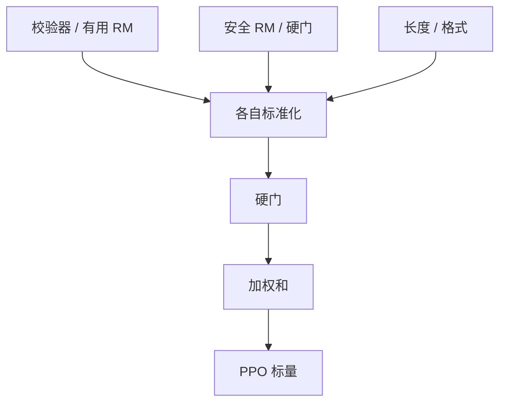

# 多目标奖励加权

有用与无害经常相反；一个标量里的权重是产品决策，不是数据里长出来的唯一解。

<footer>—— Llama 2 分头奖励；Wu 等细粒度 RLHF；Rame 等 Rewarded Soups / WARM 的权重插值</footer>

[上一课](/llm/math-verifier-equivalence)与代码验证器给出可程序化的对错。真实助手还要同时满足安全、长度、可读、引用。缺口是：**多条 $R_m$ 如何合成一个接到 [PPO](/llm/ppo-llm) 的标量，而不把某一轴偷偷关掉。** 本课写加权、硬门与帕累托，不重写 [RM](/llm/reward-model) 的 BT。细则课给出条目；本课给出合成政策。

## 问题

Llama 2 发现有用比较与安全比较经常冲突，于是训两个 RM，推理时再组合。线性加权 $r=\sum w_m R_m$ 把冲突变成「谁的 $w$ 大」。$w$ 若在验证集上用单一 Arena 扫，安全会被有用吞掉。硬门（安全低于阈值则奖励封顶为负）把不可谈判轴拿出去，剩下的才加权。

尺度不同：通过率在 $[0,1]$，RM logit 在几十，KL 惩罚是 nat。未标准化就加权，等于只优化量纲最大的那项。上一课的校准与后课白化，都是为了让 $w$ 的含义接近「相对重要性」而不是「谁没除标准差」。

### 加权和不是帕累托最优

线性加权只触及凸包上的点。若产品要「足够安全且尽量有用」，应先硬约束再优化有用，而不是指望某个 $w$ 碰巧落到那条折线上。Rewarded soups 在已经训好的专家策略之间插值权重，得到不同折中，而不对每个 $w$ 重跑 RL。

把 KL 也当成「目标」加进加权，要声明它是约束还是目标。InstructGPT 把 KL 放进奖励一侧，是约束的拉格朗日写法，不是又一条偏好。

## 方法

每条 $R_m$ 先变成可比尺度：0/1 校验器保持原样；RM 用保留集标准化或校准；长度用 token 数或超长软惩罚。合成：

$$
r = \begin{cases}
-R_{\mathrm{cap}} & \text{若硬门失败}\\
\sum_m w_m \tilde R_m & \text{否则.}
\end{cases}
$$

扫 $w$ 时看多轴金标，而不是看合成 $r$ 本身（否则又过优化合成公式）。也可以分阶段：先安全 RL，再有用 RL，类似课程。接到 [DPO](/llm/dpo) 时没有显式 $r$，多目标通常改成多份比较数据混合，混合比例承担 $w$ 的角色。

## 机制

梯度沿 $\sum w_m \nabla \tilde R_m$。某一轴标签稀、噪声大时，即使 $w$ 不小，有效学习仍弱。安全数据少，会表现为「权重给了但不灵」，需要的是数据而不是更大的 $w$。硬门在阈值附近不可微，实现上常用平滑或「失败则整条轨迹负优势」，避免策略在门槛上振荡。

报告必须同时给出各轴金标。只报加权 $r$ 上升，等于没报。

## 边界与工程取舍

轴数超过三四个，权空间扫不动，应合并共线轴（细则课的相关矩阵）。可验证主场可以 $w_{\mathrm{acc}}=1$，其它轴只做轻惩罚，以免干扰对错几何。[GRPO](/llm/grpo) 组内标准化会再次改尺度：先合成再标准化，与先分别标准化再合成，结果不同，必须锁一种。下一课把已经合成的序列奖励，再分配到 token。

## 小结

- 多目标合成是产品合同：硬门 + 标准化后的加权，权重要多轴金标扫。
- 量纲不齐时加权无意义；KL 是约束还是目标要声明。
- 线性加权只到凸包；硬约束与策略插值是另两条路。
- GRPO 的组内标准化与加权顺序必须固定。
- 出处：Touvron 等 Llama 2；Wu 等细粒度 RLHF；Rame 等 WARM / rewarded soups。
