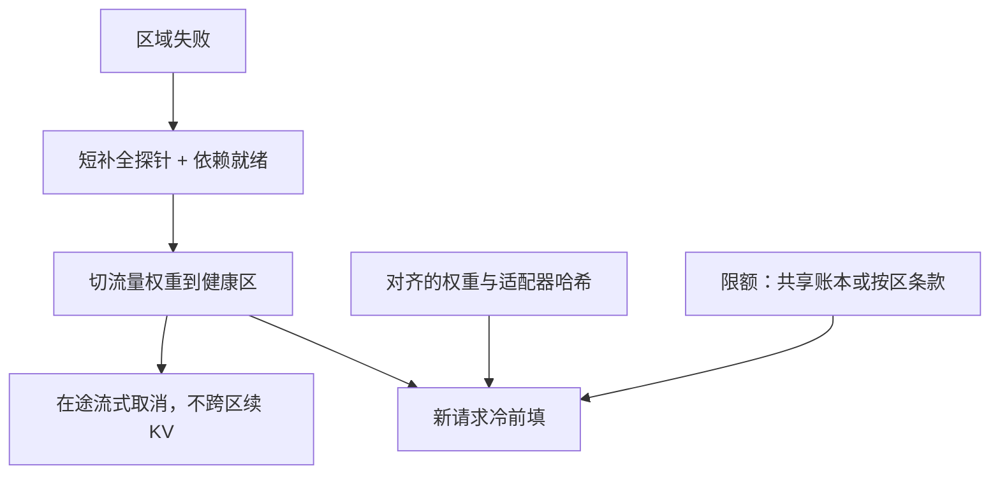

# 多区域故障转移

    
DNS 把流量拨到另一座机房，KV、适配器页和限流桶并不会跟着过去；转移的是新请求的路由，不是正在生成的那条序列的内存。

    <footer>—— 对照多活与主备在有状态生成服务上的差异：缓存亲和与版本一致先于拨流量</footer>

无状态 HTTP 的故障转移是切负载均衡。自回归服务的状态在 GPU 的 KV 里、在 [前缀缓存](/llm/prefix-caching) 里、在 [适配器页](/llm/adapter-hot-swap) 里、在 [TPM 桶](/llm/token-ratelimit) 里。一区断电，另一区可以立刻接住新 TCP，却接不住旧序列：用户看到的是断流、重连、冷前填、可能换一个模型版本。本篇写多区域转移要搬哪些控制面、哪些只能降级，以及如何避免「转移成功、TTFT 分位爆炸、账单翻倍」。不编造未公开的跨洋 NVLink，也不把某一云厂商的全球加速器名词当成标准。

## 问题

生成请求一旦进入 decode，就绑定了具体副本上的 KV 布局。区域失败时，这些页通常无法在截止时间内搬完：体积随层数、KV 头、长度线性涨，跨区域带宽与尾延迟都不适合当热路径。因此故障转移的默认语义是：**在途请求失败或取消，新请求在健康区冷启动**。产品若承诺「对话不中断」，必须预先把状态复制到对端，成本接近双写 KV，极少值得。

第二层是一致性。两区的基座量化、chat template、适配器哈希、审核模型版本若不一致，转移等于换了一个人设。用户会报告「故障后变傻 / 变啰嗦 / 安全策略变了」。第三层是控制面：限流桶若分区独立，转移后配额翻倍或清零；若强一致跨区，限流本身会在分区时不可用。

### 主备与多活管的故障集不同

主动-被动：只有主区接流量，备区跑同步的权重与配置，定期暖机。转移清晰，浪费一组 GPU。主动-主动：用户按就近接入，故障时把 DNS 或任播权重拨到另一区。平时容量有弹性，但缓存命中、会话粘滞、版本滚动都要按区理解。混合常见：交互走就近多活，批作业钉在便宜区；故障时批作业可丢，交互要有明确的降级 SLO。

健康检查不要只 ping HTTP 200。引擎可以端口还在、KV 池已死、审核依赖已熔断。探针应含一次短补全的 TTFT 上限，以及依赖（词表、适配器盘、审核）的就绪。假健康会把流量打进黑洞，分位比不转移更差。

## 方法

把对象分成三类。

**必须跨区复制、转移前对齐：** 模型与 tokenizer 工件、chat template 版本、适配器发布（内容哈希）、审核分类法与阈值、路由别名。用同一套发布流水线打到各区，禁止一区手工热更新。滚动时接受短暂的版本窗，或先停一区流量再发版。

**最好不跨区搬、转移时放弃：** 进行中的 KV、本区前缀缓存热页。文档写明：重连后第一次请求 TTFT 按未命中计。客户端应把已生成文本当作本地草稿，重试带续写或「从上次用户句重新开始」，服务端不要假装能接上 token 流。

**明确选择共享还是分片：** 限流桶、配额账本、幂等键。共享需要跨区一致存储，分区时要有本地紧急桶以免无法拒流；分片则转移后额度可能重置，需在条款里写「按区限额」或「故障时合并」。

DNS / 任播 TTL 必须短于你承诺的转移时间，但又不能短到正常抖动。网关持有主动健康权重，比等 TTL 过期更快。正在流式的连接：发送 finish reason 为 `cancelled` 或切断；不要在半截 SSE 后面接另一个区的 token，客户端无法拼接。

## 机制

用户体感的尖刺来自三件事同时发生：连接重置、冷前填、可能的排队（一区容量突然要吃两区流量）。[TTFT 分位](/llm/ttft-percentiles) 会立刻出现未命中峰；若备区平时未暖机，还有模型加载与 CUDA 捕获。备区应保持基座常驻、跑微量合成流量，把冷启动排除在转移窗口之外。容量上，多活每区都不能按「只有本地峰值」规划到 100%：转移需要余量，否则健康区跟着饱和，[goodput](/llm/goodput) 一起掉。

### 暖机与余量决定转移后的分位

适配器与 LoRA 服务：冷区若没有热页，第一次请求会走 [LoRAX](/llm/lorax-serving) 式加载，TTFT 再加一截。关键租户的适配器应在各区预加载。KV 感知路由表是区内的，转移后必须作废旧区指纹，否则网关把请求打向已死副本。

跨区「同步 KV」听起来能保住会话，实际要付带宽、一致性与隐私三笔账。PD 分离已经在区内搬 KV；再跨区搬，延迟通常大于重做前填。优先重前填，除非有同城双活、光纤相当于机柜内的特殊拓扑。

## 边界与工程取舍

异构硬件见 [异构集群](/llm/hetero-cluster)：一区 GPU、一区 NPU 不能在故障时把同一 TP 作业搬过去，只能请求级路由到能跑该运行时的池。模型级联在转移后可能从「小模型路由」退化成「只剩大模型」或反过来，要当降级档位写进 SLO，而不是静默换质量。

### 驻留与演练都是合同

合规与数据驻留：有的租户禁止出区。故障转移若把数据打到境外，是合同违约，不是高可用。应用标签钉住区域，宁可 503 也不越境。时钟与账单：两区时间不同步会让限流与缓存 TTL 错乱；以一个权威时间源为准。

测试故障转移要真切流量，而不是只切 DNS。看：在途连接是否干净结束、新请求 P99 TTFT、错误率、审核是否仍在关键路径、适配器版本是否仍对齐。演练窗口应标进分位报表，避免把演练当成事故回溯。

自动转移的抖动比不转移更危险：探针抖动导致来回拨，缓存反复冷热，限流桶来回清零。权重要有迟滞与最小保持时间，与 dLoRA 合并的迟滞是同一类稳定性需求。

## 小结

- 故障转移默认放弃在途 KV，接新请求冷启动；「对话不中断」需要预先双写，通常不划算。
- 权重、模板、适配器哈希、审核政策必须跨区对齐；限流账本共享与否写进条款。
- 备区要暖机与余量，否则转移把 TTFT 分位与排队一起打爆。
- 探针含真实短补全；流式连接取消而不是跨区续 token。
- 数据驻留、异构运行时、级联降级都是合同范围，不是 DNS 细节。
- 出处：对照有状态服务的主备/多活惯例与 LLM KV 不可廉价跨区搬迁的事实；无单独经典论文名。
