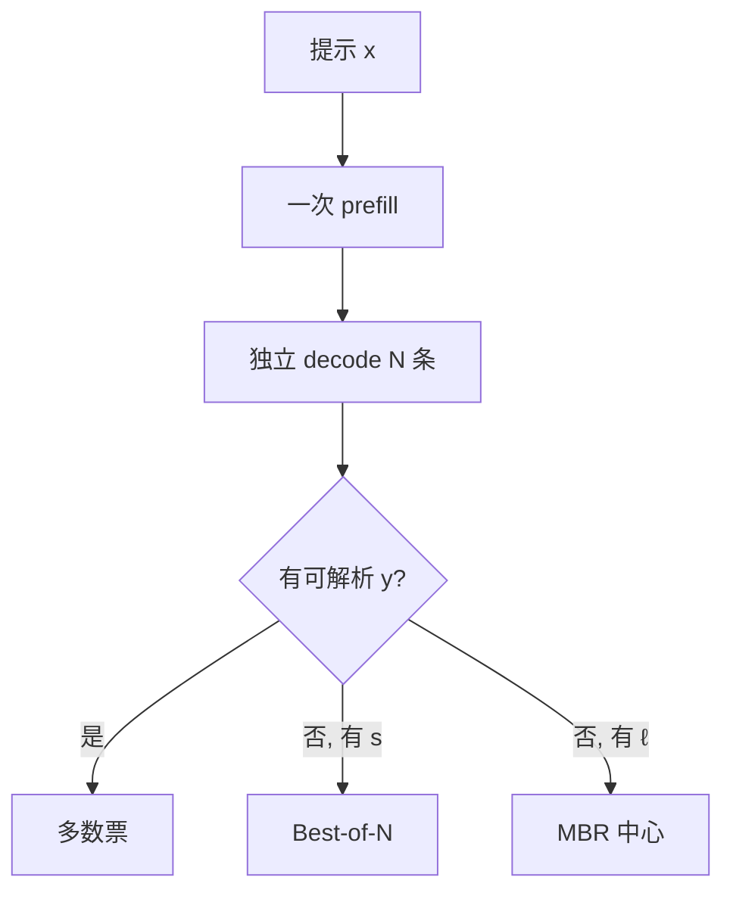

# 多样本聚合与投票

把同一问题的许多条思维链投进答案空间：错的分散，对的汇聚；聚合函数选得不对，N 只是把系统性偏差选稳。

<footer>—— Wang et al., Self-Consistency, ICLR 2023；核对器上的多样本见 Cobbe et al., 2021 与 Best-of-N</footer>

[上一课](/llm/structured-output-overhead)用掩码保证 *一条* 输出合法。本课关闭「解码进阶」：质量也可以买宽度——独立采样 $N$ 条，在答案空间或打分器上聚合。主干已有 [Self-Consistency](/llm/self-consistency) 与 [Best-of-N](/llm/best-of-n)；这里不重推多数票公式，只补本课序留下的缺口：何时投票、何时 MBR、何时 BoN，以及 $N$ 如何打在 KV 与延迟上。下一课程「推理系统进阶」从[把 KV 字节算清楚](/llm/kv-cache-size-math)开始，因为投票把 $N$ 放大之前必须先会算一份缓存。

## 问题

结构化输出解决解析，不解决算错。单次贪心把早期错误写圆，[温度](/llm/temperature-reasoning)给了覆盖，但单条高温链方差大。需要把 $N$ 条独立样本收成一条交付。缺口是聚合函数的选择，而不是再介绍一次采样：

- **多数票**：解析 $y$，取众数。无外部模型，假设错误分散。
- **BoN**：用 $s(x,y)$ 取最大。上限是 $s$ 的校准。
- **MBR**：用任务损失找集合中心，贵在两两度量。

三者都要求样本 *有效多样*。$T\to 0$ 或共享同一束前缀，$N$ 是假的。连续批与前缀缓存能让 $N$ 条共享提示 KV，但 decode KV 仍近似线性于 $N$。产品把「思考」做成 $N=1$ 的长链还是 $N=8$ 的短链，是显存与延迟的不同曲线——后课要算的就是这条曲线。

投票在答案空间；MBR 在字符串空间。不要对未解析的思维链做多数票，也不要对 boxed 数字做 BLEU-MBR。解析规则是聚合的一部分，必须写进评测。

## 方法

先能解析再聚合。数学、选项、代码（测例 0/1）优先多数票或直到成功的拒绝采样。开放写作没有 $y$ 的等价类，多数票无定义，应 BoN 或根本不聚合。$N$ 从 4–8 扫起看边际，不要默认 64。并行采样时提示 prefill 一次，decode 分叉；串行则延迟乘 $N$，只适合离线。

与自投机 / 投机的关系：每条样本内部可以加速，但不能把 $N$ 条的草稿 KV 无界堆上。结构化掩码可以每条都开，聚合前每条都合法，并不减少 $N$ 的 FLOPs。

## 机制

覆盖近似 $1-(1-p)^N$，但系统性错误使众数是错的。$s$ 的假阳性让 BoN 收敛到奖励黑客。[多样束](/llm/diverse-beam-search)不能替代独立采样：相关样本让有效 $N$ 下降。温度必须落在推理那一档，使 $y$ 不同而不是标点不同。能量与成本随 $N$ 近线性，这是下一课程用屋顶线与美元模型要接的账：投票是测试时计算，不是免费准确率。

Self-consistency 原文的 $N$ 与温度是实验设置，不是产品 SLA。线上 $N$ 应受 KV 池与尾延迟约束，而不是受论文表格约束。

## 边界与工程取舍

不要把 $N=16$ 的自洽准确率当单次模型能力。不要在开放聊天用多数票。不要在 KV 将满时对每个用户开大 $N$——应降 $N$ 或拒请求。许可证与测试集：用测试规则当 $s$ 是泄漏。下一课起不再讨论选哪条字符串，而讨论一条字符串的缓存有多大。

出处：Wang et al., ICLR 2023；Cobbe et al., 2021；BoN 见 Ouyang et al. InstructGPT 与 Snell et al. 2024。MBR 见本课序 [MBR 解码](/llm/mbr-decoding)。

## 小结

- 聚合在答案空间（投票）或打分器 / 度量上；先解析。
- 有效多样依赖 $T>0$ 与独立 RNG；束的 $B$ 条不是 $N$。
- Prefill 可共享，decode KV 与延迟近线性于 $N$。
- 系统性偏差下多数票更稳地错；BoN 上限是 $s$。
- 结构化合法与投票正交，都要付钱。
- 解码进阶到此结束；下一课算 KV 字节。
- 出处：Wang et al., ICLR 2023；Cobbe et al., 2021。
