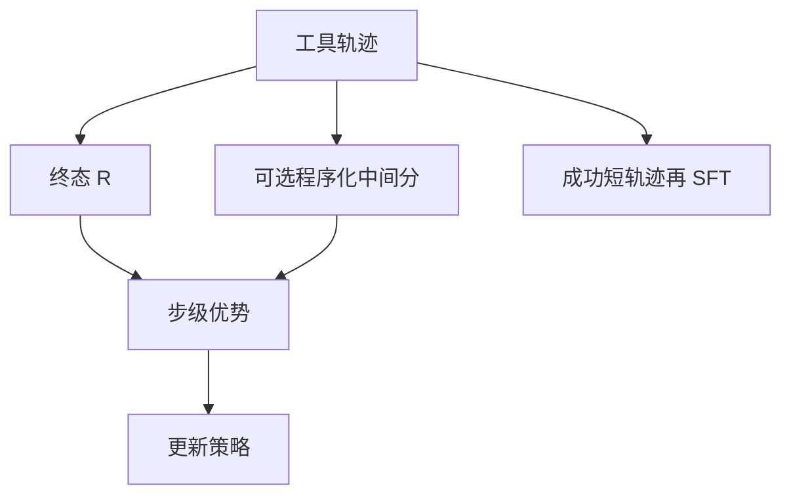

# 多步信用分配

终态奖励来得晚：中间某一次错误的工具参数可能在五步之后才让单测失败，梯度却糊在整条轨迹上。

<footer>—— 对照经典 RL 的时间信用；智能体轨迹上的工具步比 token 步更粗、更贵</footer>

[工具 schema SFT](/llm/tool-schema-sft) 让单步调用合法。缺口是 **多步任务**：检索 → 计算 → 再检索，只有最后的 $R$。与[推理 RL](/llm/verifiable-reward) 的长 CoT 同类，但动作是工具而不是思维 token，每步墙钟与副作用都大。本课写如何把终态信用分到工具步：MC 回报、逐步校验、以及为什么逐步「看起来合理」不能当奖励。后课沙箱会限制这些步能造成的伤害。

## 问题

轨迹 $a_1,o_1,\ldots,a_T,o_T$，奖励 $R$ 在 $T$。REINFORCE 给所有 $a_t$ 同一优势（或 $\gamma$ 衰减），于是成功轨迹里的弯路也被加强，失败轨迹里正确的前两步也被惩罚。工具步数通常 $10^1$–$10^2$，比 CoT token 少，但每步不可逆（发了邮件、写了文件）。错误信用的代价比多说一句 CoT 高。

过程奖励 / PRM 在工具域更难：中间「检索是否有用」没有标准答案。用 LLM 给逐步分会回到法官偏见。需要能程序化的中间信号：单测子断言、数据库不变量、是否命中白名单 URL、检索是否非空。没有这些，就老实用结果 RL + 大群体，不要假装有逐步真值。

### 动作粒度要先定

信用是相对于你定义的 $a_t$。若 $a_t$ 是整段 JSON 调用，参数里一个字段错整步背锅。若把字段当子动作，信用更细，但策略接口与 schema 解码不一致。应与训练时的动作定义一致：通常 **一次 tool_call = 一步**，字段错误由 schema SFT 消化，本课只分配步级信用。规划式智能体的「计划」本身是一步还是多步？若计划一次性写出 DAG，信用在计划 token 上，执行器错误不应回传到计划（除非允许重规划）。反应式则每步都是策略动作。控制流课的决策频率，就是信用分配的时间轴。

## 方法

### 从 MC 到过滤蒸馏

- **Monte Carlo**：成功轨迹全体小正优势，失败全体负；靠群体基线减方差。简单，弯路问题仍在。
- **逐步环境分**：$r_t$ 来自程序（检索非空 +ε、执行异常 −δ、终态 $R$）。$\varepsilon$ 过大会让模型刷检索。
- **因果替换**：对失败轨迹，从某步起换成专家 / 搜索得到的纠正，估该步的反事实价值（贵）。
- **过滤蒸馏**：只把终态成功且步数低于预算的轨迹回灌 SFT，弯路被长度门槛丢掉——与推理闭环同构。

优势估计可用 [critic-free 群体](/llm/group-relative-baseline)。工具 RL 的 $G$ 受环境墙钟限制，方差会大于数学 RL，更依赖过滤蒸馏而不是纯在线梯度。

## 机制

$\gamma<1$ 的折扣把信用推向终局附近的动作，适合「最后提交」型任务，但伤害必须早做的检索。工具任务往往前重：实体解析错则后面全废。此时反转：给早期关键步更高塑造，或用「一旦关键断言失败就截断」减少后续噪声步进入梯度。截断改变了轨迹分布，要与[长度预算](/llm/length-budget-rl) 一样防止学会过早猜终态。

延迟观察（工具 5 秒后返回）不改变信用数学，但改变训练吞吐。异步环境里不要把等待中的 token 当动作。动作只在模型产出 tool_call 的时刻。

多工具并行调用（一次助手消息里两个函数）的信用更难拆。协议若允许并行，应把并行包当作一步，或在 schema 里禁止直到信用方案就绪。评测协议要与训练动作定义一致，否则 pass 了的模型在产品并行接口上行为未定义。

### 假中间奖励

「检索条数越多越好」会训练出循环搜索。「JSON 合法 +0.1」会与约束解码重复且饱和。中间奖励必须与真实任务因果相关，并用终态 $R$ 做消融：去掉中间项 $R$ 是否掉。掉则该项在教投机，不是在帮信用。

## 边界与工程取舍

不可逆副作用使探索危险——这是沙箱课的输入。本课在数学上允许负信用，在工程上必须假设失败可重置。不能重置的环境（真邮箱）禁止 RL，只允许 SFT 与规则。

人在环逐步打分不可扩展，且不一致。若必须用，当校准数据训一个专用过程模型，不要当在线奖励。与 PRM 进环课相同：冻结、用 $R$ 守门。

SWE-bench 一类终态单测是工具域最干净的 $R$。没有单测的浏览任务，信用分配至今主要靠终态 + 人工抽查，不要在论文里写「我们解决了浏览的逐步信用」除非有程序化不变量。

## 小结

- 多步工具 RL 的主问题是终态延迟信用；动作粒度与控制流对齐。
- 优先程序化中间断言与成功短轨迹蒸馏，慎用 LLM 逐步分。
- 前重任务不要用过小 $\gamma$；失败早截断要防过早猜。
- 中间奖励必须相对 $R$ 做消融，防刷检索 / 刷合法。
- 不可重置环境不做探索性 RL。
- 出处：经典时间信用；智能体基准的终态评分实践。
