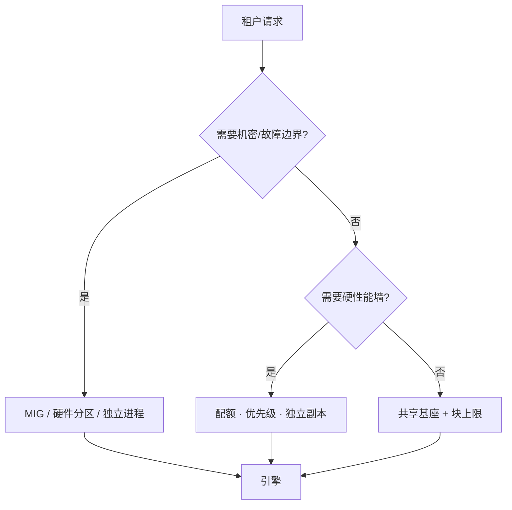

# 多租户隔离

    
共享加速器省的是权重与卡时；隔离要在故障、性能与机密三条线上同时成立，否则多租户只是把邻居的尖刺写进自己的 SLO。

    <footer>—— 对照云上 GPU 切片、MIG / 分区、以及 Punica/S-LoRA 把多租户适配器打进同一运行时的服务形态</footer>

一张卡只跑一个租户最干净：故障域等于租户域，性能可预测，权重不会被旁路读。代价是小租户吃不满 HBM，大基座被复制许多份。多租户把许多调用方打进同一份硬件或同一份基座，省的就是这份复制。隔离因此不是「K8s Namespace 建好了」，而是问：A 的长 prefill 会不会把 B 的 TPOT 打穿；A 的 kernel 崩会不会把整张卡复位；A 能不能从残留显存里读到 B 的 KV。三条分别是性能隔离、故障隔离、机密隔离，强度递减地昂贵。本篇写加速器上的层次，以及推理引擎内部的租户配额如何与集群切分对齐。

## 问题

嘈杂邻居是默认物理。连续批会把能填满 GPU 的请求都塞进去，离线租户的大包最能填满，交互租户在队列里看 [SLA](/llm/priority-sla) 破裂。这不是攻击，是目标函数仍是吞吐。第二类问题是设备重置：一个非法访问或驱动故障，MIG 之外常常整卡一起没，所有租户的 KV 同时蒸发。第三类是侧通道与残页：进程退出后 HBM 未清，或同一进程内分页池把页分给下一租户而未零填。

「多租户」还混用了两个粒度。集群多租户：不同用户的**不同引擎进程**共享节点或共享一张切过的卡。运行时多租户：同一引擎里 [多 LoRA](/llm/multi-lora-serving) 或共享基座，按请求换适配器。前者靠虚拟化；后者靠引擎自己的配额与内存消毒。混为一谈会把 LoRA 热切换当成机密隔离。

### 三种隔离不要互相冒充

性能隔离：带宽、SM/AIC 时间、KV 块上限、优先级队列。故障隔离：故障域缩小到切片或进程，能复位而不 ripple。机密隔离：地址空间、零填、无共享页跨租户、侧通道预算。QoS 做好不等于机密；MIG 做好不等于两个 LoRA 在同一进程里数据不漏。产品文档必须写清卖的是哪一层。

云厂商的「vGPU / MIG 安全隔离」通常指切片间的硬件防火墙与清页。同一 vLLM 进程里的两个 API key，默认只是逻辑租户，机密边界是进程，不是 key 字符串。

## 方法

硬件切分优先用于需要故障与机密边界的租户。NVIDIA MIG、昇腾的硬件分区、超节点上的 UB 分区，把 HBM、计算与部分互连切成更小的箱子，见 [装箱](/llm/gpu-packing)。切片内仍建议一个引擎一个租户，或一组互信工作负载。性能要求高但不要求机密的内部业务，可以用 MPS 或时间片共享 SM，HBM 仍按进程记账，并用引擎配额限制 KV。

运行时共享基座时，隔离落在调度与内存：每租户 KV 块上限、token/s 配额、优先级与老化，防止一个租户占满运行集。适配器权重按租户分库，页不跨租户共享，除非显式的公共系统提示。请求结束必须归还页；归还到跨租户池前应视为脏页——至少在机密租户场景做零填，性能租户可以跳过以省带宽。

### 控制面隔离与数据面隔离

集群里 Namespace、NetworkPolicy、青田 VPC 表解决的是包与 API 的租户边界，见 [青田 DPU](/llm/qingtian-dpu)。它们不阻止同一张卡上两个进程抢 HBM 带宽。数据面隔离必须在设备插件与引擎里落实：设备分配不要把敌对租户排进同一切片；引擎不要把敌对租户排进同一连续批——除非合同写明「共享队列、尽力而为」。超节点更要小心：统一编址让远端读更容易，UMMU/地址空间标识必须按租户分开，否则池化把机密面从单卡扩大到整柜。

共享连续批是性能优化：同一 Softmax/GEMM 打多个租户的 token。一旦合批，性能隔离就只剩下配额，不再有「时间片硬切」。要硬切就不要合批，或只在同优先级租户内合批。

## 机制

硬件切片能隔离，是因为存储器控制器与计算阵列在切片之间有独立的地址译码与重置域（以厂商文档为准）。进程隔离靠 OS：不同 PID、不同 CUDA context，驱动负责上下文切换与（理想情况下）释放时清页。引擎内隔离没有 MMU：只有软件账本。块表把物理页指给逻辑序列，序列带租户 ID，分配器拒绝超额。没有硬件强制，bug 就是越权。因此高机密场景不应把多租户合进同一进程，哪怕 LoRA 很香。

性能机制是双层队列。集群层：租户配额决定能占多少切片。引擎层：迭代准入时先扣该租户的块预算与优先级，再进入运行集。抢占受害者优先从超配额或低优先级里挑。没有引擎层，MIG 切得很干净也会在切片内部被自己的离线作业打穿。

### 噪声的来源不只是算力

PCIe/UB 上的 KV 换出、主机采样、日志与指标刮取，都会形成跨租户干扰。把采样留在设备上、把日志异步化、把换出限速，是隔离的一部分。超节点上 AIV-Direct 直写远端内存，若缓冲落在隔壁租户份额里，就是机密事故；预分配缓冲必须落在本租户地址空间。

## 边界与工程取舍

完全隔离回到一租户一卡，成本最高、最可预测。完全共享基座成本最低、机密最弱。中间态要写进合同：共享队列的 TPOT 是百分位目标，不是硬上限；MIG 切片的故障域是切片，不是机柜。不要用「我们有 Namespace」回答安全问卷。不要在未清页的池上做跨租户前缀共享，命中率再高也不值得。

合规数据（金融、医疗）默认独立副本或独立切片，基座可以同源加载，进程不要合。内部工具模型可以合批加配额。评测隔离应做对抗：租户 A 打满长 prefill，看 B 的 TPOT 与错误率，而不是只看平均利用率。

出处：Punica / S-LoRA 提供运行时多适配器的计算形态；MIG 与云 DPU 提供硬件边界。本篇把它们排成必须分开报价的层次，而不是一种「多租户技术」。

## 小结

- 多租户要分别满足性能、故障、机密；一层做好不能推断另外两层。
- 需要机密或独立故障域时用硬件切片或独立进程；共享基座只适合互信或合同允许的合批。
- 引擎内用 KV 配额与优先级落实性能隔离；合批会削弱硬隔离。
- 池化与统一编址扩大机密面，地址空间必须按租户切开。
- 对抗性评测看邻居打满时的 SLO，不看空载百分位。
- 出处：Chen 等 Punica、Sheng 等 S-LoRA（MLSys 2024）；厂商 MIG/分区文档；云 VPC/DPU 隔离实践。
