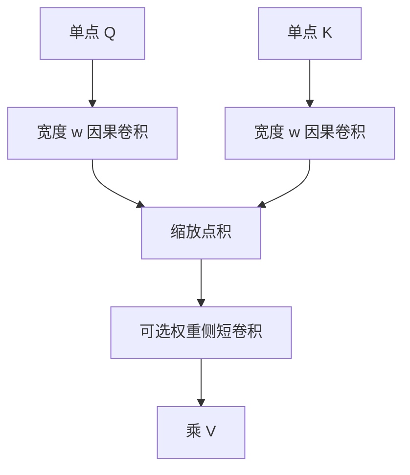

# 多 token 注意力

查询与键在打分前先与邻近位置卷积，一次注意力可以条件于短片段而不是单点向量。

<footer>—— Golovneva et al., Multi-Token Attention, 2025</footer>

[上一课](/llm/yoco)规定谁写那份 KV。默认每次打分仍是一个查询向量对一个键向量。[SDPA](/llm/sdpa) 的接口是点对点。本课补：在点积之前，让 $q$、$k$ 先看见自己的邻近 token，使匹配发生在短 n-gram 上。这与一次预测多个未来 token 的训练目标不是同一件事。后课回头看头数与头维，默认你会「键查询可以先局部混合」。

## 问题

点积匹配对精确单 token 检索很强，对「连续两个词才构成的键」很弱：必须靠某一层先把邻居写进同一个向量，下一层才能当单点去对。归纳、短语拷贝、局部模式往往消耗一层注意力只为了做这件事。缺口是在打分前提供显式的**多 token 感受野**，而不把整层改成卷积骨干。

窗口注意力改变谁能被看见；多 token 注意力改变被看见的对象是点还是短段。YOCO 的窗口是缓存范围；本课的卷积核很小，通常只覆盖邻近几个位置，发生在全范围或因果范围的点积之前。

多 token 预测（Gloeckle 等）是损失侧一次监督多个未来位置。多 token 注意力是算子侧。名字相近，课序上不要串台。

## 方法

对投影后的 $Q,K$（有时也含 $V$）沿长度做深度可分或分组卷积，核宽 $w$ 为奇数个 token，因果实现里核只看左侧。得到 $\tilde Q,\tilde K$ 后再走标准缩放点积。Golovneva 等人还允许在注意力权重上做一次沿键维的短卷积，使相邻键的权重耦合，相当于「命中一个位置时邻居也带一点」。

掩码仍加在点积分数上。卷积若泄漏未来，整层因果被破坏，必须与[因果自注意力](/llm/causal-self-attention)同一标准：核的右端为零。

### 参数与计算

$w$ 很小（如 3、5）时，卷积相对 $n^2$ 点积可忽略。它增加的是局部归纳偏置，不是另一条二次路径。核按头共享或按头独立：按头独立更贴近「有的头看 bigram、有的头仍看单点」。

## 机制

短语「New York」作为键，单点匹配可能把 New 与 York 拆开，分别被不同查询打中。卷积让 York 位置的键含有 New 的分量，查询「该城市」可以一次对上这个局部复合键。权重侧卷积则让高分位置把质量渗到邻居，缓解 tokenizer 切分造成的单点错位。

这层局部混合本可以交给前一层注意力或 FFN。显式卷积把这件事从必须学的电路里拿出来，省深度给更远的依赖。代价是归纳偏置变强：假设有用结构在宽度 $w$ 内，更长的短语仍要靠层叠。

与相对位置偏置不同：偏置改的是距离先验，卷积改的是内容的局部线性混合。二者可叠加，T5 偏置加多 token 卷积并不冲突。

## 边界

核过宽接近沿长度的通道混合，会打糊位置身份，精确拷贝变差。与 SSM 的卷积核不是同一尺度：Hyena 一类长卷积要覆盖远程，本课的 $w$ 是局部。推理时卷积需要左侧 $w-1$ 个已有 $Q/K$，状态很小，但要在 KV 缓存旁另开短缓冲，实现要比纯点积啰嗦。不要用它替代长程记忆模块。

## 小结

- 多 token 注意力在点积前（及可选在权重上）做短因果卷积，让匹配条件于局部片段。
- 它补的是单点 SDPA 对 n-gram 键的无能，不改二次复杂度主项。
- 与多 token 预测、窗口缓存、长卷积不是同一对象。
- 核必须因果；过宽会损害单点拷贝。
- 出处：Golovneva et al., 2025。
