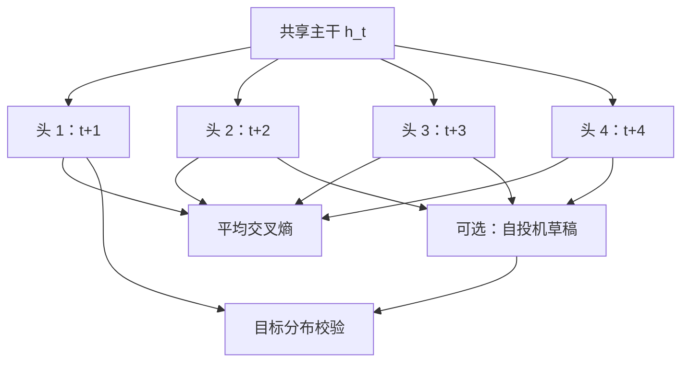

# Multi-Token Prediction 训练目标

每个位置用共享主干上的 $n$ 个独立头同时预报未来 $n$ 个 token；这首先是更密的训练信号，其次才顺便变成可自投机的草稿。

<footer>—— Gloeckle, Youbi Idrissi, Rozière, Lopez-Paz, Synnaeve, Better & Faster Large Language Models via Multi-token Prediction, ICML 2024</footer>

因果语言模型默认只对 $t+1$ 做交叉熵，位置 $t$ 的表示只要对下一词可分。Gloeckle 等人把目标改成：同一主干 $h_t$ 上架 $n$ 个**互不共享参数的输出头**，分别预测 $t+1,\ldots,t+n$。他们称之为多 token 预测（multi-token prediction），并把它当辅助训练任务：训练时间几乎不增加（骨干仍一次前向），下游尤其是代码生成变好，且随模型变大更明显。13B 上 HumanEval 多解约 12%、MBPP 约 17%；4-token 训练的模型推理最高约 3×，即使大 batch。本篇写这条**预训练目标**，对照 [DeepSeek-V3 的顺序 MTP](/llm/mtp) 与 [Medusa](/llm/medusa) 推理头，不把独立头说成保持完整因果链。

## 问题

下一词损失在长序列上已经逐位置密集，但每个 $h_t$ 只被一个标号拉。若 $h_t$ 还要解释 $t+2$，表示必须记住「还要说什么」，而不是当步能敷衍的功能词。独立头的结构性缺口正好是 EAGLE 后来叫 feature uncertainty 的东西：第 $k$ 个头看不到中间 $k-1$ 个离散选择，条件是 $P(t_{i+k}\mid h_i)$，不是 $P(t_{i+k}\mid t_{i+1:i+k-1},h_i)$。Gloeckle 等接受这个缺口，把它当成**训练期的辅助任务**，推理时主模型仍可只用第一头做标准下一词解码；多头留下的能力是自投机：用其余头并行提草稿，再一次性校验。

小模型上多 token 目标有时伤下一词语境，大模型上转正——论文明确写 increasingly useful for larger model sizes。问题因此包括：何时 $n=4$ 而不是 $n=2$；独立头是否共享词嵌入；训练多 epoch 后收益是否还在。

### 辅助任务与主损失的权重

若把 $n$ 个头等权平均，远位置更难、损失更大，梯度可能被 $t+n$ 主导。实践上常对 $n$ 个交叉熵取平均，或对远头降权。论文把 MTP 视为辅助，下一词头仍是部署用的主头。不要在没有消融的情况下把远头权重大于 1。

Gloeckle 的头在训练时并行、条件独立；DeepSeek-V3 的 MTP 模块顺序连接并吃入中间 token 嵌入，原则更接近 EAGLE 的因果链。两篇都叫多 token 预测，实现不是同一个计算图。本篇钉 ICML 2024 / arXiv:2404.19737。

## 方法

共享主干算出 $h_t$，第 $k$ 个头 $U_k$ 输出 $p_\theta(x_{t+k}\mid h_t)$。损失为

$$
\mathcal{L}=\frac{1}{n}\sum_{k=1}^{n}\mathrm{CE}\bigl(U_k(h_t),\,x_{t+k}\bigr)
$$

（或再乘全局权重）。词嵌入通常共享；输出头不共享，否则远位置与近位置抢同一套分类边界。教师强制下，$x_{t+k}$ 来自语料真值，不依赖模型自己的中间采样，因此训练图无循环，也**没有** training-time test。这与 [EAGLE-3](/llm/eagle-3) 在推理插件上模拟多步相反：MTP 从头训练骨干。

### 推理：自投机，不必另训草稿模型

4-token 模型可以把后三个头的贪婪或采样结果当成草稿前缀，主模型一次前向验证，接受规则同 Leviathan 等。因为草稿与目标共享主干，分布比「另找一个小模型」更近，接受率高，所以即使用大 batch，墙钟仍可降——论文报最高约 3×。这不是无损生成长度的保证以外的事：验证仍要走拒绝采样才与单头解码同分布。贪心解码下则是另一条「快但不保证同序列」的路径。

实验做到 7B、1T token 量级，代码与自然语言都测；算法小任务上显示对 induction head 与算法推理更友好。收益在生成式代码基准上最明显，多选题上不必期待同等涨幅。多 epoch 时作者认为方法仍有吸引力，即不是「只在第一遍数据上有效的正则」。

## 机制

同一 $h_t$ 要对齐多个未来位置，等于在表示里放入短程计划。代码里局部语法与 API 序列的互信息高，多步监督更值钱；网页散文的 $t+4$ 往往几乎不可辨，头会学到平滑的高频先验。独立头不把中间 token 当条件，因此学到的是「从现在起第 $k$ 步的边缘」，不是真正的条件语言模型——这解释了为何它作为**训练信号**可以改进 $h_t$，作为**草稿**却在远步迅速变差，需要验证截断。

Medusa 把独立头装在已训好的模型上加速推理，骨干常冻结。Gloeckle 从头用独立头训骨干。前者是插件，后者是目标。不要用 Medusa 的接受长度表去引用这篇 13B HumanEval 数字。

### 顺序 MTP 为什么后来出现

独立头实现简单、易并行、训练无循环。代价是因果缺口。DeepSeek-V3 改成深度模块：每深一层看见上一表示与已进入链的 token 嵌入，训练信号仍密，条件与真实自回归一致，推理可卸模块。EAGLE 则根本不改预训练目标，只在倒二层上训外推。三条线：训练目标（Gloeckle）、训练目标且顺序（V3）、推理外推（EAGLE）。评测加速时要声明走哪一条。

## 边界与工程取舍

$n$ 增大，远头变难，平均损失被抬高，学习率与梯度裁剪要重标。词表巨大时，$n$ 个头各一份 $D\times|V|$ 不可接受，必须共享词头、只保留小投影，或用 [CCE](/llm/cut-cross-entropy) 避免物化 $n$ 份 logits。流水线并行要把若干头与嵌入放在同一 rank，否则共享词头的梯度要额外通信——V3 的 DualPipe 讨论的是顺序模块，独立头同样有放置问题。

小模型、短训、纯网页数据上 MTP 可能中性或为负；不要当免费正则。推理若不用投机，应卸载未用头，避免 HBM 常驻。与 packing 同时用时，跨文档位置的 $t+k$ 可能落在下一文档——必须在损失里对跨边界的远头掩码，否则辅助任务在教「篇末预测篇首」。这一点与 [跨文档 packing 掩码](/llm/packing-cross-doc-mask) 耦合。

出处：Gloeckle et al., *Better & Faster Large Language Models via Multi-token Prediction*，ICML 2024，PMLR 235:15706–15734，arXiv:2404.19737。顺序变体：DeepSeek-V3 技术报告。投机：Leviathan et al. 2023。独立头推理插件：Cai et al. Medusa。

## 小结

- Gloeckle MTP：共享主干 + $n$ 个独立头并行预测未来 $n$ 个 token，作为预训练辅助目标。
- 大模型与代码基准上样本效率更高；13B 上 HumanEval / MBPP 的相对提升以论文为准。
- 4-token 训练可做自投机，推理最高约 3×，验证规则决定是否无损。
- 独立头没有中间 token 条件，与 V3 顺序 MTP、EAGLE 特征外推三分家。
- 远头损失要在文档边界上掩码；词表大时注意 $n$ 份分类器的显存。
- 出处：Gloeckle, Youbi Idrissi, Rozière, Lopez-Paz, Synnaeve，ICML 2024。
