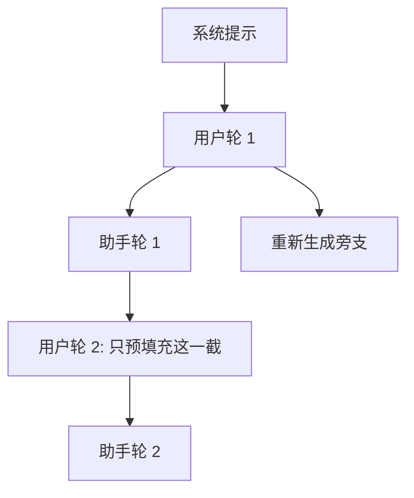

# 多轮前缀命中

    
下一轮对话几乎总是上一轮的严格加长；若上一轮的键值还在，这一轮的预填充应当退化成「只算新说的那一句」。

    <footer>—— 对照 SGLang RadixAttention 对多轮聊天与自洽采样的树形复用</footer>

多轮对话是前缀缓存最干净的特例。第 $t$ 轮的输入是系统提示、历史消息、再加本轮用户话；若引擎还保留了上一轮助手回复的 KV，则第 $t$ 轮与第 $t-1$ 轮共享几乎整段历史，差集只有新用户话（以及随后新生成的助手 token）。把这个差集做对，首 token 延迟随轮数几乎不涨；做错，每轮都把几万 token 的历史重算一遍，用户会感觉「聊得越久越卡」。本篇把多轮从一般的 [前缀缓存](/llm/prefix-caching) 里拆出来，写命中路径、分叉和失败模式。树结构见 [RadixAttention](/llm/radix-attention)。

## 问题

单轮补全的前缀常常是「大家共用的系统提示」。多轮则是**每条会话一条越来越长的私有前缀**，再在上面分叉。分叉来自：用户编辑上一句、对同一轮点重新生成、从历史气泡中途改口、并行开两条追问。扁平的「整段提示哈希」只能整存整取，一旦分叉就全军覆没。需要一条能在会话树里走路的索引，而不是只缓存一个系统提示块。

第二层问题是生命周期。会话可能间歇几分钟；HBM 等不了那么久。若每轮结束立刻丢 KV，下一轮必是全量预填充。若永不丢，长会话把卡填满。多轮命中因此同时是缓存问题与产品问题：哪些会话允许「热连接」钉在 GPU 上，哪些降级到 CPU，哪些只保留系统提示。

聊天模板把角色标记、换行、tool 调用包进 token。展示给用户的字符串相同，模板版本不同，历史 KV 全部失效。多轮命中的第一个故障排查项往往是模板，不是树。

## 方法

### 一轮在树上长一截叶子

把会话看成从根出发的路径：根是系统提示（可跨会话共享），然后交替挂用户与助手。第 $t$ 轮请求带着完整 token 序列进来，从根匹配到上一轮结束的那个节点，长度为 $p$，本轮用户话是后缀。预填充只跑后缀；解码写出的助手 token 再挂成新叶子，供第 $t+1$ 轮使用。SGLang 的示意图正是这样：同一系统提示下两条聊天各走各的分支，叶子 LRU 在会话沉寂后回收。

重新生成是旁支：父节点仍是「到用户话为止」，旧助手叶子可以留着（用户以后可能切回去），也可以立刻回收。编辑历史则必须从被编辑的那一轮切开，被改掉的后缀 KV **全部作废**——它们依赖已经不存在的 token。实现若只按会话 id 复用、不校验 token，会把旧回复的 KV 接到新问题后面，数值错误且难以察觉。

### 热会话与钉住

正在打字、刚回复过的会话应 pin 整条路径，禁止 LRU 拆根。空闲超时后再允许从叶子回收。超时要按「HBM 水位 + 业务优先级」调：客服机器人可以激进回收；IDE 里的长代理会话更值得钉住。pin 的是路径而不是整个用户：同一用户的新话题若系统提示相同，只共享根，不共享另一条对话的叶子。

### 统计要按轮，不要按请求

多轮服务的命中率若按请求计，会被「第一轮冷启动」拉低，也会被「健康检查」污染。更有用的是：第 $t$ 轮省下的预填充 token 占该轮总提示的比例，以及 $t\ge 2$ 的条件命中率。健康的系统在 $t\ge 2$ 时应接近 $p \approx n_{\mathrm{hist}}$，只漏掉新用户话。若第 5 轮仍在全量预填充，多半是模板漂移、会话 id 没绑上树、或上一轮生成没有插入缓存。

## 机制

第 $t$ 轮提示 $x^{(t)}=(x^{(t-1)}, u^{(t)})$，其中 $u^{(t)}$ 是新用户 token。若 $x^{(t-1)}$ 的 KV 仍在且位置从 $0$ 连续编号，则前 $|x^{(t-1)}|$ 步不必算。助手回复 $a^{(t)}$ 在解码时已经写入缓存，下一轮的 $x^{(t+1)}=(x^{(t-1)}, u^{(t)}, a^{(t)}, u^{(t+1)})$ 可以继续接。漏掉「把 $a^{(t)}$ 插入树」这一步，下一轮就只能命中到 $u^{(t)}$ 为止，还要把自己说过的话再预填充一次——这是多轮实现里最常见的半截命中。

位置编号必须从会话开头计，不能每轮从零开始。每轮从零开始等于告诉 RoPE 这是一篇新文档，历史 KV 全部作废。流式输出时，token 一个个追加，树的叶子可以边生成边伸长；若等整段结束再插入，中途取消的请求要回滚未完成的叶子，以免脏前缀留在树上。

工具调用轮次把「模型输出 + 工具返回」都变成历史。工具 JSON 往往很长且每轮不同，叶子会迅速膨胀。共享仍发生在工具返回之前的那一截；不要指望两轮不同的工具结果还能共用后缀 KV。

## 边界与工程取舍

上下文超窗之后，多轮命中与 [窗口淘汰](/llm/kv-eviction) 冲突。若用滑窗丢掉中间历史，树上对应节点必须一起丢掉，否则索引指向空洞。若用汇点加窗口，会话开头的系统提示可能既是语义前缀又是汇点，要避免 LRU 把 BOS 挤掉。超长会话更现实的策略是：摘要或检索替换远历史，树从摘要点重新长——这是一次主动失配，应视为新的根，而不是假装还在命中第 1 轮。

多设备也不免费。会话粘滞到同一 worker，树才有局部性；轮询到另一张卡，要么迁 KV，要么冷启动。粘滞会伤害负载均衡，不粘滞会伤害 TTFT。常见折中是按会话哈希到 replica，并允许超载时迁移且接受一次冷预填充。

评测不要只用 ShareGPT 平均长度。应构造「同一会话 10 轮、每轮加 50 token」和「每轮都改系统提示」两组对照：前者命中应接近满分，后者应接近零。若两组数字接近，说明多轮路径根本没接上。

自洽性采样是多轮的堂兄弟：同一题干挂多片叶子。调度应按最长前缀把这批采样打在一起，否则题干 KV 会被中间的无关请求挤出。

## 小结

- 多轮对话是严格的前缀加长；第 $t\ge 2$ 轮的预填充本应只覆盖新用户话。
- 必须把助手输出（以及工具返回）插入索引，否则下一轮会半截命中。
- 编辑与重新生成是树分叉；被改掉的后缀 KV 要整支作废，不能只靠会话 id。
- 热会话 pin 路径；空闲后从叶子回收。跨 worker 要在粘滞与冷启动之间取舍。
- 模板、位置从零误重置、超窗淘汰，是三类典型的静默失配。
- 指标用「第 $t$ 轮省下的预填充 token」，不要用含混的请求命中率。
- 出处：Zheng 等在 SGLang / RadixAttention 中把多轮聊天与少样本、自洽采样一起当作树形复用的主场景；自动前缀共享的一般规则见前缀缓存一篇。
