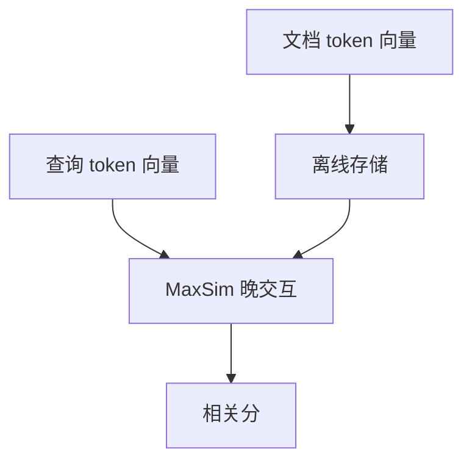
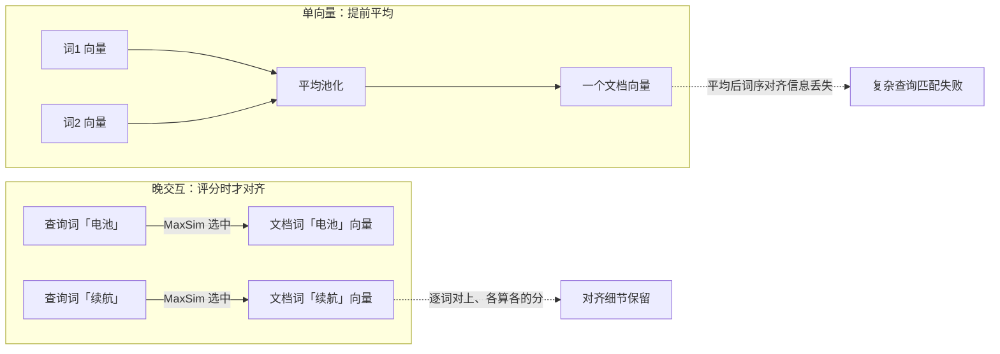

# 多向量与晚交互

一个向量平均掉词序与对齐。让文档每个 token 留一个向量，查询 token 与文档 token 做晚交互，细粒度匹配才回得来。

<footer>—— Khattab &amp; Zaharia, ColBERT</footer>

[上一课](/llm/instruction-embeddings)把单向量条件化。否定、实体对齐、多约束查询仍常败给均值。[重排序](/llm/rerank) 用交叉编码器最准，但不能预计算。本课写多向量晚交互：离线存 token 向量，在线只做轻量聚合。缺口是精度与存储的折中。后课稀疏检索从另一端——词法——补单向量失败的标识符。

## 问题

双塔把文档压成一个 $z_d$，查询压成 $z_q$，交互只有点积。ColBERT 为每个 token 留一个短向量，相关分是查询 token 对文档 token 的 MaxSim 再求和（晚交互）：对齐发生在评分时，而不是在单向量里预先平均。存储从每文档一向量变成每 token 一向量，需要压缩与剪枝。

早交互即交叉编码器：拼接后全注意力，准、贵、不可索引。晚交互把交互推迟到已编码的多向量上，可预计算文档侧。

MaxSim 对每个查询词找文档中最像的位置，擅长「词都能对上」，对需要组合推理的查询仍然弱，那是阅读器的事。

「晚交互」可以想象成：单向量像把整篇文章读完只留一句摘要去比对，而晚交互给每个词各留一张卡片，查询时逐张卡片找最像的那张再加分。摘要省地方但丢细节，卡片占地方但每个词都对得上号。

## 方法

文档离线过编码器得 $H_d\in\mathbb{R}^{m\times d'}$（$d'$ 常远小于 $d$），可选残差压缩。查询在线得 $H_q$。分数 $\sum_i \max_j H_{q,i}^\top H_{d,j}$。检索：先用单向量或 PLAID 一类剪枝取候选，再在候选上算晚交互，避免对全库 MaxSim。训练仍可用对比损失，正负例定义与单向量课相同。

数字实例：一篇 256 token 的文档，若每个 token 存一个 $d'=128$ 维的 float16 向量，就是 $256 \times 128 \times 2$ 字节 $=64$ KB；而一篇同样 128 维的单向量只要 256 字节。差了 256 倍——这就是为什么残差压缩和剪枝不是可选项，而是这套方法能不能落地的前提。

```mermaid
flowchart TD
  D["文档 token 向量"] --> STO["离线存储"]
  Q["查询 token 向量"] --> MS["MaxSim 晚交互"]
  STO --> MS
  MS --> S["相关分"]
```

## 机制

均值池化要求每个位置都把全部语义投进同一 $z$，位置冲突就糊。多向量允许不同位置专司不同实体，查询侧用 MaxSim 选中它们。这是表示能力，不是更深的网络。代价转移到内存：token 向量要用量化与剪枝，否则索引涨一个数量级。

常见误区：初学者容易以为晚交互是把两句话所有 token 两两点积再求和，实际上求的是「每个查询 token 先取最大值、再求和」。max 保证一个查询词只对上文档里最合适的一个位置；若直接全求和，文档越长分数越高，长度就会冒充相关性。

```mermaid
flowchart LR
  subgraph SV["单向量：提前平均"]
    A["词1 向量"] --> M["平均池化"]
    B["词2 向量"] --> M
    M --> Z["一个文档向量"]
  end
  subgraph MV["晚交互：评分时才对齐"]
    C["查询词「电池」"] -->|"MaxSim 选中"| E["文档词「电池」向量"]
    F["查询词「续航」"] -->|"MaxSim 选中"| G["文档词「续航」向量"]
  end
  Z -.->|"平均后词序对齐信息丢失"| X["复杂查询匹配失败"]
  G -.->|"逐词对上、各算各的分"| Y["对齐细节保留"]
```

## 边界

晚交互不是生成式阅读。下一课 BM25：当标识符必须字面命中时，词法通道往往比多向量更便宜也更稳。

## 小结

- 晚交互在预计算的 token 向量上做 MaxSim，补单向量的对齐损失。
- 存储要用压缩；全库晚交互不可行，先候选再精算。
- 交叉编码器仍更准，但不能当第一段召回。
- 出处：Khattab & Zaharia, ColBERT。
