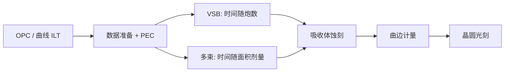

# 多束电子束写掩模

掩模写入时间若随图形复杂度线性膨胀，计算光刻给出的曲线与碎多边形就无法进入生产线。多束把时间从「炮数」改写为「面积与剂量」。

<footer>—— 对照电子束掩模写入与计算光刻量产约束的公开论述</footer>

光学掩模是石英上的吸收体图形，本身由电子束光刻写成。可变成形束（VSB）用少量可变矩形炮填充多边形：曼哈顿、低 OPC 复杂度时炮数可控；[模型 OPC](/llm/opc) 把边切碎、[ILT 曲线](/llm/ilt-curvilinear) 把形状变成非矩形之后，炮数可以涨一到两个数量级，写入从数小时变成数天，成为 TAPOUT 的墙。多束电子束写入机用十万至数十万根并行细束、按位图或等效栅格扫描，写入时间对图形复杂度近似一阶不敏感。它不是把电子束「变得更准」这么简单，而是换了复杂度的计量单位。

## 问题

VSB 的节拍是：每个矩形炮要偏转、成形、曝光、稳定。OPC 碎片变短，炮变多；曲线若先用大量微矩形逼近，炮数再乘一截。同时，先进节点掩模层数因 EUV 减少了部分多重图形，但单层的数据密度与 CD 控制更严，单张掩模更难写。产线要的是可预测的写入日历：不能让某一层 ILT 把机台吞掉一周。

电子束还有自己的邻近效应：电子在抗蚀剂与衬底里散射，雾化、加热、充电让剂量与位置漂移。这些必须在写入时做电子束邻近修正（PEC），与晶圆侧光学 OPC 不是同一件事。问题是：在保持套刻、CD 均匀与缺陷目标的前提下，让写入时间与「光学上正确的复杂掩模」解耦。

### 炮数墙与面积墙

VSB 墙是炮数：复杂度涨，时间涨。多束墙是面积 × 剂量 / 总电流：同样胶灵敏度下，写满一场的时间与图案黑白比例弱相关，与曲线还是直角几乎无关。换机台家族等于换哪堵墙先撞上。ILT 要量产，必须活在面积墙里；否则计算光刻只能输出 VSB 吃得下的曼哈顿。

多束并不自动更快。对简单接触层或稀疏图形，VSB 的单炮面积大，可能仍合算。多束的价值在复杂度的尾部：曲线、碎 SRAF、全芯片 ILT。用「所有掩模都该多束」去规划产能会买错机台组合。

## 方法

多束系统（公开讨论中以 IMS 一类 Multibeam Mask Writer 为代表）把阵列化的电子束打到掩模抗蚀剂上，每束可独立开闭，等效于把掩模数据栅格化后并行曝光。加速电压、束流、抗蚀剂灵敏度决定每场时间。数据路径必须能把曲线多边形在机台侧或离线转成束阵列能消化的位图，带宽与解码成为与光学计算并列的工程。

写入还包括：对准与拼接、充电补偿、加热模型、PEC、以及吸收体蚀刻后的计量反馈。曲线 MRC 要与束栅格匹配，过小的曲率半径在栅格上退化成噪声。量产流程是：计算光刻输出曲线 → 数据准备（分档、PEC、断裂）→ 多束写 → 显影蚀刻 → 曲边检测。任何一环仍按直角假设，曲线收益会在检测或修补处丢掉。

### 与 VSB 混线

掩模厂不会一夜切到纯多束。关键 EUV 层、ILT 层走多束；较松的层留在 VSB 以保护产能。同一套版图里不同层用不同写入器，套刻与 CD 基准要能跨机台对齐。数据准备软件必须同时吐 VSB 炮表和多束位图，这是 TAPOUT 工具链的一部分，不是机台手册里的附录。

## 机制

单束电流受库仑效应与亮度限制，不能靠「把一束电流加到无限」来换时间。多束把总电流摊到空间上独立的许多束，库仑效应按单束计，总剂量速率按束数加。这与晶圆 EUV 光源「提高总功率」是不同的物理：这里并行的是曝光通道。代价是校准：每束的电流、位置、形状都要均匀，否则栅格上会出现条纹与 CD 指纹，这种指纹会被光学成像部分传到晶圆，表现为难以用 [OPC](/llm/opc) 修掉的系统误差——因为 OPC 假定掩模误差是局部随机或已知偏置，而不是写入器阵列的周期指纹。

PEC 补偿的是电子散射造成的剂量背景，使孤立与密集图形在抗蚀剂里吃到等效剂量。曲线图形的密度场更平滑，PEC 模型反而可能更稳；但充电与加热仍随局部剂量率变。多束的瞬时剂量率分布与 VSB 不同，加热模型必须重做，不能把 VSB 的经验表贴上去。

电子束邻近修正不是光学 OPC。前者补偿电子在掩模抗蚀剂里的散射；后者补偿光子在投影系统与晶圆胶里的衍射。两套模型、两套校准片，不要共用一个「邻近」名词就合并流程。

### 数据量与安全

全芯片曲线位图远大于多边形。传输、加密、在机台缓冲里的停留时间，成为新的瓶颈与攻击面。写入器若等数据，产率按面积模型算的数字是假的。计算光刻 GPU 化之后，数据准备与多束 I/O 会变成下一段墙，需要与 [GPU OPC](/llm/computational-litho-gpu) 同一量级的工程对待。

## 边界与工程取舍

多束不消除掩模缺陷、空白片质量和吸收体蚀刻粗糙度。它只改写入时间对复杂度的导数。若检测仍按直角边算法漏掉曲边缺陷，良率问题会从「写不完」变成「测不准」。修补（e-beam repair）对曲线的等价性也要重新定义：修出一段曼哈顿补丁，可能毁掉 ILT 精心放的频谱。

不要用某一代机台的「262144 束」当永久常数。束数、电流、数据速率每代都会变；论证应落在「复杂度与时间是否解耦」，而不是某一个硬件宣传数字。与 SMO/ILT 的正确耦合是：计算侧允许的 MRC 集合 = 写入侧能稳定重现的集合。

规划先进节点掩模产能时，要把 ILT 层比例、多束机数量和数据准备算力放在同一张表。只扩计算光刻 GPU、不扩多束，曲线会堵在掩模厂门口。

## 小结

- VSB 写入时间随矩形炮数涨，复杂 OPC 与曲线 ILT 会撞炮数墙。
- 多束以面积与剂量为主导，使写入时间对图形复杂度一阶解耦。
- 电子束 PEC、充电、加热、阵列指纹是多束自己的误差源，不能靠光学 OPC 事后抹平。
- 量产是 VSB 与多束混线，数据准备必须双输出。
- 曲线检测、修补与数据带宽是与写入并列的闸门。
- 计算光刻、多束、检测三者缺一，ILT 不能算量产。
- 出处：多束掩模写入与计算光刻量产公开材料；Mack 掩模与成像框架。
