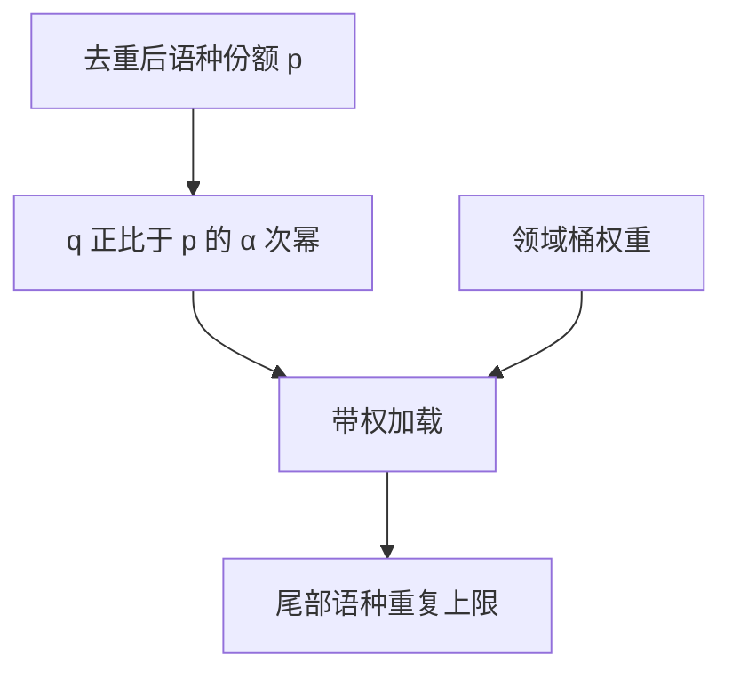

# 多语言 α 采样

按语种频次的 $\alpha$ 次幂抽样，低资源语言被抬起来，高资源语言仍占大头；$\alpha=1$ 是自然分布，$\alpha=0$ 是语种均匀。

<footer>—— Conneau 与 Lample，XLM；Conneau 等，XLM-R</footer>

[上一课](/llm/influence-data-selection)用梯度给文档打分，贵，且假定探针已定。多语言预训练常常连「主探针」都还没有，却必须先决定 100 种语言各吃多少 token。本课不重讲影响函数。缺口是一个只依赖语种频次的便宜旋钮：XLM / XLM-R 的 $\alpha$-sampling。它补的是支撑与公平，不是桶内质量。

## 问题

[网页清洗](/llm/web-clean-dedup) 之后，英语仍可能占 web 的一大半。按自然 token 分布训，低资源语言的子词本就更碎（fertility 课），再叠加更少的句子，模型在那些语言上接近没训。按语种均匀采，英语能力会掉，而且低资源语种的重复率飙升，变成过拟合那一小摊爬取。需要在 $p_i^{\alpha}$ 上插值：设语种 $i$ 的自然份额为 $p_i$，抽样概率 $q_i\propto p_i^{\alpha}/\sum_j p_j^{\alpha}$。

Conneau 等人在 XLM 与 XLM-R 里把 $\alpha$ 当成多语言 MLM 的标准旋钮。预训练自回归模型同样能用，只是会计从「句子」换成「token」，并要与 fertility 一起读：$\alpha$ 补偿的是语种出现次数，不是切分倍率。

### $\alpha$ 不是质量分

低资源语种的爬取往往更噪。提高 $q_i$ 会多喂噪声，除非该语种先经过同样严格的过滤。α 采样在干净的语种边际上操作；脏数据应在进入 $p_i$ 统计之前杀掉，否则 $p_i$ 本身被垃圾撑大。

语言识别错误会制造幽灵语种或把方言并进大语种。$p_i$ 应在识别之后、去重之后统计，并定期抽检。

## 方法

在去重后的语料上估计 $p_i$（按 token 或按字符；选定后不得混用）。选 $\alpha\in[0,1]$：XLM-R 一类常用 $0.3$ 或 $0.5$ 量级，使尾部语种可见又不过分重复。加载器按 $q_i$ 做带权抽样；对极小语种设重复上限与 epoch 内无放回，防止同一页每个 epoch 出现几十次。与领域桶相乘：先语种 $q$，再在语种内按来源 $w$，或反过来做成层次——必须写清顺序，两种顺序给出不同的联合分布。

把 α 与 [DoReMi](/llm/doremi) 一起用时，不要让 DRO 再去「发现」语种权重，除非桶的定义里没有语种轴。一轴一方法：语种用 α，来源用 DRO 或人工。RegMix 的设计点也可以把 α 当成一个标量自变量扫。

### 与词表的耦合

α 抬起的语种若词表覆盖差，抬起来的是更长的字节回退序列，有效语义更少。扩表应先于把 α 降得很低。fertility 报表是验收：过采样后，该语种的有效字符预算是否真的上升。

评测集语种分布若与 $q$ 一致，分数会好看；产品用户若更偏英语，应对产品分布单独报。α 是训练测度，不是承诺公平测树。

## 机制

$p_i^{\alpha}$ 在对数单纯形上把质量从头部推向尾部，$\alpha$ 越小越均匀。重复的代价是：尾部语种的独特文档少，模型记忆那些页。Lee 等人对重复与记忆的结论在语种维上同样成立。因此 α 必须与去重、重复上限一起设，而不是单独调到验证 perplexity 最低——最低往往是多喂英语。

## 边界

α 采样不管代码仓库结构、不管长文档、不管指令格式。那些是随后几课的排布与目标问题。它也不选「哪一篇中文更好」——那是影响函数或质量模型。把 α 调到 0 当作政治正确，会得到一轮均匀的过拟合。下一课进入代码：单位从语种变成仓库，抽样要保持文件间的依赖，而不是把文件当独立语言页。

## 小结

- 本课不重讲梯度选文档；只补语种频次的幂次抽样。
- $q_i\propto p_i^{\alpha}$ 在自然分布与均匀之间插值；与领域 $w$ 层次相乘，顺序要写清。
- 先过滤再估计 $p_i$；尾部设重复上限。
- 词表覆盖不足时，降 α 只会多喂碎片。
- 出处：Conneau & Lample, XLM, 2019；Conneau et al., XLM-R, 2020；重复与记忆对照 Lee et al., 2022。
